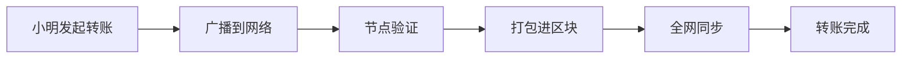

# 🔗 区块链：改变世界的账本革命

## 📖 开篇：一个价值10万美元的披萨故事

2010年5月22日，程序员 Laszlo Hanyecz 用 10,000 个比特币买了两个披萨。这是比特币首次在现实世界中被使用。按今天的价格，这两个披萨价值超过 3 亿美元！

这个故事的背后，是一项革命性的技术——**区块链**。

## 🎯 一句话说清区块链

> **想象一下，全世界共用一个账本，每个人都有一份副本，任何人想作弊都会被所有人发现。**

这就是区块链！一个**透明**、**防篡改**、**去中心化**的超级账本。

## 🎬 三分钟看懂区块链运作

### 场景：小明给小红转账的奇妙之旅

让我们跟踪一笔转账，看看区块链是如何工作的：



**第一步：发起交易** 🚀
- 小明：「我要给小红转 1 个比特币」
- 系统自动检查：小明账户是否有足够余额

**第二步：全网广播** 📢
- 交易信息像涟漪一样扩散到整个网络
- 每个节点都会收到这笔交易

**第三步：矿工竞赛** ⛏️
- 矿工们开始了一场数学竞赛
- 谁先解出难题，谁就能把交易打包进新区块
- 获胜者赢得奖励（这就是"挖矿"的由来）

**第四步：全网认可** ✅
- 新区块被添加到区块链上
- 所有节点更新自己的账本
- 小红成功收到 1 个比特币！

## 💡 区块链的三大超能力

### 1. 🛡️ **防篡改**：改一个字，全世界都知道
每个区块都包含前一个区块的"指纹"（哈希值）。想改历史？你得说服全世界 51% 以上的节点，几乎不可能！

### 2. 🌍 **去中心化**：没有老大，人人平等
没有中央服务器，没有管理员。每个参与者都是网络的一部分，共同维护这个系统。

### 3. 🔍 **透明公开**：阳光是最好的防腐剂
所有交易记录公开可查，但用户身份通过加密保护。就像戴着面具的超级英雄，行动透明但身份保密。

## 🚀 区块链进化史：从 1.0 到 3.0

```timeline
2009: 比特币诞生 (区块链 1.0)
      - 数字黄金时代
      - 解决了"双花"问题

2015: 以太坊上线 (区块链 2.0)
      - 智能合约革命
      - "可编程的钱"

2020+: 新一代公链 (区块链 3.0)
       - Solana：秒级确认，费用几乎为零
       - Polkadot：区块链的互联网
       - Cosmos：万链互联
```

## 🎮 为什么选择 Solana？

想象一下：
- **比特币**：像老式银行汇款，要等 10 分钟，手续费还贵
- **以太坊**：像改进版 ATM，快了点但高峰期还是慢，费用依然高
- **Solana**：像闪电支付，眨眼完成，费用忽略不计

### Solana 的独特优势：
- ⚡ **速度**：每秒处理 65,000+ 笔交易
- 💰 **费用**：每笔交易仅需 $0.00025
- 🏗️ **开发友好**：支持 Rust、C++，甚至即将支持 Move
- 🌐 **生态繁荣**：NFT、DeFi、GameFi 应有尽有

## 🤔 常见疑问，一次说清

**Q：区块链安全吗？**
A：比你的银行账户还安全。除非有人控制全网 51% 的算力，否则无法作恶。

**Q：为什么挖矿要耗电？**
A：这是"工作量证明"的代价。就像金矿需要挖掘一样，数字黄金也需要"开采"。不过新一代区块链（如 Solana）采用更环保的共识机制。

**Q：区块链只能用来炒币吗？**
A：当然不是！供应链追踪、数字身份、版权保护、去中心化金融（DeFi）、游戏（GameFi）等等，应用无限。

## 🎯 下一步：开启你的 Web3 之旅

恭喜你！现在你已经理解了区块链的核心概念。接下来，你可以：

1. 🔨 **动手实践**：创建你的第一个 Solana 钱包
2. 📚 **深入学习**：探索智能合约开发
3. 🌟 **参与生态**：加入 Solana 开发者社区

## 📚 推荐阅读

- 🥇 [《精通比特币》](https://github.com/bitcoinbook/bitcoinbook) - 区块链圣经
- 🚀 [Solana 白皮书](https://solana.com/solana-whitepaper.pdf) - 了解 Solana 的创新
- 🎮 [Solana Playground](https://beta.solpg.io) - 在线编程，无需配置

---

> 💬 **"区块链不仅是一项技术，更是一场关于信任的革命。"**
>
> 准备好加入这场革命了吗？让我们一起构建 Web3 的未来！
