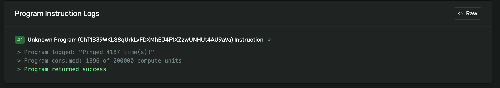

# 📝 构建你的第一个 Solana 交互脚本

## 🎯 学习目标

准备好成为 **Solana 脚本大师** 了吗？今天我们要构建一个超酷的自动化脚本！🤖

你将学会：
- 🔑 自动生成和管理密钥对
- 💰 自动获取测试币（空投）
- 📡 与链上程序交互
- 🎮 操作一个真实的计数器程序

:::tip 🌟 为什么要学脚本？
脚本 = 自动化 = 效率 💯
- **快速测试**：无需前端即可测试功能
- **批量操作**：一键完成多个任务
- **开发神器**：调试和实验的最佳工具
:::

## 🏗️ 第一章：搭建本地客户端环境

### 🎪 告别 React，拥抱纯 TypeScript！

为什么选择纯 TS 脚本？让我们对比一下：

| 方式 | React 应用 | TS 脚本 |
|------|-----------|---------|
| **搭建时间** | 30分钟 😴 | 1分钟 ⚡ |
| **测试速度** | 需要浏览器 | 命令行直接跑 |
| **调试体验** | 开发者工具 | console.log 大法 |
| **适用场景** | 用户界面 | 自动化任务 |

### 🚀 一键创建项目

```bash
# 🎯 使用神奇的脚手架工具
npx create-solana-client solana-intro-client

# 📁 进入项目目录
cd solana-intro-client

# 🔧 用 VSCode 打开（或你喜欢的编辑器）
code .
```

:::success 🎉 恭喜！
仅用两条命令，你的 Solana 客户端环境就搭建完成了！比泡一杯咖啡还快 ☕
:::

### 📂 项目结构一览

```
📦 solana-intro-client
├── 📄 package.json      # 项目配置
├── 📄 tsconfig.json     # TypeScript 配置
├── 📄 .env             # 环境变量（私钥存这里）
├── 📁 src/
│   └── 📜 index.ts     # 主脚本文件 ⭐
└── 📁 node_modules/    # 依赖包
```

## ⚙️ 第二章：编写核心功能

### 🎬 设置主函数框架

打开 `src/index.ts`，让我们搭建基础框架：

```typescript
// 🎨 导入必要的工具包
import * as Web3 from '@solana/web3.js';
import * as fs from 'fs';
import dotenv from 'dotenv';

// 🔐 加载环境变量
dotenv.config();

// 🎭 主函数 - 所有魔法发生的地方
async function main() {
    console.log("🚀 Solana 脚本启动！");

    // 这里将添加我们的功能

    console.log("✅ 任务完成！");
}

// 🏃 运行主函数
main()
    .then(() => {
        console.log('🎊 执行成功！');
        process.exit(0);  // 成功退出
    })
    .catch((error) => {
        console.error('❌ 出错了:', error);
        process.exit(1);  // 错误退出
    });
```

测试一下：
```bash
npm start
```

输出：
```
🚀 Solana 脚本启动！
✅ 任务完成！
🎊 执行成功！
```

### 🔑 智能密钥管理系统

现在添加一个**超级智能**的密钥管理函数：

```typescript
/**
 * 🔑 智能密钥对初始化器
 * 功能：有则用，无则造！
 */
async function initializeKeypair(
    connection: Web3.Connection
): Promise<Web3.Keypair> {

    // 🔍 检查是否已有私钥
    if (!process.env.PRIVATE_KEY) {
        console.log('🆕 检测到新用户！');
        console.log('🎲 正在生成新密钥对...');

        // 生成全新的密钥对
        const signer = Web3.Keypair.generate();

        // 💾 保存到 .env 文件
        console.log('📝 保存密钥到 .env 文件...');
        fs.writeFileSync(
            '.env',
            `PRIVATE_KEY=[${signer.secretKey.toString()}]`
        );

        console.log('✨ 新钱包创建成功！');
        console.log('📮 你的地址:', signer.publicKey.toBase58());

        return signer;
    }

    // 🔓 从环境变量恢复密钥对
    console.log('🔐 检测到现有密钥，正在加载...');

    // 解析私钥数组
    const secret = JSON.parse(process.env.PRIVATE_KEY ?? '') as number[];
    const secretKey = Uint8Array.from(secret);
    const keypair = Web3.Keypair.fromSecretKey(secretKey);

    console.log('✅ 密钥加载成功！');
    console.log('📮 你的地址:', keypair.publicKey.toBase58());

    return keypair;
}
```

:::info 💡 工作原理解析
这个函数就像一个**智能管家** 🏠：
1. **首次运行**：创建新钱包，保存密钥
2. **后续运行**：加载已有密钥
3. **自动管理**：无需手动处理密钥文件
:::

### 💰 自动空投系统 - 永不缺钱！

添加这个神奇的自动补充余额功能：

```typescript
/**
 * 💰 智能空投器
 * 功能：穷则空投，富则跳过！
 */
async function airdropSolIfNeeded(
    signer: Web3.Keypair,
    connection: Web3.Connection
) {
    console.log('\n💳 检查钱包余额...');

    // 查询当前余额
    const balance = await connection.getBalance(signer.publicKey);
    const balanceInSol = balance / Web3.LAMPORTS_PER_SOL;

    console.log(`📊 当前余额: ${balanceInSol} SOL`);

    // 判断是否需要空投（少于 1 SOL 就补充）
    if (balanceInSol < 1) {
        console.log('💸 余额不足，申请空投中...');
        console.log('🚁 空投直升机起飞...');

        try {
            // 请求空投 1 SOL
            const airdropSignature = await connection.requestAirdrop(
                signer.publicKey,
                Web3.LAMPORTS_PER_SOL
            );

            // 等待确认
            console.log('⏳ 等待交易确认...');
            const latestBlockhash = await connection.getLatestBlockhash();

            await connection.confirmTransaction({
                blockhash: latestBlockhash.blockhash,
                lastValidBlockHeight: latestBlockhash.lastValidBlockHeight,
                signature: airdropSignature,
            });

            // 查询新余额
            const newBalance = await connection.getBalance(signer.publicKey);
            const newBalanceInSol = newBalance / Web3.LAMPORTS_PER_SOL;

            console.log(`✅ 空投成功！新余额: ${newBalanceInSol} SOL`);
            console.log(`🔗 查看交易: https://explorer.solana.com/tx/${airdropSignature}?cluster=devnet`);

        } catch (error) {
            console.error('⚠️ 空投失败，可能处于冷却期');
            console.log('💡 提示：等待几秒后重试，或使用水龙头网站');
        }
    } else {
        console.log('💰 余额充足，无需空投！');
    }
}
```

:::warning ⏰ 空投冷却期
Devnet 空投有频率限制：
- 每次最多 2 SOL
- 连续请求需间隔约 30 秒
- 被限制时可访问 [Sol Faucet](https://solfaucet.com/)
:::

### 🔄 更新主函数

现在把所有功能组合起来：

```typescript
async function main() {
    console.log("🚀 Solana 脚本启动！");
    console.log("=" .repeat(50));

    // 🌐 连接到 Devnet
    console.log("📡 连接到 Solana Devnet...");
    const connection = new Web3.Connection(
        Web3.clusterApiUrl('devnet'),
        'confirmed'
    );
    console.log("✅ 连接成功！");

    // 🔑 初始化密钥对
    const signer = await initializeKeypair(connection);

    // 💰 检查并空投
    await airdropSolIfNeeded(signer, connection);

    console.log("=" .repeat(50));
    console.log("✅ 初始化完成！准备开始交互...");
}
```

## 🎮 第三章：调用链上程序 - Ping 计数器

### 🎯 理解 Ping 程序

我们要交互的程序是一个**计数器程序**，工作原理很简单：

```
用户: "Ping!" 👋
程序: "收到！计数 +1" 📊
```

每次调用都会增加一个全局计数器，所有人都能看到！

### 📍 定义程序地址

在文件顶部添加程序地址：

```typescript
// 🎮 Ping 程序的地址
const PROGRAM_ID = new Web3.PublicKey(
    "ChT1B39WKLS8qUrkLvFDXMhEJ4F1XZzwUNHUt4AU9aVa"
);

// 💾 存储计数器数据的账户
const PROGRAM_DATA_PUBLIC_KEY = new Web3.PublicKey(
    "Ah9K7dQ8EHaZqcAsgBW8w37yN2eAy3koFmUn4x3CJtod"
);
```

:::info 📚 为什么有两个地址？
还记得吗？Solana 的独特设计：
- **PROGRAM_ID** = 可执行代码（程序逻辑）
- **PROGRAM_DATA_PUBLIC_KEY** = 存储数据（计数器值）

就像把 **引擎** 和 **油箱** 分开存放！
:::

### 🏓 编写 Ping 函数

```typescript
/**
 * 🏓 Ping 程序交互函数
 * 功能：向链上计数器 +1
 */
async function pingProgram(
    connection: Web3.Connection,
    payer: Web3.Keypair
) {
    console.log("\n🏓 准备 Ping 程序...");

    // 📝 Step 1: 创建交易
    const transaction = new Web3.Transaction();

    // 🎯 Step 2: 构建指令
    const instruction = new Web3.TransactionInstruction({
        // 📋 需要访问的账户列表
        keys: [
            {
                pubkey: PROGRAM_DATA_PUBLIC_KEY,  // 数据账户
                isSigner: false,                  // 不需要签名
                isWritable: true                  // 需要写入（修改计数器）
            }
        ],

        // 🏭 目标程序 ID
        programId: PROGRAM_ID,

        // 📦 指令数据（这个程序不需要额外数据）
        // data: Buffer.alloc(0)  // 可选，默认为空
    });

    console.log("📦 构建指令完成");

    // ➕ Step 3: 添加指令到交易
    transaction.add(instruction);

    // 🚀 Step 4: 发送并确认交易
    console.log("🚀 发送交易...");
    const transactionSignature = await Web3.sendAndConfirmTransaction(
        connection,
        transaction,
        [payer]  // 签名者数组
    );

    // 🎉 Step 5: 显示结果
    console.log("✅ Ping 成功！");
    console.log(`📝 交易签名: ${transactionSignature}`);
    console.log(
        `🔍 查看交易: https://explorer.solana.com/tx/${transactionSignature}?cluster=devnet`
    );

    return transactionSignature;
}
```

### 🎨 理解指令的三要素

```typescript
// 🎯 每个指令都需要回答三个问题：

// 1️⃣ WHO - 涉及哪些账户？
keys: [
    { pubkey, isSigner, isWritable }
]

// 2️⃣ WHERE - 发送到哪个程序？
programId: PROGRAM_ID

// 3️⃣ WHAT - 传递什么数据？
data: Buffer.from([...])  // 可选
```

:::tip 💡 Keys 数组的权限组合
| isSigner | isWritable | 使用场景 | 例子 |
|----------|------------|---------|------|
| ✅ | ✅ | 授权+修改 | 转账的发送方 |
| ✅ | ❌ | 仅授权 | 验证身份 |
| ❌ | ✅ | 仅修改 | 数据存储账户 |
| ❌ | ❌ | 只读 | 查询配置 |
:::

### 🔄 完整的主函数

```typescript
async function main() {
    console.log("🚀 Solana Ping 程序客户端");
    console.log("=" .repeat(50));

    // 🌐 连接网络
    const connection = new Web3.Connection(
        Web3.clusterApiUrl('devnet'),
        'confirmed'
    );

    // 🔑 初始化账户
    const signer = await initializeKeypair(connection);

    // 💰 确保有余额
    await airdropSolIfNeeded(signer, connection);

    // 🏓 调用 Ping 程序
    console.log("\n🎮 开始与链上程序交互...");
    await pingProgram(connection, signer);

    console.log("\n🎊 所有任务完成！");
}
```

### 🎮 运行测试

```bash
npm start
```

期望输出：
```
🚀 Solana Ping 程序客户端
==================================================
📡 连接到 Solana Devnet...
✅ 连接成功！
🔐 检测到现有密钥，正在加载...
✅ 密钥加载成功！
📮 你的地址: 7cVf...

💳 检查钱包余额...
📊 当前余额: 1.99 SOL
💰 余额充足，无需空投！

🎮 开始与链上程序交互...
🏓 准备 Ping 程序...
📦 构建指令完成
🚀 发送交易...
✅ Ping 成功！
📝 交易签名: 2Kh5...
🔍 查看交易: https://explorer.solana.com/tx/2Kh5...?cluster=devnet

🎊 所有任务完成！
```

### 🔍 在浏览器中验证

点击输出的链接，你会看到：



在 "Program Instruction Logs" 部分，你能看到计数器的变化！

## 🏆 挑战任务：SOL 转账脚本

### 🎯 任务目标

创建一个**自动转账脚本**，实现：
1. 创建两个账户（发送方和接收方）
2. 给发送方空投 SOL
3. 转账 0.1 SOL 到接收方
4. 显示交易详情

### 💡 提示和线索

```typescript
// 🔑 提示 1：生成两个密钥对
const sender = Web3.Keypair.generate();
const receiver = Web3.Keypair.generate();

// 💰 提示 2：系统程序有转账方法
SystemProgram.transfer({
    fromPubkey: ?,
    toPubkey: ?,
    lamports: ?
})

// 📝 提示 3：记得处理 lamports 单位
const amount = 0.1 * Web3.LAMPORTS_PER_SOL;
```

### 📋 检查清单

- [ ] 生成发送方和接收方账户
- [ ] 给发送方空投至少 1 SOL
- [ ] 创建转账指令
- [ ] 发送交易
- [ ] 打印交易签名
- [ ] 验证接收方余额

### 🏅 进阶挑战

1. **批量转账**：一次交易转给多个接收者
2. **添加备注**：使用 Memo 程序添加转账说明
3. **余额监控**：转账前后显示双方余额变化

### 🎓 学习成果验证

完成后，你应该能看到：
```
💸 转账成功！
📤 发送方: 7cVf... (-0.1 SOL)
📥 接收方: 8dWg... (+0.1 SOL)
🔗 交易: https://explorer.solana.com/tx/...
```

:::tip 🎯 独立完成提示
先自己尝试 30 分钟，遇到困难时：
1. 查看 Web3.js 文档
2. 搜索 "Solana transfer SOL"
3. 参考前面的代码结构

实在需要时，[查看参考答案](https://github.com/all-in-one-solana/solana-co-learn-code/blob/main/src/transferSol.ts)
:::

## 📚 知识要点总结

### ✅ 你已经掌握了

1. **环境搭建** 🏗️
   - 使用 create-solana-client 快速开始
   - 管理项目依赖和配置

2. **密钥管理** 🔑
   - 自动生成和保存密钥对
   - 从环境变量恢复密钥

3. **网络交互** 🌐
   - 连接到 Solana 网络
   - 查询余额和空投

4. **程序调用** 🎮
   - 构建交易和指令
   - 与链上程序交互

### 🚀 下一步学习路径

1. **深入程序开发**：学习 Rust，编写自己的程序
2. **前端集成**：将脚本功能集成到 Web 应用
3. **高级功能**：代币操作、NFT 铸造、DeFi 交互

## 🎊 恭喜完成！

你已经成功：
- 🤖 构建了自动化 Solana 脚本
- 📡 与真实的链上程序交互
- 💪 掌握了 Solana 开发的核心技能

**继续加油，未来的 Solana 大师！** 🚀
