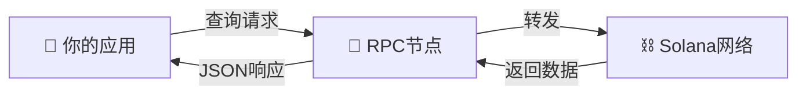

# 🔍 从 Solana 区块链读取数据 - 你的第一步！

## 🎯 学习目标

欢迎来到 Solana 开发的起点！今天我们要学习如何从区块链读取数据 📖

你将掌握：
- 🏦 理解 Solana 独特的账户模型
- 🔗 使用 RPC 与区块链交互
- 💰 查询任意账户的余额
- 🛠️ 构建你的第一个 Solana 应用

:::tip 🌟 为什么从读取开始？
就像学习一门新语言，我们先学会"听"，再学会"说"。在区块链世界，先学会读取数据，再学习写入数据！
:::

## 📚 第一章：理解 Solana 账户 - 万物皆账户！

### 🎭 账户是什么？一个生动的比喻

想象 Solana 是一个巨大的储物柜系统 🗄️：

```
🏢 Solana 银行大厦
├── 🗂️ 储物柜 A：存钱（钱包账户）
├── 📚 储物柜 B：存程序代码（程序账户）
├── 💾 储物柜 C：存数据（数据账户）
└── 🔐 储物柜 D：特殊保险箱（PDA账户）

每个储物柜都有：
- 🏷️ 编号（地址/公钥）
- 💰 里面的钱（lamports）
- 📦 存储的东西（data）
- 👤 主人（owner）
- 🔑 是否能打开执行（executable）
```

:::info 💡 核心理念
**在 Solana 上，一切都是账户！**
- 你的钱包？是账户 ✅
- 智能合约？是账户 ✅
- NFT数据？是账户 ✅
- 游戏存档？还是账户 ✅
:::

### 🎨 账户的三大家族

让我们认识 Solana 账户的三大家族：

#### 1️⃣ **数据账户家族** 📦
```
👛 钱包账户（System Account）
   ├── 你的 SOL 余额住在这里
   ├── 像你的银行活期账户
   └── 可以签名授权交易

💾 PDA账户（Program Derived Address）
   ├── 程序专属的保险箱
   ├── 没有私钥，超级安全
   └── 只有创建它的程序能控制
```

#### 2️⃣ **程序账户家族** 🤖
```
📜 智能合约代码
   ├── 存储可执行的程序逻辑
   ├── 像手机上的 App
   └── 可以被调用执行
```

#### 3️⃣ **原生账户家族** ⚙️
```
🏛️ 系统核心账户
   ├── 维持区块链运行
   ├── 处理质押、投票等
   └── 普通用户较少直接接触
```

### 📊 账户的身份证 - 数据结构

每个账户都有标准的"身份证信息"：

```typescript
interface SolanaAccount {
  lamports: number;      // 💰 余额（1 SOL = 10亿 lamports）
  owner: PublicKey;      // 👤 主人是谁
  data: Buffer;          // 📦 存储的数据
  executable: boolean;   // 🎮 是否可执行
  rentEpoch: number;     // 📅 租金周期（现已废弃）
}
```

让我们用表格对比不同类型账户的特征：

| 账户类型 | 💰 有余额 | 📦 有数据 | 🎮 可执行 | 🔑 谁控制 | 🎯 用途 |
|---------|---------|---------|---------|----------|--------|
| **钱包账户** | ✅ 大量 | ❌ 空的 | ❌ | System Program | 存钱、签名 |
| **程序账户** | ✅ 少量 | ✅ 程序代码 | ✅ | BPF Loader | 执行逻辑 |
| **数据账户** | ✅ 少量 | ✅ 状态数据 | ❌ | 各种程序 | 存储信息 |
| **PDA账户** | ✅ 少量 | ✅ 程序数据 | ❌ | 创建它的程序 | 安全存储 |

### 🔍 深入理解：为什么 Solana 这样设计？

:::info 🏎️ 性能优势解密
**程序与状态分离** = **极致并行**

想象两个场景：

❌ **传统方式**（程序和数据在一起）：
```
用户A 调用合约 → 🔒 锁定整个合约 → 执行 → 解锁
用户B 调用合约 → ⏳ 等待... → 等待... → 终于轮到我
```

✅ **Solana方式**（程序和数据分离）：
```
用户A 调用程序 → 读取程序（共享） → 修改数据账户A
用户B 调用程序 → 读取程序（共享） → 修改数据账户B
                    同时进行！🚀
```
:::

## 🌐 第二章：与区块链对话 - JSON RPC

### 🗣️ 什么是 RPC？

RPC（远程过程调用）就像是区块链的客服热线 📞：

```
你：喂，区块链吗？请告诉我账户 ABC 有多少钱 💬
RPC：稍等... 查到了，有 100 SOL 📊
你：谢谢！再见 👋
```

### 📡 工作原理图解



### 💻 代码对比：原始方式 vs SDK方式

#### ❌ 原始方式（繁琐）

```typescript
// 😵 需要手动构建请求，处理响应
async function getBalanceHardWay(address: string): Promise<number> {
    const url = 'https://api.devnet.solana.com';

    // 构建复杂的请求体
    return fetch(url, {
        method: 'POST',
        headers: { 'Content-Type': 'application/json' },
        body: JSON.stringify({
            "jsonrpc": "2.0",
            "id": 1,
            "method": "getBalance",
            "params": [address]
        })
    })
    .then(response => response.json())
    .then(json => {
        if (json.error) throw json.error;
        return json.result.value;
    });
}
```

#### ✅ SDK方式（优雅）

```typescript
// 😎 简洁优雅，一目了然
import { Connection, PublicKey, clusterApiUrl } from '@solana/web3.js';

async function getBalanceEasyWay(address: string): Promise<number> {
    const connection = new Connection(clusterApiUrl('devnet'));
    const publicKey = new PublicKey(address);
    const balance = await connection.getBalance(publicKey);
    return balance / 1_000_000_000; // 转换为 SOL
}
```

:::success 🎊 对比结果
- 代码量：**减少 70%**
- 可读性：**提升 200%**
- 出错概率：**降低 80%**
:::

## 🛠️ 第三章：构建余额查询器

### 🎯 项目目标

我们要构建一个 **"宇宙余额查询器"** 🌌 - 能查询 Solana 上任何账户余额的应用！

想象一下，如果你能查询地球上任何人的银行余额... 在 Solana 上，这是完全透明和可能的！

### 🚀 项目设置

#### Step 1: 克隆启动项目

```bash
# 🎬 Action！
git clone https://github.com/all-in-one-solana/solana-intro-frontend
cd solana-intro-frontend
git checkout starter
npm install

# 🏃 启动开发服务器
npm run dev
```

#### Step 2: 安装 Solana Web3.js

```bash
# 🔧 安装魔法工具
npm install @solana/web3.js
```

### 📝 核心代码实现

打开 `index.tsx`，让我们赋予它生命：

```typescript
// 🎨 导入 Solana 工具包
import * as web3 from '@solana/web3.js';

// 🎯 处理地址提交的函数
const addressSubmittedHandler = async (address: string) => {
    try {
        // 🔄 Step 1: 验证地址格式
        console.log("🔍 验证地址:", address);
        const publicKey = new web3.PublicKey(address);

        // 🌐 Step 2: 连接到 Solana 网络
        console.log("📡 连接到 Devnet...");
        const connection = new web3.Connection(
            web3.clusterApiUrl('devnet'),
            'confirmed' // 确认级别
        );

        // 💰 Step 3: 查询余额
        console.log("💳 查询余额中...");
        const balanceInLamports = await connection.getBalance(publicKey);

        // 🔢 Step 4: 转换单位（Lamports → SOL）
        const balanceInSOL = balanceInLamports / web3.LAMPORTS_PER_SOL;
        console.log("✅ 余额:", balanceInSOL, "SOL");

        // 🎨 Step 5: 更新 UI
        setAddress(publicKey.toBase58());
        setBalance(balanceInSOL);

    } catch (error) {
        // ❌ 错误处理
        console.error("😱 出错了:", error);
        alert(`查询失败: ${error.message}`);
        setAddress('');
        setBalance(0);
    }
};
```

### 🎮 测试你的应用

#### 📋 测试账户列表

这里有一些有趣的账户供你测试：

| 账户类型 | 地址 | 描述 |
|---------|------|------|
| 🐋 **巨鲸账户** | `B1aLAAe4vW8nSQCetXnYqJfRxzTjnbooczwkUJAr7yMS` | 有很多 SOL |
| 🤖 **程序账户** | `TokenkegQfeZyiNwAJbNbGKPFXCWuBvf9Ss623VQ5DA` | Token 程序 |
| 💎 **USDC Mint** | `EPjFWdd5AufqSSqeM2qN1xzybapC8G4wEGGkZwyTDt1v` | USDC 代币 |

### 🎨 UI 优化建议

让你的应用更美观：

```css
/* 添加动画效果 */
.balance-display {
    animation: fadeIn 0.5s ease-in;
    font-size: 2rem;
    color: #14F195;
}

@keyframes fadeIn {
    from { opacity: 0; transform: translateY(-10px); }
    to { opacity: 1; transform: translateY(0); }
}
```

## 🏆 挑战任务：账户侦探 🕵️

### 🎯 任务目标

升级你的应用，让它能显示更多账户信息：

```typescript
interface AccountDetails {
    balance: number;        // 💰 余额
    owner: string;          // 👤 所有者
    executable: boolean;    // 🎮 是否可执行
    dataSize: number;       // 📊 数据大小
    accountType: string;    // 🏷️ 账户类型
}
```

### 💡 实现提示

```typescript
const getAccountDetails = async (address: string): Promise<AccountDetails> => {
    const publicKey = new web3.PublicKey(address);
    const connection = new web3.Connection(web3.clusterApiUrl('devnet'));

    // 🔍 获取完整账户信息
    const accountInfo = await connection.getAccountInfo(publicKey);

    if (!accountInfo) {
        throw new Error('账户不存在');
    }

    // 🎯 判断账户类型
    const accountType = determineAccountType(accountInfo);

    return {
        balance: accountInfo.lamports / web3.LAMPORTS_PER_SOL,
        owner: accountInfo.owner.toBase58(),
        executable: accountInfo.executable,
        dataSize: accountInfo.data.length,
        accountType
    };
};

// 🏷️ 智能判断账户类型
function determineAccountType(accountInfo: web3.AccountInfo<Buffer>): string {
    if (accountInfo.executable) {
        return "🤖 程序账户";
    } else if (accountInfo.owner.equals(web3.SystemProgram.programId)) {
        return "👛 钱包账户";
    } else if (accountInfo.owner.toBase58().includes("Token")) {
        return "🪙 代币账户";
    } else {
        return "💾 数据账户";
    }
}
```

### 🎨 展示界面示例

```tsx
<div className="account-details">
    <h2>🔍 账户详情</h2>
    <div className="detail-grid">
        <div className="detail-item">
            <span className="label">💰 余额</span>
            <span className="value">{details.balance} SOL</span>
        </div>
        <div className="detail-item">
            <span className="label">🏷️ 类型</span>
            <span className="value">{details.accountType}</span>
        </div>
        <div className="detail-item">
            <span className="label">👤 所有者</span>
            <span className="value">{truncateAddress(details.owner)}</span>
        </div>
        <div className="detail-item">
            <span className="label">📊 数据大小</span>
            <span className="value">{details.dataSize} bytes</span>
        </div>
        <div className="detail-item">
            <span className="label">🎮 可执行</span>
            <span className="value">{details.executable ? "✅" : "❌"}</span>
        </div>
    </div>
</div>
```

### 🏅 测试用例

使用这些地址测试你的账户侦探：

```javascript
const testCases = [
    {
        name: "计算预算程序",
        address: "ComputeBudget111111111111111111111111111111",
        expected: "程序账户，可执行"
    },
    {
        name: "系统程序",
        address: "11111111111111111111111111111111",
        expected: "原生程序"
    },
    {
        name: "你的钱包",
        address: "你的地址",
        expected: "钱包账户"
    }
];
```

## 🎓 深入学习：Account vs AccountInfo

### 🔍 两个视角的对比

```typescript
// 👀 客户端视角：Account（查询时获得）
interface Account {
    lamports: number;     // 静态余额
    data: Buffer;         // 只读数据
    owner: PublicKey;     // 所有者
    executable: boolean;  // 是否可执行
}

// ⚙️ 合约视角：AccountInfo（程序执行时使用）
interface AccountInfo {
    key: PublicKey;           // 账户地址
    lamports: RefCell<u64>;   // 可变余额
    data: RefCell<&mut [u8]>; // 可变数据
    owner: PublicKey;          // 所有者
    is_signer: boolean;        // 是否签名
    is_writable: boolean;      // 是否可写
}
```

### 🎭 使用场景对比

| 场景 | 使用 Account | 使用 AccountInfo |
|-----|-------------|-----------------|
| 🔍 查询余额 | ✅ | ❌ |
| 📊 读取数据 | ✅ | ✅ |
| ✏️ 修改数据 | ❌ | ✅ |
| 🔐 权限验证 | ❌ | ✅ |
| 💻 客户端代码 | ✅ | ❌ |
| 📜 合约代码 | ❌ | ✅ |

## 🚀 进阶挑战

### 1️⃣ **多账户批量查询**
实现一次查询多个账户的功能

### 2️⃣ **历史余额追踪**
记录并显示余额变化历史

### 3️⃣ **账户关系图谱**
展示账户之间的关联关系

## 📚 学习资源

### 官方文档
- 📖 [Solana Cookbook - Accounts](https://solanacookbook.com/core-concepts/accounts.html)
- 📚 [Solana Docs - Accounts](https://docs.solana.com/developing/programming-model/accounts)
- 🔧 [Web3.js Documentation](https://solana-labs.github.io/solana-web3.js/)

### 社区资源
- 💬 [Solana Stack Exchange](https://solana.stackexchange.com/)
- 🐦 [Solana Developers Twitter](https://twitter.com/solana_devs)
- 🎮 [Solana Playground](https://beta.solpg.io/)

## 🎊 总结

恭喜你完成了 Solana 开发的第一课！你已经：

✅ **理解了 Solana 账户模型**
- 万物皆账户的设计理念
- 不同账户类型的特征和用途
- 程序与状态分离的性能优势

✅ **掌握了数据读取技能**
- 使用 RPC 与区块链交互
- 通过 SDK 简化开发流程
- 构建了实用的查询应用

✅ **为进阶学习打下基础**
- Account vs AccountInfo 的区别
- 账户的深层次理解
- 实际应用的开发经验

---

🚀 **下一步：学习如何向 Solana 写入数据，创建你的第一个交易！**
