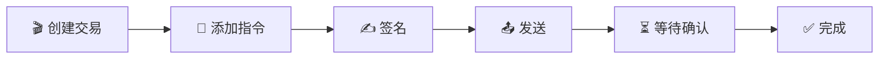

# ✍️ 将数据写入 Solana - 掌握区块链的"写"权！

## 🎯 学习目标

上一课我们学会了"读"，现在要学习"写"了！就像从**观众**变成**导演** 🎬

你将掌握：
- 🔑 理解公钥私钥的魔法
- 📝 创建并发送交易
- 🎭 构建自定义指令
- 💰 处理交易费用

:::tip 🚀 准备好了吗？
写入区块链就像在石头上刻字 - 一旦写入，永远存在！让我们学会如何安全地"刻字"吧！
:::

## 🔐 第一章：密钥对 - 你的数字身份证

### 🎭 什么是密钥对？

想象密钥对就像你的**银行账户系统**：

```
🏦 你的数字银行
├── 📮 公钥 = 银行账号（可以公开分享）
│   └── 用来接收转账
└── 🔑 私钥 = 银行密码（绝对保密！）
    └── 用来授权支出
```

:::danger ⚠️ 黄金法则
**永远不要分享你的私钥！**
- 公钥 = 你的收款地址 ✅ 可以分享
- 私钥 = 你的支付密码 ❌ 绝对保密

记住：拥有私钥 = 拥有账户的一切！
:::

### 💻 代码实战：生成密钥对

```typescript
import { Keypair } from '@solana/web3.js';

// 🎲 生成全新的密钥对（像摇骰子一样随机）
const newKeypair = Keypair.generate();

console.log("🎉 恭喜！你的新身份：");
console.log("📮 公钥（地址）：", newKeypair.publicKey.toBase58());
console.log("🔐 私钥（保密）：", newKeypair.secretKey);

// 输出示例：
// 📮 公钥：7cVfgArCheMR6Cs4t6vz5rfnqd56vZq4ndaBrY5xkxXy
// 🔐 私钥：[174, 47, 154, 16, 202, ...]（一串神秘数字）
```

### 🎨 私钥的三种形态

私钥可以有不同的表现形式，就像水可以是冰、液体或蒸汽：

#### 1️⃣ **助记词形式**（最友好）🌱
```javascript
// 12-24个单词，容易记忆
"pill tomorrow foster begin walnut borrow virtual kick shift mutual shoe scatter"

// 🎯 使用场景：钱包备份，人类记忆
```

#### 2️⃣ **Base58 字符串**（钱包常用）📝
```javascript
"5MaiiCavjCmn9Hs1o3eznqDEhRwxo7pXiAYez7keQUviUkauRiTMD8DrESdrNjN8zd9mTmVhRvBJeg5vhyvgrAhG"

// 🎯 使用场景：钱包导出/导入
```

#### 3️⃣ **字节数组**（程序使用）🔢
```javascript
[174, 47, 154, 16, 202, 193, 206, 113, 199, 190, ...]

// 🎯 使用场景：程序内部处理
```

### 🔄 转换密钥格式

```typescript
// 🎯 场景：从环境变量恢复密钥对
const recoverKeypair = () => {
    // 从 .env 文件读取（开发环境）
    const secretString = process.env.PRIVATE_KEY || "";

    // 转换步骤：
    // 1. 字符串 → 数字数组
    const secretArray = JSON.parse(secretString) as number[];

    // 2. 数字数组 → Uint8Array
    const secretKey = Uint8Array.from(secretArray);

    // 3. Uint8Array → Keypair对象
    const keypair = Keypair.fromSecretKey(secretKey);

    console.log("✅ 密钥对恢复成功！");
    console.log("📮 地址：", keypair.publicKey.toBase58());

    return keypair;
};
```

:::warning 🔒 安全提示
**生产环境密钥管理**：
- ❌ 不要硬编码私钥
- ❌ 不要提交到 Git
- ✅ 使用硬件钱包
- ✅ 使用密钥管理服务（AWS KMS、HashiCorp Vault）
- ✅ 使用环境变量（仅开发环境）
:::

## 📮 第二章：交易 - 区块链的邮政系统

### 🎯 交易是什么？

把交易想象成**快递包裹** 📦：

```
📦 一个 Solana 交易包裹
├── 📋 收件人列表（涉及的账户）
├── 📝 包裹内容（指令）
├── ✍️ 寄件人签名（授权）
└── 💰 邮费（交易费）
```

### 🚀 创建你的第一笔交易

让我们创建一个转账交易 - 从 Alice 转 1 SOL 给 Bob：

```typescript
import {
    Connection,
    Transaction,
    SystemProgram,
    LAMPORTS_PER_SOL,
    sendAndConfirmTransaction,
    Keypair,
    PublicKey
} from '@solana/web3.js';

async function sendSol() {
    // 🌐 Step 1: 连接到网络
    const connection = new Connection('https://api.devnet.solana.com', 'confirmed');

    // 👥 Step 2: 准备参与者
    const alice = Keypair.generate();  // 发送者（有私钥）
    const bob = new PublicKey("Bob的地址");  // 接收者（只需要地址）

    // 💰 Step 3: 确保 Alice 有钱（开发网空投）
    console.log("💸 向 Alice 空投 2 SOL...");
    const airdropSignature = await connection.requestAirdrop(
        alice.publicKey,
        2 * LAMPORTS_PER_SOL
    );
    await connection.confirmTransaction(airdropSignature);
    console.log("✅ 空投成功！");

    // 📦 Step 4: 创建交易
    const transaction = new Transaction();

    // 📝 Step 5: 添加转账指令
    const transferInstruction = SystemProgram.transfer({
        fromPubkey: alice.publicKey,   // 从谁
        toPubkey: bob,                  // 给谁
        lamports: LAMPORTS_PER_SOL      // 多少（1 SOL）
    });

    transaction.add(transferInstruction);

    // 🚀 Step 6: 发送交易
    console.log("📤 发送交易...");
    const signature = await sendAndConfirmTransaction(
        connection,
        transaction,
        [alice]  // 签名者数组（Alice 需要签名授权）
    );

    console.log("🎉 交易成功！");
    console.log("🔗 查看交易：", `https://explorer.solana.com/tx/${signature}?cluster=devnet`);
}
```

### 🎨 交易的生命周期



### 💡 批量操作：一个交易，多个指令

交易的强大之处在于可以**批量执行**多个操作：

```typescript
async function multipleInstructions() {
    const transaction = new Transaction();

    // 🎯 指令1：Alice → Bob 转 1 SOL
    transaction.add(
        SystemProgram.transfer({
            fromPubkey: alice.publicKey,
            toPubkey: bob,
            lamports: LAMPORTS_PER_SOL
        })
    );

    // 🎯 指令2：Alice → Charlie 转 0.5 SOL
    transaction.add(
        SystemProgram.transfer({
            fromPubkey: alice.publicKey,
            toPubkey: charlie,
            lamports: 0.5 * LAMPORTS_PER_SOL
        })
    );

    // 🎯 指令3：Alice → David 转 0.1 SOL
    transaction.add(
        SystemProgram.transfer({
            fromPubkey: alice.publicKey,
            toPubkey: david,
            lamports: 0.1 * LAMPORTS_PER_SOL
        })
    );

    // 🚀 一次发送，全部执行（原子性）
    const signature = await sendAndConfirmTransaction(
        connection,
        transaction,
        [alice]  // Alice 签一次，授权所有转账
    );

    console.log("💰 批量转账完成！一笔交易费，多个转账！");
}
```

:::success 🎊 批量操作的优势
- ⚡ **效率高**：一次网络请求
- 💰 **省钱**：只付一次交易费
- 🔒 **原子性**：要么全部成功，要么全部失败
:::

## 🎭 第三章：指令 - 交易的灵魂

### 📋 指令的结构

指令就像**菜谱** 🍳，告诉程序要做什么：

```typescript
interface Instruction {
    programId: PublicKey;     // 🏭 哪个程序（厨房）
    keys: AccountMeta[];      // 📦 需要哪些材料（账户）
    data?: Buffer;           // 📝 具体食谱（数据）
}
```

### 🔧 创建自定义指令

当调用非系统程序时，需要手动构建指令：

```typescript
// 🎯 示例：调用自定义程序
async function callCustomProgram() {
    // 1️⃣ 定义程序 ID
    const programId = new PublicKey("你的程序地址");

    // 2️⃣ 准备账户列表
    const accounts: AccountMeta[] = [
        {
            pubkey: dataAccount,      // 数据账户
            isSigner: false,          // 不需要签名
            isWritable: true          // 需要写入
        },
        {
            pubkey: userAccount,       // 用户账户
            isSigner: true,           // 需要签名
            isWritable: false         // 只读
        }
    ];

    // 3️⃣ 构造指令数据（如果需要）
    const instructionData = Buffer.from([
        0x01,  // 指令类型
        0x02,  // 参数1
        0x03   // 参数2
    ]);

    // 4️⃣ 创建指令
    const instruction = new TransactionInstruction({
        keys: accounts,
        programId,
        data: instructionData
    });

    // 5️⃣ 添加到交易并发送
    const transaction = new Transaction().add(instruction);
    const signature = await sendAndConfirmTransaction(
        connection,
        transaction,
        [userKeypair]  // 签名者
    );

    console.log("✅ 自定义程序调用成功！");
}
```

### 📊 账户元数据详解

```typescript
interface AccountMeta {
    pubkey: PublicKey;    // 账户地址
    isSigner: boolean;    // 是否需要签名
    isWritable: boolean;  // 是否可写
}
```

让我们用表格理解这些属性的组合：

| isSigner | isWritable | 含义 | 使用场景 |
|----------|------------|------|---------|
| ✅ | ✅ | 签名 + 可写 | 扣款账户、所有者账户 |
| ✅ | ❌ | 签名 + 只读 | 授权验证 |
| ❌ | ✅ | 不签名 + 可写 | 数据存储账户 |
| ❌ | ❌ | 不签名 + 只读 | 配置账户、引用数据 |

## 💰 第四章：交易费用 - 区块链的汽油费

### ⛽ 费用机制

Solana 的费用就像**高速公路过路费** 🚗：

```
🛣️ Solana 高速公路
├── 🚗 交易 = 你的车
├── 💰 费用 = 过路费
├── 🏃 验证者 = 收费员
└── ⚡ 速度 = 超快（不堵车！）
```

### 💸 费用计算

```typescript
// 🧮 Solana 费用公式
费用 = 基础费用 + (签名数量 × 签名费用)

// 实际例子：
基础费用 = 5000 lamports
每个签名 = 5000 lamports

// 一个签名的交易：
总费用 = 5000 + (1 × 5000) = 10000 lamports = 0.00001 SOL

// 💡 对比：
// Ethereum: $5-50 😱
// Solana: $0.00025 😎
```

### 🎯 谁付钱？第一签名者规则！

```typescript
const transaction = new Transaction().add(instruction);

// 👥 多个签名者的情况
const signers = [alice, bob, charlie];

// 💰 Alice（第一个）付费！
const signature = await sendAndConfirmTransaction(
    connection,
    transaction,
    signers  // Alice 在第一位 = Alice 付钱
);
```

:::tip 💡 省钱技巧
1. **批量操作**：多个指令放一个交易
2. **优化账户**：减少不必要的账户
3. **复用交易**：相似操作可以复用
:::

### 🚿 获取测试币

开发时需要测试币？这里有免费的！

```typescript
// 🎯 方法1：代码空投
async function getTestSOL(publicKey: PublicKey) {
    const connection = new Connection('https://api.devnet.solana.com');

    console.log("🚁 空投中...");
    const signature = await connection.requestAirdrop(
        publicKey,
        2 * LAMPORTS_PER_SOL  // 2 SOL
    );

    await connection.confirmTransaction(signature);
    console.log("💰 到账 2 SOL！");
}

// 🎯 方法2：命令行
// solana airdrop 2 <你的地址> --url devnet

// 🎯 方法3：水龙头网站
// https://solfaucet.com/
```

## 🎮 实战项目：构建转账应用

### 🎯 项目目标

构建一个**友好的转账界面**，支持：
- 💸 SOL 转账
- 📊 余额查询
- 📜 交易历史

### 💻 完整代码实现

```typescript
import React, { useState } from 'react';
import {
    Connection,
    PublicKey,
    Transaction,
    SystemProgram,
    LAMPORTS_PER_SOL,
    sendAndConfirmTransaction,
    Keypair
} from '@solana/web3.js';

function TransferApp() {
    const [recipient, setRecipient] = useState('');
    const [amount, setAmount] = useState('');
    const [status, setStatus] = useState('');
    const [txSignature, setTxSignature] = useState('');

    const handleTransfer = async () => {
        try {
            setStatus('🔄 准备交易...');

            // 连接网络
            const connection = new Connection(
                'https://api.devnet.solana.com',
                'confirmed'
            );

            // 获取发送者密钥对（实际应用中应安全管理）
            const sender = getStoredKeypair();

            // 验证接收地址
            const recipientPubkey = new PublicKey(recipient);

            setStatus('📦 创建交易...');

            // 创建交易
            const transaction = new Transaction().add(
                SystemProgram.transfer({
                    fromPubkey: sender.publicKey,
                    toPubkey: recipientPubkey,
                    lamports: parseFloat(amount) * LAMPORTS_PER_SOL
                })
            );

            setStatus('✍️ 签名并发送...');

            // 发送交易
            const signature = await sendAndConfirmTransaction(
                connection,
                transaction,
                [sender]
            );

            setTxSignature(signature);
            setStatus('✅ 转账成功！');

        } catch (error) {
            setStatus(`❌ 错误: ${error.message}`);
        }
    };

    return (
        <div className="transfer-app">
            <h2>💸 SOL 转账工具</h2>

            <div className="form">
                <input
                    type="text"
                    placeholder="接收者地址"
                    value={recipient}
                    onChange={(e) => setRecipient(e.target.value)}
                />

                <input
                    type="number"
                    placeholder="SOL 数量"
                    value={amount}
                    onChange={(e) => setAmount(e.target.value)}
                />

                <button onClick={handleTransfer}>
                    发送 SOL
                </button>
            </div>

            <div className="status">
                {status}
            </div>

            {txSignature && (
                <div className="result">
                    <p>交易签名：{txSignature.slice(0, 20)}...</p>
                    <a
                        href={`https://explorer.solana.com/tx/${txSignature}?cluster=devnet`}
                        target="_blank"
                    >
                        在浏览器中查看 →
                    </a>
                </div>
            )}
        </div>
    );
}
```

## 🏆 挑战任务

### 🎯 Level 1：批量转账工具

创建一个可以同时给多人转账的工具：

```typescript
interface BatchTransfer {
    recipients: Array<{
        address: string;
        amount: number;
    }>;
}
```

### 🎯 Level 2：带备注的转账

添加备注功能（使用 Memo 程序）：

```typescript
// 提示：使用 @solana/spl-memo
import { createMemoInstruction } from '@solana/spl-memo';

transaction.add(
    createMemoInstruction("生日快乐！🎂", [sender.publicKey])
);
```

### 🎯 Level 3：定时转账

实现定时/定期转账功能（高级）

## 📚 学习资源

### 官方文档
- 📖 [Solana 交易文档](https://docs.solana.com/developing/programming-model/transactions)
- 🔧 [Web3.js 交易 API](https://solana-labs.github.io/solana-web3.js/classes/Transaction.html)
- 💰 [手续费文档](https://docs.solana.com/transaction_fees)

### 安全最佳实践
- 🔒 [密钥管理指南](https://docs.solana.com/wallet-guide/paper-wallet#seed-phrase-generation)
- 🛡️ [安全开发建议](https://github.com/project-serum/sealevel-attacks)

## 🎊 总结

恭喜你！现在你已经掌握了：

✅ **密钥对管理**
- 生成和恢复密钥对
- 理解公钥私钥的关系
- 安全存储私钥

✅ **交易构建**
- 创建和发送交易
- 批量添加指令
- 处理签名授权

✅ **自定义指令**
- 理解指令结构
- 调用任意程序
- 管理账户权限

✅ **费用处理**
- 理解费用机制
- 优化交易成本
- 获取测试代币

---

🚀 **下一步：学习如何创建你自己的 Solana 程序！**
