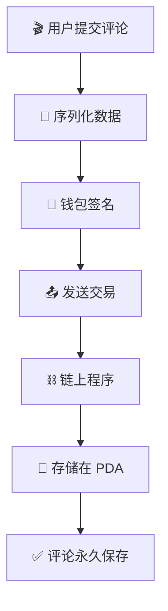
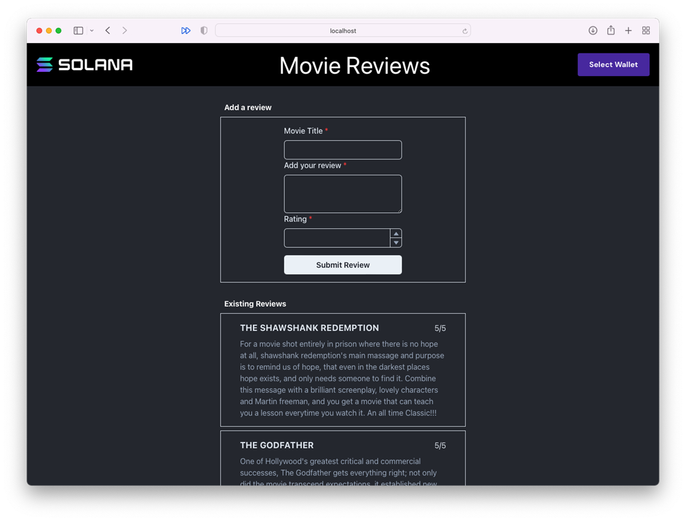
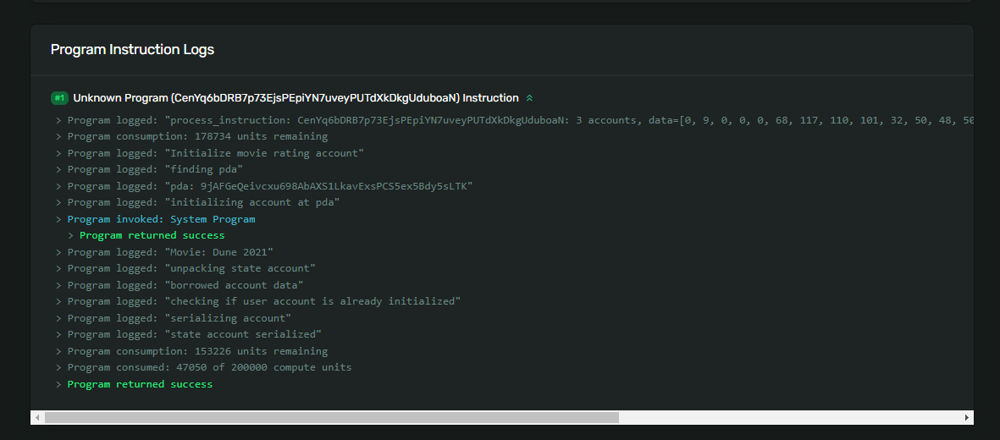
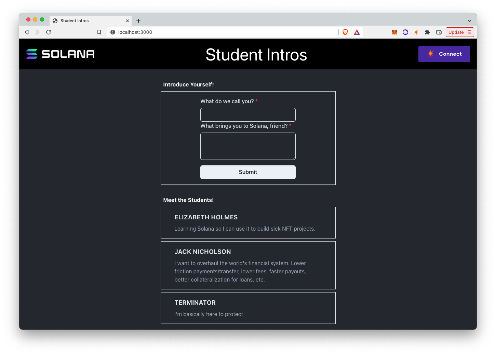

# 🎥 构建电影评论 DApp - 你的第一个完整应用！

## 🎯 项目目标

准备好构建你的**第一个完整的 Solana 应用**了吗？我们要创建一个去中心化的烂番茄！🍅

**你将构建什么：**
- 🎬 链上电影评论系统
- ⭐ 评分功能（1-5星）
- 💬 评论存储
- 👛 钱包集成
- 🔗 永久存储在区块链上

:::tip 🌟 为什么这个项目很酷？
- **实用性**：真实的应用场景
- **综合性**：涵盖所有核心概念
- **可扩展**：可以加入更多功能
- **炫耀性**：可以向朋友展示！
:::

## 🏗️ 项目架构概览

让我们先理解整个系统是如何工作的：



## 🚀 第一步：项目初始化

### 📦 克隆并设置项目

```bash
# 🎬 克隆电影评论项目
git clone https://github.com/all-in-one-solana/solana-movie-frontend.git

# 📁 进入项目目录
cd solana-movie-frontend

# 🌿 切换到起始分支
git checkout starter

# 📦 安装依赖
npm install

# 🏃 启动开发服务器
npm run dev
```

### 🎨 初始界面预览

访问 `http://localhost:3000`，你会看到：



:::info 💡 项目结构亮点
```
📦 solana-movie-frontend
├── 📁 components/
│   ├── 🎨 Form.tsx      # 评论表单（主战场）
│   ├── 🎬 MovieList.tsx  # 电影列表
│   └── 💳 AppBar.tsx     # 钱包连接
├── 📁 models/
│   └── 🎭 Movie.ts       # 数据模型（重点）
└── 📁 pages/
    └── 🏠 index.tsx      # 主页
```
:::

## 📊 第二步：定义数据结构

### 🛠️ 安装 Borsh 序列化库

```bash
# 安装 Borsh（我们的数据打包工具）
npm install @project-serum/borsh --force
```

### 🎭 创建 Movie 数据模型

打开 `models/Movie.ts`，让我们定义电影评论的数据结构：

```typescript
// 📁 models/Movie.ts

import * as borsh from '@project-serum/borsh'

export class Movie {
    title: string;        // 🎬 电影标题
    rating: number;       // ⭐ 评分 (1-5)
    description: string;  // 💬 评论内容

    constructor(title: string, rating: number, description: string) {
        this.title = title;
        this.rating = rating;
        this.description = description;
    }

    // 🎬 模拟数据 - 展示用
    static mocks: Movie[] = [
        new Movie(
            '肖申克的救赎',
            5,
            '希望让人自由！这部电影告诉我们，即使在最黑暗的地方，希望依然存在。'
        ),
        new Movie(
            '教父',
            5,
            '有史以来最伟大的黑帮电影，每一个镜头都是艺术。'
        ),
        // ... 更多模拟数据
    ]

    // 🗺️ Borsh 序列化模式 - 告诉程序如何解读我们的数据
    borshInstructionSchema = borsh.struct([
        borsh.u8('variant'),      // 指令类型（0 = 创建评论）
        borsh.str('title'),       // 电影标题
        borsh.u8('rating'),       // 评分（1-5）
        borsh.str('description'), // 评论内容
    ])

    // 📦 序列化方法 - 将数据打包成字节
    serialize(): Buffer {
        // 1️⃣ 创建缓冲区（像准备一个大箱子）
        const buffer = Buffer.alloc(1000)

        // 2️⃣ 编码数据（把东西装进箱子）
        this.borshInstructionSchema.encode(
            { ...this, variant: 0 },  // variant: 0 表示"创建评论"
            buffer
        )

        // 3️⃣ 裁剪多余空间（去掉箱子里的空气）
        return buffer.slice(0, this.borshInstructionSchema.getSpan(buffer))
    }
}
```

:::success 🎯 关键概念：序列化模式
序列化模式必须与链上程序期望的**完全匹配**！

```
程序期望：[variant, title, rating, description]
我们发送：[variant, title, rating, description] ✅

如果顺序错了：
我们发送：[title, variant, rating, description] ❌
程序会读取错误的数据！
```
:::

### 🎨 理解序列化过程

```
📝 原始数据（JavaScript 对象）
{
    variant: 0,
    title: "星际穿越",
    rating: 5,
    description: "视觉盛宴..."
}
    ↓ serialize()

📦 序列化后的字节数组
[00, 09, 00, 00, 00, E6, 98, 9F, E9, 99, 85, E7, A9, BF, E8, B6, 8A, 05, ...]
 ↑   ↑                    ↑                                      ↑
变体 标题长度              标题内容                              评分
```

## 🔗 第三步：创建交易

### 📝 更新 Form.tsx

现在让我们实现提交评论的功能：

```tsx
// 📁 components/Form.tsx

import { FC } from 'react'
import { Movie } from '../models/Movie'
import { useState } from 'react'
import * as web3 from '@solana/web3.js'
import { useConnection, useWallet } from '@solana/wallet-adapter-react'

// 🎬 电影评论程序的地址
const MOVIE_REVIEW_PROGRAM_ID = 'CenYq6bDRB7p73EjsPEpiYN7uveyPUTdXkDkgUduboaN'

export const Form: FC = () => {
    // 🪝 Hooks - 获取连接和钱包
    const { connection } = useConnection()
    const { publicKey, sendTransaction } = useWallet()

    // 📊 状态管理
    const [title, setTitle] = useState('')
    const [rating, setRating] = useState(0)
    const [description, setDescription] = useState('')
    const [loading, setLoading] = useState(false)

    // 🚀 处理交易提交
    const handleTransactionSubmit = async (movie: Movie) => {
        // 🔍 Step 1: 检查钱包连接
        if (!publicKey) {
            alert('🔌 请先连接钱包！')
            return
        }

        setLoading(true)
        console.log('🎬 准备提交评论...')

        try {
            // 📦 Step 2: 序列化电影数据
            const buffer = movie.serialize()
            console.log('📊 数据大小:', buffer.length, '字节')

            // 🏗️ Step 3: 创建交易
            const transaction = new web3.Transaction()

            // 🔑 Step 4: 生成 PDA（存储评论的地址）
            console.log('🔑 生成 PDA...')
            const [pda] = await web3.PublicKey.findProgramAddress(
                [
                    publicKey.toBuffer(),                    // 种子1: 用户地址
                    new TextEncoder().encode(movie.title)    // 种子2: 电影标题
                ],
                new web3.PublicKey(MOVIE_REVIEW_PROGRAM_ID)
            )
            console.log('📍 PDA 地址:', pda.toBase58())

            // 📝 Step 5: 创建指令
            const instruction = new web3.TransactionInstruction({
                // 🔑 账户列表
                keys: [
                    {
                        pubkey: publicKey,           // 用户账户
                        isSigner: true,              // 需要签名
                        isWritable: false            // 不修改
                    },
                    {
                        pubkey: pda,                 // 存储账户
                        isSigner: false,             // PDA 不能签名
                        isWritable: true             // 需要写入
                    },
                    {
                        pubkey: web3.SystemProgram.programId,  // 系统程序
                        isSigner: false,
                        isWritable: false
                    }
                ],

                // 📨 自定义数据！
                data: buffer,

                // 🎯 目标程序
                programId: new web3.PublicKey(MOVIE_REVIEW_PROGRAM_ID)
            })

            // ➕ Step 6: 添加指令到交易
            transaction.add(instruction)

            // 🚀 Step 7: 发送交易
            console.log('📤 发送交易...')
            const signature = await sendTransaction(transaction, connection)

            // ⏳ Step 8: 等待确认
            console.log('⏳ 等待确认...')
            await connection.confirmTransaction(signature)

            // ✅ Step 9: 成功！
            console.log('✅ 评论提交成功！')
            console.log(`🔍 查看交易: https://explorer.solana.com/tx/${signature}?cluster=devnet`)

            // 清空表单
            setTitle('')
            setRating(0)
            setDescription('')

            alert('🎉 评论提交成功！')

        } catch (error) {
            console.error('❌ 错误:', error)
            alert(`提交失败: ${error.message}`)
        } finally {
            setLoading(false)
        }
    }

    // 🎨 渲染表单
    return (
        <div className="movie-form">
            {/* 表单内容 */}
            <button
                onClick={() => handleTransactionSubmit(
                    new Movie(title, rating, description)
                )}
                disabled={loading}
            >
                {loading ? '⏳ 提交中...' : '🎬 提交评论'}
            </button>
        </div>
    )
}
```

### 🔑 理解 PDA（程序派生地址）

PDA 是 Solana 的独特概念，让我们用一个比喻理解：

```
🏦 传统方式：
用户 → 创建账户 → 存储数据
（需要私钥）

🔐 PDA 方式：
用户地址 + 电影标题 → 生成确定性地址 → 存储数据
（不需要私钥，由程序控制）
```

:::info 💡 PDA 的魔法
PDA 解决了"鸡生蛋"问题：
- 问题：需要地址才能发送交易，但账户还不存在
- 解决：使用确定性算法，预先计算出地址
- 结果：同样的种子总是生成同样的地址！

```typescript
// 同样的输入
种子1: 用户地址 "ABC..."
种子2: "星际穿越"
    ↓
// 总是得到同样的 PDA
PDA: "XYZ123..."
```
:::

## 🧪 第四步：测试你的应用

### 🎬 完整测试流程

```
1️⃣ 确保钱包在 Devnet
   设置 → 网络 → Devnet

2️⃣ 获取测试 SOL
   solana airdrop 2 <你的地址> --url devnet

3️⃣ 启动应用
   npm run dev

4️⃣ 连接钱包
   点击 "Connect Wallet"

5️⃣ 提交评论
   填写表单 → 点击提交

6️⃣ 查看结果
   Explorer 中查看交易
```

### 🔍 在 Explorer 查看

成功提交后，在 Explorer 中你会看到：



检查要点：
- ✅ 交易状态：Success
- ✅ 程序日志：显示电影标题
- ✅ 账户变化：PDA 被创建

## 🏆 挑战任务：Solana 开发者介绍系统

### 🎯 任务目标

创建一个让 Solana 开发者自我介绍的应用！



### 📋 任务要求

程序地址：`HdE95RSVsdb315jfJtaykXhXY478h53X6okDupVfY9yf`（Devnet）

数据结构：
1. `variant` (u8) - 指令类型，固定为 0
2. `name` (string) - 开发者名字
3. `message` (string) - 自我介绍

### 🚀 起始代码

```bash
git clone https://github.com/all-in-one-solana/solana-student-intros-frontend.git
cd solana-student-intros-frontend
git checkout starter
npm install
```

### 💡 实现提示

```typescript
// 数据模式
const IntroSchema = borsh.struct([
    borsh.u8('variant'),
    borsh.str('name'),
    borsh.str('message')
])

// PDA 生成（只使用公钥作为种子）
const [pda] = await web3.PublicKey.findProgramAddress(
    [publicKey.toBuffer()],
    programId
)
```

:::warning ⚠️ 注意事项
每个钱包地址只能提交一次介绍！重复提交会失败。
:::

## 🎊 恭喜完成！

你已经成功构建了一个**完整的 Solana DApp**！

### ✅ 你掌握了什么

- 📦 **数据序列化** - 使用 Borsh 打包数据
- 🔑 **PDA 生成** - 创建程序控制的账户
- 📤 **交易构建** - 发送复杂指令
- 💾 **链上存储** - 永久保存数据
- 🎨 **完整应用** - 前后端集成

### 🚀 可以扩展的功能

1. **显示所有评论** - 从链上读取并展示
2. **编辑功能** - 更新已有评论
3. **点赞系统** - 为评论点赞
4. **评论过滤** - 按评分筛选
5. **用户主页** - 显示用户所有评论

---

**你已经是真正的 Solana 开发者了！** 🎓
