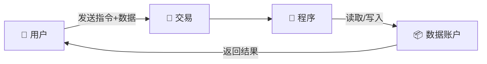
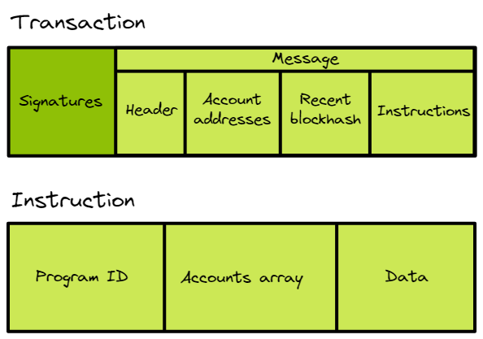
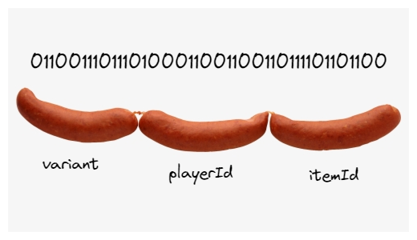

# 🤔 自定义指令 - 让程序听懂你的话！

## 🎯 学习目标

准备好让你的程序变得更智能了吗？今天我们要学习如何向程序发送**复杂数据**！🚀

你将掌握：
- 📦 理解 Solana 的数据格式
- 🔧 使用 Borsh 序列化数据
- 📨 发送自定义指令
- 🎮 构建真实应用场景

:::tip 🌟 为什么这很重要？
掌握自定义指令 = 解锁无限可能！
- 从简单的 "Ping" → 复杂的游戏逻辑
- 从固定操作 → 动态交互
- 从玩具项目 → 生产级应用
:::

## 🎭 第一章：理解 Solana 的独特架构

### 🏗️ 程序 vs 数据的分离哲学

让我们通过一个生动的比喻理解 Solana 的设计：

```
🏢 传统智能合约（如 Ethereum）
├── 📝 代码逻辑
└── 💾 存储数据
    → 所有东西都在一起（像一体机）

🏗️ Solana 架构
├── 🤖 程序账户（只有逻辑）
│   └── "我是计算器，只会算数"
└── 📦 数据账户（只有数据）
    └── "我存储所有的数字"
    → 分工明确（像专业团队）
```


:::info 💡 设计优势
**为什么要分离？**
- ⚡ **并行处理**：多个程序可同时读取同一程序
- 🔄 **可升级性**：升级程序不影响数据
- 💰 **成本效率**：只为需要的数据付费
- 🚀 **性能优化**：减少不必要的数据加载
:::

### 📊 数据流动示意



## 📧 第二章：指令数据的奥秘

### 🔢 什么是 8 位数据？

让我们用一个形象的比喻：

```
人类语言：         "装备剑"
     ↓ 翻译
计算机语言：    [01000101, 01110001, 01110101]
                    ↑         ↑         ↑
                  装备      剑ID     玩家ID
```

### 🎯 为什么要用字节数组？

| 方式 | 示例 | 传输大小 | 处理速度 |
|------|------|----------|----------|
| ❌ **JSON** | `{"action":"equip","item":123}` | 30 字节 | 慢（需解析） |
| ❌ **XML** | `<action>equip</action>` | 50 字节 | 更慢 |
| ✅ **字节数组** | `[0x01, 0x7B]` | 2 字节 | 极快！ |

:::success 🚀 性能对比
字节数组让 Solana 快 **100倍**！
- 无需解析 JSON
- 直接读取内存
- 最小传输开销
:::

### 📦 交易结构详解



```typescript
// 🎨 一个交易的完整画面
const transaction = {
    // 可以有多个指令（批量操作）
    instructions: [
        {
            programId: "游戏程序地址",     // 调用谁
            accounts: ["玩家", "物品库"],   // 涉及谁
            data: [0x01, 0x02, 0x03]       // 说什么
        },
        {
            programId: "代币程序地址",
            accounts: ["玩家钱包", "商店"],
            data: [0x04, 0x05]
        }
    ]
}
```

## 🔨 第三章：Borsh 序列化实战

### 🎯 什么是序列化？

序列化就像**打包行李** 🧳：

```
📦 打包过程（序列化）
原始数据 → 压缩 → 标准格式 → 字节数组

🎁 解包过程（反序列化）
字节数组 → 解析 → 还原 → 原始数据
```

### 🛠️ 安装 Borsh

```bash
# 安装 Borsh 库
npm install @project-serum/borsh
```

### 📝 实战示例：游戏装备系统

让我们创建一个完整的游戏装备系统：

```typescript
// 📁 gameInstructions.ts

import * as Borsh from "@project-serum/borsh";
import { Buffer } from "buffer";

// 🎮 Step 1: 定义指令类型
enum GameInstruction {
    EquipItem = 0,    // 装备物品
    UnequipItem = 1,  // 卸下物品
    UpgradeItem = 2,  // 升级物品
    TradeItem = 3     // 交易物品
}

// 📊 Step 2: 定义数据结构
interface EquipItemData {
    instruction: number;  // 指令类型
    playerId: number;     // 玩家 ID
    itemId: number;       // 物品 ID
    slot: number;         // 装备槽位
}

// 🗺️ Step 3: 创建序列化模式
const EquipItemSchema = Borsh.struct([
    Borsh.u8("instruction"),  // u8 = 无符号 8 位整数 (0-255)
    Borsh.u32("playerId"),    // u32 = 无符号 32 位整数
    Borsh.u32("itemId"),
    Borsh.u8("slot")
]);

// 🔧 Step 4: 序列化函数
export function createEquipInstruction(
    playerId: number,
    itemId: number,
    slot: number
): Buffer {
    // 📦 准备数据
    const data: EquipItemData = {
        instruction: GameInstruction.EquipItem,
        playerId,
        itemId,
        slot
    };

    // 🎯 创建缓冲区（预留足够空间）
    const buffer = Buffer.alloc(100);
    console.log("📏 初始缓冲区大小:", buffer.length);

    // 🔨 编码数据
    EquipItemSchema.encode(data, buffer);

    // ✂️ 裁剪到实际大小
    const instructionBuffer = buffer.slice(
        0,
        EquipItemSchema.getSpan(buffer)
    );
    console.log("✅ 最终数据大小:", instructionBuffer.length);
    console.log("📊 数据内容:", instructionBuffer.toString('hex'));

    return instructionBuffer;
}

// 🎯 使用示例
const equipData = createEquipInstruction(
    1001,  // 玩家 ID
    5678,  // 物品 ID (比如：炎魔剑)
    2      // 装备槽 (比如：主手)
);
```

### 🎨 可视化序列化过程

```
原始数据：
{
    instruction: 0,    // EquipItem
    playerId: 1001,
    itemId: 5678,
    slot: 2
}
    ↓ Borsh.encode()

字节数组（十六进制）：
[00] [E9 03 00 00] [2E 16 00 00] [02]
 ↑        ↑            ↑          ↑
指令   玩家ID        物品ID      槽位

就像切香肠一样精确！🌭
```



## 💻 第四章：完整实战 - 发送自定义指令

### 🎮 构建游戏交易

```typescript
// 📁 sendGameTransaction.ts

import {
    Connection,
    Transaction,
    TransactionInstruction,
    PublicKey,
    sendAndConfirmTransaction,
    Keypair,
    clusterApiUrl
} from '@solana/web3.js';
import { createEquipInstruction } from './gameInstructions';

// 🎯 游戏程序 ID（示例）
const GAME_PROGRAM_ID = new PublicKey(
    "GameProgramID111111111111111111111111111111"
);

async function equipItemTransaction() {
    console.log("🎮 开始装备物品...");

    // 🌐 Step 1: 连接网络
    const connection = new Connection(
        clusterApiUrl('devnet'),
        'confirmed'
    );

    // 🔑 Step 2: 准备账户
    const player = Keypair.generate();  // 实际中从钱包获取
    const playerDataAccount = new PublicKey("玩家数据账户");
    const itemDataAccount = new PublicKey("物品数据账户");
    const gameStateAccount = new PublicKey("游戏状态账户");

    // 📦 Step 3: 创建指令数据
    const instructionData = createEquipInstruction(
        1001,  // 玩家 ID
        5678,  // 炎魔剑 ID
        2      // 主手槽位
    );

    // 🏗️ Step 4: 构建指令
    const instruction = new TransactionInstruction({
        programId: GAME_PROGRAM_ID,

        // 🔑 账户列表（顺序很重要！）
        keys: [
            {
                pubkey: player.publicKey,
                isSigner: true,      // 玩家需要签名
                isWritable: false    // 不修改玩家账户
            },
            {
                pubkey: playerDataAccount,
                isSigner: false,     // 数据账户不签名
                isWritable: true     // 需要写入装备信息
            },
            {
                pubkey: itemDataAccount,
                isSigner: false,
                isWritable: true     // 更新物品状态
            },
            {
                pubkey: gameStateAccount,
                isSigner: false,
                isWritable: true     // 更新游戏状态
            }
        ],

        // 📨 自定义数据！
        data: instructionData
    });

    // 📮 Step 5: 创建交易
    const transaction = new Transaction().add(instruction);

    console.log("📤 发送交易...");
    console.log("📊 数据大小:", instructionData.length, "字节");

    try {
        // 🚀 Step 6: 发送并确认
        const signature = await sendAndConfirmTransaction(
            connection,
            transaction,
            [player]  // 签名者
        );

        console.log("✅ 装备成功！");
        console.log("🔗 交易签名:", signature);
        console.log(`🔍 查看: https://explorer.solana.com/tx/${signature}?cluster=devnet`);

        return signature;

    } catch (error) {
        console.error("❌ 装备失败:", error);
        throw error;
    }
}

// 🎮 执行
equipItemTransaction().then(sig => {
    console.log("🎊 游戏操作完成！");
}).catch(err => {
    console.error("😢 游戏操作失败:", err);
});
```

### 🎨 前端集成示例

```tsx
// 📁 components/GameActions.tsx

import { useWallet, useConnection } from '@solana/wallet-adapter-react';
import { createEquipInstruction } from '../utils/gameInstructions';

export function GameActions() {
    const { publicKey, sendTransaction } = useWallet();
    const { connection } = useConnection();
    const [loading, setLoading] = useState(false);

    const handleEquipItem = async (itemId: number, slot: number) => {
        if (!publicKey) {
            alert("请先连接钱包！");
            return;
        }

        setLoading(true);

        try {
            // 创建指令数据
            const data = createEquipInstruction(
                12345,  // 玩家 ID（从游戏状态获取）
                itemId,
                slot
            );

            // 构建交易
            const transaction = new Transaction().add(
                new TransactionInstruction({
                    programId: GAME_PROGRAM_ID,
                    keys: [/* ... */],
                    data
                })
            );

            // 发送交易
            const signature = await sendTransaction(
                transaction,
                connection
            );

            // 等待确认
            await connection.confirmTransaction(signature);

            alert(`✅ 装备成功！物品 ${itemId} 已装备到槽位 ${slot}`);

        } catch (error) {
            alert(`❌ 装备失败: ${error.message}`);
        } finally {
            setLoading(false);
        }
    };

    return (
        <div className="game-inventory">
            <h2>🎒 背包物品</h2>

            <div className="items-grid">
                <button
                    onClick={() => handleEquipItem(5678, 2)}
                    disabled={loading}
                >
                    ⚔️ 装备炎魔剑
                </button>

                <button
                    onClick={() => handleEquipItem(9012, 3)}
                    disabled={loading}
                >
                    🛡️ 装备圣盾
                </button>
            </div>

            {loading && <p>⏳ 处理中...</p>}
        </div>
    );
}
```

## 🏆 挑战任务：构建消息板应用

### 🎯 任务目标

创建一个链上消息板，支持：
1. 📝 发布消息（包含作者、内容、时间戳）
2. ❤️ 点赞消息
3. 💬 回复消息

### 📊 数据结构设计

```typescript
// 消息指令类型
enum MessageInstruction {
    PostMessage = 0,
    LikeMessage = 1,
    ReplyMessage = 2
}

// 发布消息的数据
interface PostMessageData {
    instruction: number;
    content: string;      // 消息内容（最多 280 字符）
    timestamp: number;    // 时间戳
}

// 创建序列化模式
const PostMessageSchema = Borsh.struct([
    Borsh.u8("instruction"),
    Borsh.str("content"),     // 字符串类型
    Borsh.u64("timestamp")    // 64 位时间戳
]);
```

### 💡 实现提示

1. **字符串处理**：Borsh 的 `str` 类型会自动处理长度
2. **时间戳**：使用 `Date.now()` 获取
3. **账户设计**：考虑如何存储消息和用户数据

## 📚 深入理解

### 🎯 Borsh 数据类型速查

| 类型 | 说明 | 字节数 | 范围 |
|------|------|--------|------|
| `u8` | 无符号 8 位 | 1 | 0-255 |
| `u16` | 无符号 16 位 | 2 | 0-65,535 |
| `u32` | 无符号 32 位 | 4 | 0-4,294,967,295 |
| `u64` | 无符号 64 位 | 8 | 很大！ |
| `i8` | 有符号 8 位 | 1 | -128 到 127 |
| `bool` | 布尔值 | 1 | true/false |
| `str` | 字符串 | 可变 | UTF-8 编码 |
| `[u8; N]` | 固定数组 | N | N 个字节 |

### 🔍 调试技巧

```typescript
// 🔍 查看序列化数据
function debugBuffer(buffer: Buffer, label: string) {
    console.log(`\n=== ${label} ===`);
    console.log("长度:", buffer.length, "字节");
    console.log("十六进制:", buffer.toString('hex'));
    console.log("字节数组:", Array.from(buffer));
    console.log("===============\n");
}

// 使用
const data = createEquipInstruction(1001, 5678, 2);
debugBuffer(data, "装备指令数据");
```

### ⚠️ 常见陷阱和解决方案

| 问题 | 原因 | 解决方案 |
|------|------|----------|
| "缓冲区溢出" | 分配空间不足 | 增加 `Buffer.alloc()` 大小 |
| "无效指令" | 数据格式错误 | 检查模式定义顺序 |
| "账户不匹配" | 账户顺序错误 | 确认程序期望的顺序 |
| "序列化失败" | 数据类型不匹配 | 使用正确的 Borsh 类型 |

## 🎊 总结

恭喜你掌握了自定义指令！你现在可以：

✅ **理解数据格式** - 知道为什么用字节数组
✅ **使用 Borsh** - 序列化各种数据类型
✅ **发送复杂指令** - 不再局限于简单操作
✅ **构建真实应用** - 游戏、DeFi、社交等

### 🚀 你的能力升级了！

```
之前：只能 Ping 一下 😅
现在：可以构建完整应用！🚀

从 $10,000 项目 → $10,000,000 项目！
```

---

**下一步：学习如何在 Solana 程序中处理这些自定义指令！** 🎯
