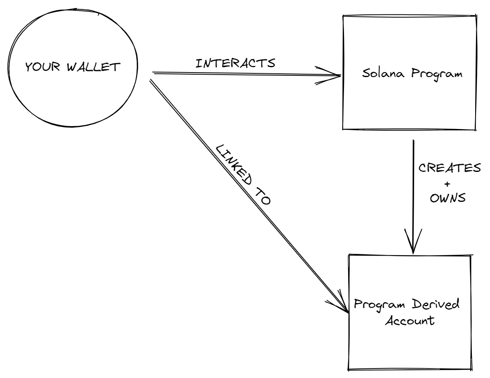
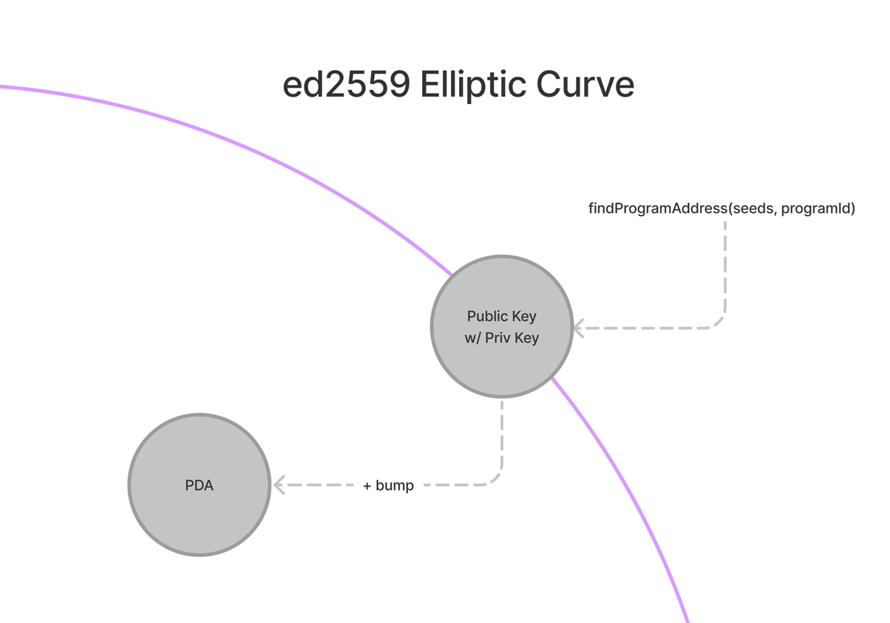
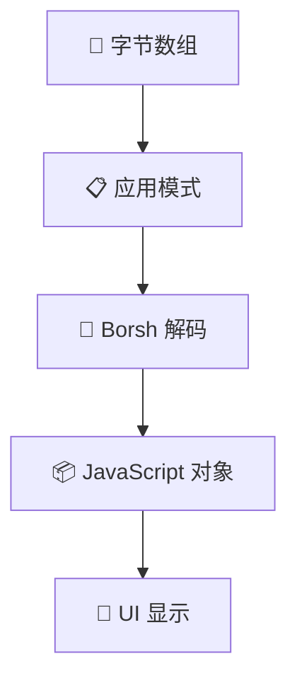

# 📡 反序列化 - 解读链上数据的艺术！

## 🎯 学习目标

上一节我们学会了**写入**数据，现在要学习**读取**数据了！就像学会写信后，也要学会读信 📮

你将掌握：
- 🔑 深入理解 PDA（程序派生地址）
- 📖 从链上读取自定义数据
- 🔄 反序列化字节数据
- 🎬 显示所有电影评论

:::tip 🌟 为什么反序列化很重要？
写入数据 = 发送信息 📤
读取数据 = 接收信息 📥
**两者结合 = 完整的通信！** 🔄
:::

## 🗝️ 第一章：理解 PDA - Solana 的魔法地址

### 🎭 什么是 PDA？

让我们用一个生动的比喻理解 PDA：

```
🏦 传统账户（像个人银行账户）
├── 📮 公钥（账号）
├── 🔑 私钥（密码）
└── 💰 可以自主控制

🎯 PDA（像公司保险箱）
├── 📮 地址（保险箱编号）
├── ❌ 没有私钥（没有钥匙）
└── 🤖 只能由程序控制（只有程序能打开）
```

:::info 💡 PDA 的独特之处
**PDA = Program Derived Address（程序派生地址）**

它们是"假账户"：
- ✅ 有地址，可以存储数据
- ❌ 没有私钥，不能签名
- 🤖 完全由创建它的程序控制
- 🔒 极其安全（没人能偷走控制权）
:::

### 🎲 PDA 的生成机制



```typescript
// 🎯 PDA 生成的魔法公式
const [pda, bump] = await PublicKey.findProgramAddress(
    seeds,      // 🌱 种子（输入）
    programId   // 🏭 程序 ID
);

// 神奇的地方：相同的输入总是得到相同的输出！
```

### 📊 Ed25519 曲线的秘密



```
普通地址：在曲线上 ✅ → 有私钥 🔑
PDA 地址：不在曲线上 ❌ → 没有私钥 🚫

如果生成的地址碰巧在曲线上怎么办？
加个 bump！把它"撞"出曲线 💥
```

:::success 🎯 关键理解
你不需要成为密码学专家！只需记住：
- PDA = 没有私钥的特殊地址
- 由程序完全控制
- 用于安全存储数据
:::

### 🗃️ PDA 作为数据库

PDA 就像 Solana 的**键值数据库**：

```typescript
// 🌍 全局状态示例（一个程序一个）
const [globalPda] = await PublicKey.findProgramAddress(
    [Buffer.from("GLOBAL_STATE")],  // 固定种子
    programId
);

// 👤 用户特定数据（每个用户一个）
const [userPda] = await PublicKey.findProgramAddress(
    [userPublicKey.toBuffer()],     // 用户地址作为种子
    programId
);

// 📝 用户笔记系统（用户+标题的组合）
const [notePda] = await PublicKey.findProgramAddress(
    [
        userPublicKey.toBuffer(),
        Buffer.from("My First Note")  // 笔记标题
    ],
    programId
);
```

## 🔄 第二章：反序列化 - 解码的艺术

### 📖 什么是反序列化？

反序列化就像**解密摩斯电码** 📡：

```
链上数据（字节）：[01001000 01101001 00100001]
        ↓ 反序列化
应用数据（对象）：{ message: "Hi!" }
```

### 🎨 反序列化流程图



### 🏗️ 账户数据结构回顾

```typescript
// 🎯 Solana 账户的标准结构
interface AccountInfo {
    lamports: number;      // 💰 余额
    owner: PublicKey;      // 👤 所有者程序
    executable: boolean;   // 🎮 是否可执行
    data: Buffer;         // 📦 原始数据（我们要解码的）
    rentEpoch: number;    // 📅 租金周期
}
```

## 💻 第三章：构建反序列化器

### 🚀 项目设置

```bash
# 选项 1：继续上一节的项目（推荐）
cd solana-movie-frontend

# 选项 2：克隆完成的版本
git clone https://github.com/all-in-one-solana/solana-movie-frontend.git
cd solana-movie-frontend
git checkout solution-serialize-instruction-data
npm install
```

### 🎬 更新 Movie 模型

打开 `models/Movie.ts`，添加反序列化功能：

```typescript
// 📁 models/Movie.ts

import * as borsh from '@project-serum/borsh'

export class Movie {
    title: string;
    rating: number;
    description: string;

    constructor(title: string, rating: number, description: string) {
        this.title = title;
        this.rating = rating;
        this.description = description;
    }

    // 🗺️ 账户数据的模式（注意顺序！）
    static borshAccountSchema = borsh.struct([
        borsh.bool('initialized'),    // 是否已初始化
        borsh.u8('rating'),           // 评分（1-5）
        borsh.str('title'),           // 电影标题
        borsh.str('description'),     // 评论内容
    ])

    // 🔄 反序列化方法 - 字节变对象的魔法！
    static deserialize(buffer?: Buffer): Movie | null {
        // 🔍 Step 1: 检查是否有数据
        if (!buffer) {
            console.log('⚠️ 没有数据可以反序列化');
            return null;
        }

        try {
            // 📦 Step 2: 使用 Borsh 解码
            console.log('🔄 开始反序列化...');
            console.log('📊 数据大小:', buffer.length, '字节');

            const decodedData = this.borshAccountSchema.decode(buffer);
            console.log('✅ 解码成功:', decodedData);

            // 🎬 Step 3: 创建 Movie 对象
            const { title, rating, description } = decodedData;

            // 验证数据
            if (!title || rating === undefined || !description) {
                console.log('⚠️ 数据不完整');
                return null;
            }

            const movie = new Movie(title, rating, description);
            console.log('🎬 创建电影对象:', movie);

            return movie;

        } catch (error) {
            // ❌ 解码失败（可能不是电影数据）
            console.log('❌ 反序列化错误:', error);
            return null;
        }
    }

    // 🎨 用于显示的辅助方法
    getStars(): string {
        return '⭐'.repeat(this.rating);
    }

    getSummary(): string {
        return this.description.length > 100
            ? this.description.substring(0, 100) + '...'
            : this.description;
    }
}
```

### 📋 创建 MovieList 组件

更新 `components/MovieList.tsx`，从链上获取所有电影：

```typescript
// 📁 components/MovieList.tsx

import { Card } from './Card'
import { FC, useEffect, useState } from 'react'
import { Movie } from '../models/Movie'
import * as web3 from '@solana/web3.js'
import { useConnection } from '@solana/wallet-adapter-react'

// 🎬 电影评论程序 ID
const MOVIE_REVIEW_PROGRAM_ID = 'CenYq6bDRB7p73EjsPEpiYN7uveyPUTdXkDkgUduboaN'

export const MovieList: FC = () => {
    // 🔗 获取连接
    const { connection } = useConnection();

    // 🎬 状态：存储电影列表
    const [movies, setMovies] = useState<Movie[]>([]);
    const [loading, setLoading] = useState(true);
    const [error, setError] = useState<string | null>(null);

    useEffect(() => {
        loadMovies();
    }, []);

    // 🚀 加载所有电影评论
    const loadMovies = async () => {
        try {
            setLoading(true);
            setError(null);
            console.log('🔍 开始加载电影评论...');

            // 📡 Step 1: 获取程序的所有账户
            const programId = new web3.PublicKey(MOVIE_REVIEW_PROGRAM_ID);
            console.log('📍 程序 ID:', programId.toBase58());

            const accounts = await connection.getProgramAccounts(programId, {
                // 可选：添加过滤器以优化性能
                dataSlice: {
                    offset: 0,
                    length: 1000  // 只获取前 1000 字节
                }
            });

            console.log(`📊 找到 ${accounts.length} 个账户`);

            // 🔄 Step 2: 反序列化每个账户
            const movieList: Movie[] = [];

            for (const { pubkey, account } of accounts) {
                console.log(`\n🔍 处理账户: ${pubkey.toBase58()}`);

                // 尝试反序列化
                const movie = Movie.deserialize(account.data);

                if (movie) {
                    console.log(`✅ 成功解析: ${movie.title}`);
                    movieList.push(movie);
                } else {
                    console.log(`⏭️ 跳过账户（非电影数据）`);
                }
            }

            // 🎨 Step 3: 排序（评分高的在前）
            movieList.sort((a, b) => b.rating - a.rating);

            console.log(`\n🎬 总共加载了 ${movieList.length} 个电影评论`);
            setMovies(movieList);

        } catch (err) {
            console.error('❌ 加载失败:', err);
            setError('加载电影评论失败，请刷新重试');
        } finally {
            setLoading(false);
        }
    };

    // 🎨 渲染 UI
    if (loading) {
        return (
            <div className="loading-container">
                <h2>⏳ 正在加载电影评论...</h2>
                <div className="spinner">🎬</div>
            </div>
        );
    }

    if (error) {
        return (
            <div className="error-container">
                <h2>❌ 出错了</h2>
                <p>{error}</p>
                <button onClick={loadMovies}>🔄 重试</button>
            </div>
        );
    }

    if (movies.length === 0) {
        return (
            <div className="empty-container">
                <h2>📭 还没有电影评论</h2>
                <p>成为第一个评论者吧！</p>
            </div>
        );
    }

    return (
        <div className="movie-grid">
            <h2>🎬 所有电影评论 ({movies.length})</h2>
            <div className="movies-container">
                {movies.map((movie, index) => (
                    <Card key={index} movie={movie} />
                ))}
            </div>
        </div>
    );
};
```

### 🎨 理解 reduce 方法（高级版本）

如果你想使用更函数式的方法：

```typescript
// 🎯 使用 reduce 的优雅版本
const movies: Movie[] = accounts.reduce(
    (accumulator: Movie[], { pubkey, account }) => {
        // 尝试反序列化
        const movie = Movie.deserialize(account.data);

        // 如果成功，添加到数组
        return movie
            ? [...accumulator, movie]
            : accumulator;
    },
    []  // 初始值：空数组
);
```

### 🔍 优化：使用过滤器

对于生产环境，使用过滤器提高性能：

```typescript
// 🚀 只获取已初始化的账户
const accounts = await connection.getProgramAccounts(programId, {
    filters: [
        {
            memcmp: {
                offset: 0,     // 检查第一个字节
                bytes: '2'     // 2 = true (已初始化)
            }
        }
    ]
});
```

## 🧪 第四章：测试你的应用

### 🎮 完整测试流程

```bash
# 1️⃣ 启动应用
npm run dev

# 2️⃣ 访问
http://localhost:3000

# 3️⃣ 你应该看到：
# - 之前提交的所有评论
# - 按评分排序
# - 完整的电影信息
```

### 🔍 调试技巧

```typescript
// 🐛 添加详细日志
console.group('🎬 电影数据');
console.log('标题:', movie.title);
console.log('评分:', movie.rating);
console.log('描述:', movie.description.substring(0, 50) + '...');
console.groupEnd();
```

## 🏆 挑战任务：Student Intros 反序列化

### 🎯 任务目标

完成 Student Intros 应用的读取功能！

程序地址：`HdE95RSVsdb315jfJtaykXhXY478h53X6okDupVfY9yf`

### 📊 数据结构

```typescript
// Student 账户数据结构
{
    initialized: boolean;  // 是否初始化
    name: string;         // 学生姓名
    message: string;      // 介绍信息
}
```

### 💡 实现步骤

#### Step 1: 创建 StudentIntro 模型

```typescript
// 📁 models/StudentIntro.ts

export class StudentIntro {
    name: string;
    message: string;

    static borshAccountSchema = borsh.struct([
        borsh.bool('initialized'),
        borsh.str('name'),
        borsh.str('message'),
    ]);

    static deserialize(buffer?: Buffer): StudentIntro | null {
        // 实现反序列化逻辑
    }
}
```

#### Step 2: 创建列表组件

```typescript
// 📁 components/StudentIntroList.tsx

const loadStudentIntros = async () => {
    const accounts = await connection.getProgramAccounts(programId);
    // 反序列化并显示
};
```

### 🏅 成功标准

- ✅ 显示所有学生介绍
- ✅ 正确反序列化数据
- ✅ 优雅的错误处理
- ✅ 加载状态显示

## 📚 深入理解

### 🎯 getProgramAccounts 的注意事项

:::warning ⚠️ 性能警告
`getProgramAccounts` 是重量级操作！
- 可能返回大量数据
- 消耗大量 RPC 资源
- 在生产环境谨慎使用

**最佳实践：**
- 使用过滤器限制结果
- 实现分页
- 考虑使用索引服务
:::

### 🔍 反序列化失败的常见原因

| 问题 | 原因 | 解决方案 |
|------|------|----------|
| "无效的字节" | 模式不匹配 | 检查字段顺序 |
| "缓冲区太短" | 数据不完整 | 验证数据完整性 |
| "未知账户" | 非目标数据 | 添加类型检查 |

## 🎊 恭喜完成！

你已经掌握了完整的数据循环：

✅ **写入数据** - 序列化并发送
✅ **存储位置** - 理解 PDA
✅ **读取数据** - 获取并反序列化
✅ **展示数据** - 在 UI 中显示

### 🚀 你的技能树

```
之前：只能发送简单交易 😅
现在：可以构建完整的读写应用！🚀

从单向通信 → 双向数据流！
```

---

**下一步：学习更高级的 Solana 开发模式！** 🎯
