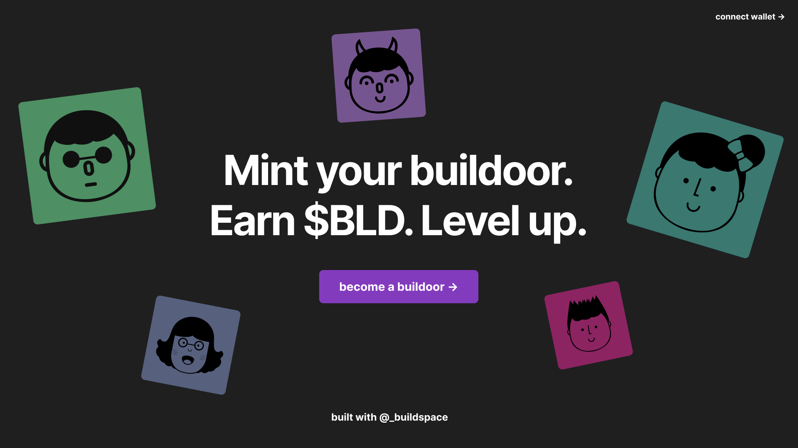
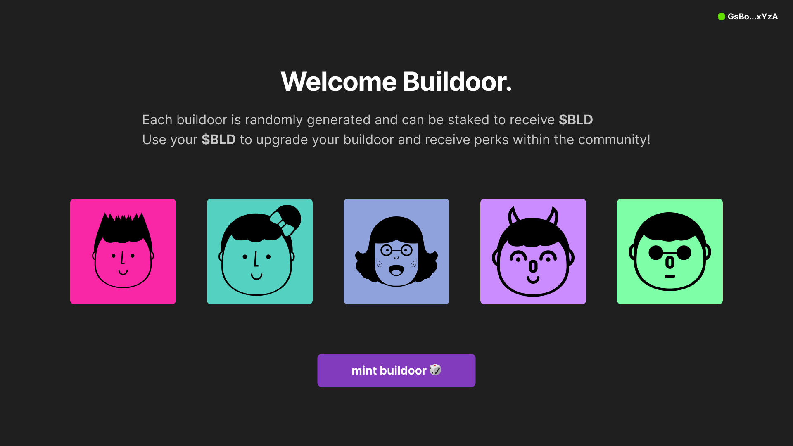

# 💻 构建 NFT 铸造前端 - 打造你的 Buildoor！

## 🎯 项目目标

欢迎来到**第一周挑战**！今天我们要构建一个超酷的 NFT 铸造应用 🎨

你将创建什么：
- 🎨 精美的登录页面
- 👛 钱包连接功能
- 🖼️ NFT 展示界面
- 🎮 铸造按钮（下周实现功能）

:::tip 🌟 为什么这个项目很重要？
这不仅仅是一个练习项目！你将：
- 🚀 走出本地环境，构建真实应用
- 🌍 创建可以分享给朋友的作品
- 💡 学习现代 Web3 开发流程
- 🏆 获得战利品箱奖励！
:::

## 🎨 最终效果预览

### 🏠 登录页面（未连接钱包）


### 🎮 铸造页面（已连接钱包）


## 🚀 第一步：项目初始化

### 🛠️ 创建 Next.js 项目

让我们从零开始，没有模板！纯手工打造 💪

```bash
# 🎬 创建 Next.js 应用（TypeScript 版本）
npx create-next-app buildoor-nft --typescript

# 📁 进入项目目录
cd buildoor-nft

# 🎨 安装 UI 框架 - Chakra UI
npm i @chakra-ui/react @emotion/react@^11 @emotion/styled@^11 framer-motion@^10 @chakra-ui/icons

# 👛 安装 Solana 钱包适配器
npm i @solana/wallet-adapter-base \
      @solana/wallet-adapter-react \
      @solana/wallet-adapter-react-ui \
      @solana/wallet-adapter-wallets \
      @solana/web3.js
```

:::info 💡 技术栈说明
- **Next.js**: React 框架，支持 SSR
- **TypeScript**: 类型安全，减少 bug
- **Chakra UI**: 现代化 UI 组件库
- **Solana Wallet Adapter**: 钱包连接解决方案
:::

### 🎨 添加视觉资源

下载资源包并放入 `public` 文件夹：

```bash
# 📦 资源包包含：
public/
├── 👤 avatar1.png  # NFT 角色 1
├── 👤 avatar2.png  # NFT 角色 2
├── 👤 avatar3.png  # NFT 角色 3
├── 👤 avatar4.png  # NFT 角色 4
├── 👤 avatar5.png  # NFT 角色 5
└── 🌌 home-background.svg  # 背景图
```

[📥 下载资源包](https://cdn.disco.co/media%2FAssets_a68f5cab-20c9-45c7-b25c-43bc9dcd9e7d.zip)

## 🎨 第二步：配置 Chakra UI

### 🎯 设置主题和颜色

打开 `pages/_app.tsx`，让我们创建一个暗黑风格的主题：

```tsx
// 📁 pages/_app.tsx

import type { AppProps } from "next/app"
import { ChakraProvider, extendTheme } from "@chakra-ui/react"

// 🎨 自定义颜色主题
const colors = {
  background: "#1F1F1F",     // 深色背景
  accent: "#833BBE",         // 紫色强调色
  bodyText: "rgba(255, 255, 255, 0.75)",  // 半透明白色文字
}

// 🎯 扩展默认主题
const theme = extendTheme({ colors })

function MyApp({ Component, pageProps }: AppProps) {
  return (
    <ChakraProvider theme={theme}>
      <Component {...pageProps} />
    </ChakraProvider>
  )
}

export default MyApp
```

:::tip 🎨 自定义你的主题
你可以修改颜色来创建独特的风格：
- `background`: 尝试 `#0A0A0A`（纯黑）或 `#1A1A2E`（深蓝）
- `accent`: 尝试 `#00D9FF`（青色）或 `#FF006E`（粉色）
- 添加更多颜色：`success`, `warning`, `error` 等
:::

### 🎯 全局样式设置

更新 `styles/Home.module.css`：

```css
/* 📁 styles/Home.module.css */

.container {
  background: #1F1F1F;
  min-height: 100vh;
  background-image: linear-gradient(
    135deg,
    #667eea 0%,
    #764ba2 100%
  );
}

/* 💜 钱包按钮样式 */
.wallet-adapter-button-trigger {
  background-color: #833BBE !important;
  border: none !important;
  border-radius: 12px !important;
  font-weight: bold !important;
  transition: all 0.3s ease !important;
}

.wallet-adapter-button-trigger:hover {
  transform: scale(1.05) !important;
  box-shadow: 0 10px 20px rgba(131, 59, 190, 0.4) !important;
}
```

## 🏗️ 第三步：构建主页面结构

### 🎯 创建页面骨架

更新 `pages/index.tsx`：

```tsx
// 📁 pages/index.tsx

import { Box, Center, Spacer, Stack } from "@chakra-ui/react"
import type { NextPage } from "next"
import Head from "next/head"
import styles from "../styles/Home.module.css"

const Home: NextPage = () => {
  return (
    <div className={styles.container}>
      <Head>
        <title>Buildoors NFT | 打造你的 Web3 身份</title>
        <meta name="description" content="最酷的 NFT 收藏品" />
        <link rel="icon" href="/favicon.ico" />
      </Head>

      <Box
        w="full"
        h="100vh"
        bgImage="url(/home-background.svg)"
        backgroundPosition="center"
        backgroundSize="cover"
        backgroundRepeat="no-repeat"
      >
        <Stack w="full" h="100vh" justify="center">
          {/* 🎯 导航栏位置 */}

          <Spacer />

          <Center>
            {/* 🎮 主要内容区域 */}
          </Center>

          <Spacer />

          <Center>
            <Box marginBottom={4} color="white">
              <a
                href="https://twitter.com/_buildspace"
                target="_blank"
                rel="noopener noreferrer"
                style={{ textDecoration: 'none' }}
              >
                🚀 与 @_buildspace 一同打造
              </a>
            </Box>
          </Center>
        </Stack>
      </Box>
    </div>
  )
}

export default Home
```

## 🎯 第四步：创建导航栏组件

### 📍 NavBar 组件

创建 `components/NavBar.tsx`：

```tsx
// 📁 components/NavBar.tsx

import { HStack, Spacer, Image } from "@chakra-ui/react"
import { FC } from "react"
import styles from "../styles/Home.module.css"
import dynamic from "next/dynamic"

// 🎯 动态导入钱包按钮（避免 SSR 问题）
const WalletMultiButtonDynamic = dynamic(
  async () =>
    (await import("@solana/wallet-adapter-react-ui")).WalletMultiButton,
  { ssr: false }
)

const NavBar: FC = () => {
  return (
    <HStack
      width="full"
      padding={4}
      position="fixed"
      top={0}
      zIndex={999}
      backdropFilter="blur(10px)"
      backgroundColor="rgba(31, 31, 31, 0.8)"
    >
      {/* 🎨 Logo 区域 */}
      <HStack spacing={2}>
        <Image src="/logo.png" alt="Logo" height="40px" />
        <Text fontSize="xl" fontWeight="bold" color="white">
          Buildoors
        </Text>
      </HStack>

      <Spacer />

      {/* 👛 钱包连接按钮 */}
      <WalletMultiButtonDynamic
        className={styles["wallet-adapter-button-trigger"]}
      />
    </HStack>
  )
}

export default NavBar
```

:::info 💡 动态导入解释
使用 `dynamic` 导入是因为：
- Next.js 是服务端渲染（SSR）
- 钱包适配器需要浏览器 API（如 `window`）
- `{ ssr: false }` 禁用服务端渲染
:::

## 🏠 第五步：创建登录页面

### 🎯 Disconnected 组件

创建 `components/Disconnected.tsx`：

```tsx
// 📁 components/Disconnected.tsx

import { FC, MouseEventHandler, useCallback } from "react"
import {
  Button,
  Container,
  Heading,
  HStack,
  Text,
  VStack,
  Box,
  keyframes,
} from "@chakra-ui/react"
import { ArrowForwardIcon } from "@chakra-ui/icons"

// 🎨 创建动画
const glow = keyframes`
  0% { box-shadow: 0 0 5px #833BBE; }
  50% { box-shadow: 0 0 20px #833BBE, 0 0 30px #833BBE; }
  100% { box-shadow: 0 0 5px #833BBE; }
`

const Disconnected: FC = () => {
  const handleClick: MouseEventHandler<HTMLButtonElement> = useCallback(
    (event) => {
      if (event.defaultPrevented) return
      // 钱包连接逻辑（稍后实现）
    },
    []
  )

  return (
    <Container maxW="container.md">
      <VStack spacing={20}>
        <VStack spacing={8}>
          {/* 🎯 主标题 */}
          <Heading
            color="white"
            as="h1"
            size="4xl"
            noOfLines={2}
            textAlign="center"
            bgGradient="linear(to-r, #833BBE, #FF006E)"
            bgClip="text"
            animation={`${glow} 2s ease-in-out infinite`}
          >
            打造你的 Buildoor
          </Heading>

          {/* 📝 副标题 */}
          <Heading
            color="white"
            as="h2"
            size="xl"
            textAlign="center"
            opacity={0.8}
          >
            赚取 $BLD • 升级装备 • 解锁特权
          </Heading>
        </VStack>

        {/* 🔮 特性展示 */}
        <HStack spacing={8} justify="center">
          <VStack>
            <Text fontSize="3xl">🎨</Text>
            <Text color="white">独特设计</Text>
          </VStack>
          <VStack>
            <Text fontSize="3xl">💎</Text>
            <Text color="white">稀有属性</Text>
          </VStack>
          <VStack>
            <Text fontSize="3xl">🚀</Text>
            <Text color="white">社区特权</Text>
          </VStack>
        </HStack>

        {/* 🎮 行动按钮 */}
        <Button
          bgColor="accent"
          color="white"
          size="lg"
          onClick={handleClick}
          _hover={{
            transform: "scale(1.05)",
            boxShadow: "0 0 30px #833BBE",
          }}
          transition="all 0.3s"
          borderRadius="full"
          px={8}
          py={6}
        >
          <HStack spacing={3}>
            <Text fontSize="lg">成为 Buildoor</Text>
            <ArrowForwardIcon boxSize={5} />
          </HStack>
        </Button>
      </VStack>
    </Container>
  )
}

export default Disconnected
```

## 🎮 第六步：创建已连接视图

### 🎯 Connected 组件

创建 `components/Connected.tsx`：

```tsx
// 📁 components/Connected.tsx

import { FC } from "react"
import {
  Button,
  Container,
  Heading,
  HStack,
  Text,
  VStack,
  Image,
  SimpleGrid,
  Box,
} from "@chakra-ui/react"
import { ArrowForwardIcon } from "@chakra-ui/icons"

const Connected: FC = () => {
  return (
    <VStack spacing={20}>
      <Container maxW="container.lg">
        <VStack spacing={8}>
          {/* 👋 欢迎信息 */}
          <Heading
            color="white"
            as="h1"
            size="2xl"
            textAlign="center"
            bgGradient="linear(to-r, #833BBE, #FF006E)"
            bgClip="text"
          >
            欢迎回来，Buildoor！
          </Heading>

          {/* 📝 说明文字 */}
          <Text
            color="bodyText"
            fontSize="xl"
            textAlign="center"
            maxW="600px"
          >
            每个 Buildoor 都是独一无二的随机生成 NFT。
            质押你的 NFT 来赚取 <Text as="b" color="accent">$BLD</Text> 代币，
            使用代币升级你的 Buildoor，解锁社区特权！
          </Text>
        </VStack>
      </Container>

      {/* 🖼️ NFT 展示画廊 */}
      <Box>
        <Text color="white" fontSize="lg" mb={4} textAlign="center">
          🎨 稀有度展示
        </Text>
        <HStack spacing={10}>
          {[1, 2, 3, 4, 5].map((i) => (
            <VStack key={i}>
              <Box
                borderRadius="lg"
                overflow="hidden"
                boxShadow="0 0 20px rgba(131, 59, 190, 0.3)"
                transition="all 0.3s"
                _hover={{
                  transform: "scale(1.1)",
                  boxShadow: "0 0 30px rgba(131, 59, 190, 0.6)",
                }}
              >
                <Image
                  src={`avatar${i}.png`}
                  alt={`Buildoor ${i}`}
                  width="100px"
                  height="100px"
                />
              </Box>
              <Text color="white" fontSize="sm">
                {i === 1 && "普通"}
                {i === 2 && "稀有"}
                {i === 3 && "史诗"}
                {i === 4 && "传说"}
                {i === 5 && "神话"}
              </Text>
            </VStack>
          ))}
        </HStack>
      </Box>

      {/* 🎯 铸造按钮 */}
      <Button
        bgGradient="linear(to-r, #833BBE, #FF006E)"
        color="white"
        size="lg"
        _hover={{
          bgGradient: "linear(to-r, #FF006E, #833BBE)",
          transform: "scale(1.05)",
        }}
        transition="all 0.3s"
        borderRadius="full"
        px={8}
        py={6}
      >
        <HStack spacing={3}>
          <Text fontSize="lg">铸造你的 Buildoor</Text>
          <ArrowForwardIcon boxSize={5} />
        </HStack>
      </Button>
    </VStack>
  )
}

export default Connected
```

## 🔌 第七步：设置钱包连接

### 🎯 钱包配置提供者

创建 `components/WalletContextProvider.tsx`：

```tsx
// 📁 components/WalletContextProvider.tsx

import { FC, ReactNode, useMemo } from "react"
import {
  ConnectionProvider,
  WalletProvider,
} from "@solana/wallet-adapter-react"
import { WalletModalProvider } from "@solana/wallet-adapter-react-ui"
import { clusterApiUrl } from "@solana/web3.js"
import {
  BackpackWalletAdapter,
  PhantomWalletAdapter,
  SolflareWalletAdapter,
} from "@solana/wallet-adapter-wallets"

// 💅 导入钱包样式
require("@solana/wallet-adapter-react-ui/styles.css")

interface Props {
  children: ReactNode
}

const WalletContextProvider: FC<Props> = ({ children }) => {
  // 🌐 配置网络（devnet 用于测试）
  const url = useMemo(() => clusterApiUrl("devnet"), [])

  // 👛 配置支持的钱包
  const wallets = useMemo(
    () => [
      new PhantomWalletAdapter(),
      new BackpackWalletAdapter(),
      new SolflareWalletAdapter(),
    ],
    []
  )

  return (
    <ConnectionProvider endpoint={url}>
      <WalletProvider wallets={wallets} autoConnect>
        <WalletModalProvider>
          {children}
        </WalletModalProvider>
      </WalletProvider>
    </ConnectionProvider>
  )
}

export default WalletContextProvider
```

### 🎯 集成到应用

更新 `_app.tsx`：

```tsx
// 📁 pages/_app.tsx

import WalletContextProvider from '../components/WalletContextProvider'

function MyApp({ Component, pageProps }: AppProps) {
  return (
    <ChakraProvider theme={theme}>
      <WalletContextProvider>
        <Component {...pageProps} />
      </WalletContextProvider>
    </ChakraProvider>
  )
}
```

### 🎯 连接按钮功能

更新 `Disconnected.tsx`：

```tsx
// 添加导入
import { useWalletModal } from "@solana/wallet-adapter-react-ui"
import { useWallet } from "@solana/wallet-adapter-react"

// 在组件内部
const modalState = useWalletModal()
const { wallet, connect } = useWallet()

const handleClick: MouseEventHandler<HTMLButtonElement> = useCallback(
  (event) => {
    if (event.defaultPrevented) return

    if (!wallet) {
      modalState.setVisible(true)  // 显示钱包选择弹窗
    } else {
      connect().catch(() => {})     // 连接钱包
    }
  },
  [wallet, connect, modalState]
)
```

## 🎯 第八步：条件渲染

更新 `index.tsx` 实现条件渲染：

```tsx
// 📁 pages/index.tsx

import { useWallet } from "@solana/wallet-adapter-react"
import NavBar from "../components/NavBar"
import Connected from "../components/Connected"
import Disconnected from "../components/Disconnected"

const Home: NextPage = () => {
  const { connected } = useWallet()

  return (
    <div className={styles.container}>
      {/* ... Head 部分 ... */}

      <Box
        w="full"
        h="100vh"
        bgImage={connected ? "" : "url(/home-background.svg)"}
        backgroundPosition="center"
      >
        <Stack w="full" h="100vh" justify="center">
          <NavBar />

          <Spacer />

          <Center>
            {connected ? <Connected /> : <Disconnected />}
          </Center>

          <Spacer />

          {/* ... Footer 部分 ... */}
        </Stack>
      </Box>
    </div>
  )
}
```

## 🧪 测试你的应用

### 🚀 启动开发服务器

```bash
npm run dev
```

### ✅ 测试清单

- [ ] 访问 `http://localhost:3000`
- [ ] 查看登录页面是否正常显示
- [ ] 点击"成为 Buildoor"按钮
- [ ] 选择钱包并连接
- [ ] 验证是否切换到已连接视图
- [ ] 检查 NFT 展示效果
- [ ] 测试断开连接功能

## 🎊 恭喜完成！

你已经成功构建了一个专业的 NFT 铸造前端！

### ✅ 你学到了什么

- 🎨 **Next.js + Chakra UI** - 现代前端开发
- 👛 **钱包集成** - Web3 用户认证
- 🎯 **条件渲染** - 动态用户界面
- 🎮 **组件化开发** - 模块化架构

### 🚀 下一步

1. **添加铸造功能** - 连接智能合约
2. **显示用户 NFT** - 读取链上数据
3. **实现质押系统** - 赚取 $BLD
4. **添加升级功能** - 使用代币升级

### 💡 扩展想法

- 🎵 添加背景音乐
- 🌈 实现主题切换
- 📱 优化移动端体验
- 🎯 添加稀有度动画
- 📊 显示铸造统计

---

**准备好了吗？下周我们将实现真正的铸造功能！** 🚀
