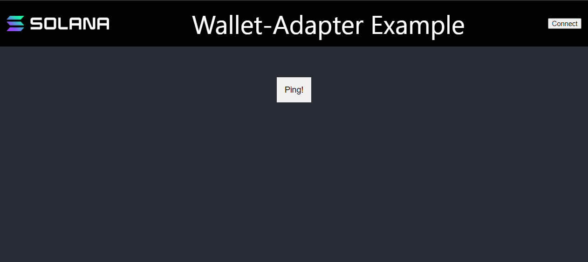

# 🔌 连接钱包 - 让用户安全地接入你的 DApp！

## 🎯 学习目标

终于到了最激动人心的部分 - **连接真实用户的钱包**！🎊

你将学会：
- 🔐 理解钱包的安全机制
- 🎨 集成专业的钱包连接界面
- 🔗 支持多种主流钱包
- 💡 构建用户友好的 DApp

:::tip 🌟 为什么钱包如此重要？
钱包 = Web3 的护照 🛂
- **身份认证**：证明你是谁
- **授权签名**：批准交易
- **资产管理**：查看和使用代币
- **安全保障**：私钥永不泄露
:::

## 🎭 第一章：理解钱包的本质

### 🔑 钱包不只是"钱包"

让我们重新认识钱包：

```
传统理解 ❌：钱包 = 存钱的地方

Web3 理解 ✅：钱包 = 你的数字身份管理器
├── 🔐 保管私钥（永不泄露）
├── ✍️ 签署交易（授权操作）
├── 👤 管理身份（多账户切换）
├── 🌐 连接 DApp（安全交互）
└── 📊 显示资产（余额、NFT 等）
```

### 🎨 钱包的形态万千

| 类型 | 示例 | 优点 | 缺点 | 适用场景 |
|------|------|------|------|----------|
| 🌐 **浏览器插件** | Phantom, Backpack | 方便快捷 | 依赖浏览器 | 日常使用 |
| 📱 **移动钱包** | Solflare Mobile | 随身携带 | 屏幕小 | 移动交易 |
| 🔧 **硬件钱包** | Ledger | 最安全 | 不够便捷 | 大额资产 |
| 💻 **桌面钱包** | Exodus | 功能全面 | 需要安装 | 专业用户 |

### 🛡️ 安全第一原则

```typescript
// ❌ 绝对不要这样做！
const privateKey = "你的私钥";  // 危险！暴露私钥
const wallet = new Wallet(privateKey);

// ✅ 正确的做法
const wallet = await window.solana.connect();  // 让钱包管理私钥
```

:::danger ⚠️ 黄金安全法则
**永远不要**：
- ❌ 在代码中硬编码私钥
- ❌ 要求用户输入私钥
- ❌ 在网络传输私钥
- ❌ 存储私钥到数据库

**始终要**：
- ✅ 让钱包管理私钥
- ✅ 只请求必要的权限
- ✅ 验证交易内容
- ✅ 使用 HTTPS
:::

## 🛠️ 第二章：Solana 钱包适配器 - 一统江湖

### 🎯 什么是钱包适配器？

想象一个**万能遥控器** 📱：

```
🎮 Solana Wallet Adapter
├── 支持 Phantom 钱包 ✅
├── 支持 Backpack 钱包 ✅
├── 支持 Solflare 钱包 ✅
├── 支持 Glow 钱包 ✅
└── 支持 20+ 其他钱包 ✅

一套代码，支持所有钱包！🎊
```

### 📦 安装必要的包

```bash
# 🎯 核心包 - 必须安装
npm install @solana/wallet-adapter-base \
            @solana/wallet-adapter-react \
            @solana/wallet-adapter-react-ui

# 🎨 钱包包 - 按需选择
npm install @solana/wallet-adapter-phantom \
            @solana/wallet-adapter-backpack \
            @solana/wallet-adapter-solflare
```

让我们理解每个包的作用：

| 包名 | 作用 | 必需？ |
|------|------|--------|
| 🏗️ `wallet-adapter-base` | 基础架构 | ✅ 必需 |
| ⚛️ `wallet-adapter-react` | React 集成 | ✅ 必需 |
| 🎨 `wallet-adapter-react-ui` | UI 组件 | 强烈推荐 |
| 👻 `wallet-adapter-phantom` | Phantom 支持 | 可选 |
| 🎒 `wallet-adapter-backpack` | Backpack 支持 | 可选 |

:::tip 💡 选择建议
推荐至少支持 3-5 个主流钱包：
1. **Phantom** - 用户最多
2. **Backpack** - 功能强大
3. **Solflare** - 老牌稳定
:::

## 🎨 第三章：构建钱包连接界面

### 🚀 快速开始 - 克隆模板

```bash
# 1️⃣ 克隆项目模板
git clone https://github.com/all-in-one-solana/solana-ping-frontend

# 2️⃣ 进入项目目录
cd solana-ping-frontend

# 3️⃣ 切换到起始分支
git checkout starter

# 4️⃣ 安装依赖
npm install

# 5️⃣ 启动开发服务器
npm run dev
```

访问 `http://localhost:3000`，你会看到：



### 🏗️ 配置钱包提供者

打开 `_app.tsx`，让我们把它改造成**钱包连接中心**：

```tsx
import React, { useMemo } from "react";
import { WalletAdapterNetwork } from "@solana/wallet-adapter-base";
import { WalletModalProvider } from "@solana/wallet-adapter-react-ui";
import { ConnectionProvider, WalletProvider } from "@solana/wallet-adapter-react";
import {
  PhantomWalletAdapter,
  BackpackWalletAdapter,
  SolflareWalletAdapter,
  GlowWalletAdapter,
} from "@solana/wallet-adapter-wallets";
import { clusterApiUrl } from "@solana/web3.js";

// 💅 导入样式
require("@solana/wallet-adapter-react-ui/styles.css");
require("../styles/globals.css");

const App = ({ Component, pageProps }) => {
  // 🌐 Step 1: 选择网络
  // 可选: 'devnet' | 'testnet' | 'mainnet-beta'
  const network = WalletAdapterNetwork.Devnet;
  console.log("🌐 当前网络:", network);

  // 🔗 Step 2: 设置 RPC 端点
  const endpoint = useMemo(() => {
    // 可以使用自定义 RPC
    // return "https://api.devnet.solana.com";
    return clusterApiUrl(network);
  }, [network]);
  console.log("🔗 RPC 端点:", endpoint);

  // 👛 Step 3: 配置支持的钱包
  const wallets = useMemo(
    () => [
      new PhantomWalletAdapter(),    // 最流行
      new BackpackWalletAdapter(),   // 功能强大
      new SolflareWalletAdapter(),   // 老牌稳定
      new GlowWalletAdapter(),       // 新兴选择
    ],
    [network]
  );
  console.log("👛 支持钱包数:", wallets.length);

  // 🎭 Step 4: 包装应用
  return (
    // 连接层：管理 RPC 连接
    <ConnectionProvider endpoint={endpoint}>
      {/* 钱包层：管理钱包状态 */}
      <WalletProvider wallets={wallets} autoConnect>
        {/* UI 层：提供连接界面 */}
        <WalletModalProvider>
          {/* 你的应用 */}
          <Component {...pageProps} />
        </WalletModalProvider>
      </WalletProvider>
    </ConnectionProvider>
  );
};

export default App;
```

### 🎯 理解三层架构

```
🏗️ 应用架构
├── 📡 ConnectionProvider
│   └── 管理网络连接
│       └── 提供 connection 对象
├── 👛 WalletProvider
│   └── 管理钱包状态
│       └── 提供 wallet 对象
└── 🎨 WalletModalProvider
    └── 管理 UI 交互
        └── 提供连接弹窗
```

:::info 💡 各层职责
- **ConnectionProvider**：像电话线，连接到 Solana 网络
- **WalletProvider**：像电话簿，管理所有钱包
- **WalletModalProvider**：像拨号界面，让用户选择钱包
:::

## 🎮 第四章：创建钱包连接按钮

### 🔘 最简单的集成

打开 `components/AppBar.tsx`：

```tsx
import { FC } from 'react';
import styles from '../styles/Home.module.css';
import Image from 'next/image';
import { WalletMultiButton } from '@solana/wallet-adapter-react-ui';

export const AppBar: FC = () => {
    return (
        <div className={styles.AppHeader}>
            <Image src="/solanaLogo.png" height={30} width={200} />
            <span>🚀 我的 DApp</span>
            {/* 🎉 就这一行！ */}
            <WalletMultiButton />
        </div>
    );
};
```

就这么简单！`WalletMultiButton` 为你处理了一切：
- 🔗 连接钱包
- 🔄 切换钱包
- 📋 复制地址
- ❌ 断开连接

### 🎨 自定义按钮样式

```tsx
import { WalletMultiButton } from '@solana/wallet-adapter-react-ui';

// 方式 1: 使用 className
<WalletMultiButton className="custom-wallet-button" />

// 方式 2: 自定义文本
<WalletMultiButton>
    {/* 未连接时显示 */}
    连接钱包 🔗
</WalletMultiButton>

// 方式 3: 完全自定义
import { useWallet } from '@solana/wallet-adapter-react';

function CustomWalletButton() {
    const { publicKey, connect, disconnect, connected } = useWallet();

    return (
        <button onClick={connected ? disconnect : connect}>
            {connected
                ? `已连接: ${publicKey?.toBase58().slice(0, 4)}...`
                : '🔗 连接钱包'
            }
        </button>
    );
}
```

### 🪝 使用钱包 Hook

```tsx
import { useWallet } from '@solana/wallet-adapter-react';
import { useConnection } from '@solana/wallet-adapter-react';

function MyComponent() {
    // 🔐 钱包相关
    const {
        publicKey,        // 用户地址
        connected,        // 是否已连接
        connecting,       // 正在连接中
        disconnect,       // 断开函数
        select,          // 选择钱包
        wallet,          // 当前钱包
        wallets,         // 所有钱包
        signTransaction,  // 签名交易
        signMessage      // 签名消息
    } = useWallet();

    // 🌐 连接相关
    const { connection } = useConnection();

    // 🎯 使用示例
    useEffect(() => {
        if (connected && publicKey) {
            console.log('✅ 钱包已连接:', publicKey.toBase58());

            // 查询余额
            connection.getBalance(publicKey).then(balance => {
                console.log('💰 余额:', balance / 1e9, 'SOL');
            });
        }
    }, [connected, publicKey, connection]);

    return (
        <div>
            {connected ? (
                <div>
                    <p>👤 地址: {publicKey?.toBase58()}</p>
                    <p>👛 钱包: {wallet?.adapter.name}</p>
                    <button onClick={disconnect}>断开连接</button>
                </div>
            ) : (
                <button onClick={() => select('Phantom')}>
                    连接 Phantom
                </button>
            )}
        </div>
    );
}
```

## 🚀 第五章：实战 - 构建完整功能

### 🎯 实现 Ping 功能

```tsx
import { useConnection, useWallet } from '@solana/wallet-adapter-react';
import { Transaction, TransactionInstruction, PublicKey } from '@solana/web3.js';

function PingButton() {
    const { connection } = useConnection();
    const { publicKey, signTransaction } = useWallet();
    const [loading, setLoading] = useState(false);

    const handlePing = async () => {
        if (!publicKey || !signTransaction) {
            alert('请先连接钱包！');
            return;
        }

        setLoading(true);
        console.log('🏓 开始 Ping...');

        try {
            // 1️⃣ 创建交易
            const transaction = new Transaction();

            // 2️⃣ 添加指令
            const instruction = new TransactionInstruction({
                keys: [{
                    pubkey: new PublicKey("Ah9K7dQ8EHaZqcAsgBW8w37yN2eAy3koFmUn4x3CJtod"),
                    isSigner: false,
                    isWritable: true
                }],
                programId: new PublicKey("ChT1B39WKLS8qUrkLvFDXMhEJ4F1XZzwUNHUt4AU9aVa")
            });

            transaction.add(instruction);

            // 3️⃣ 获取最新区块哈希
            const { blockhash } = await connection.getLatestBlockhash();
            transaction.recentBlockhash = blockhash;
            transaction.feePayer = publicKey;

            // 4️⃣ 请求用户签名
            console.log('✍️ 请求签名...');
            const signed = await signTransaction(transaction);

            // 5️⃣ 发送交易
            console.log('📤 发送交易...');
            const signature = await connection.sendRawTransaction(signed.serialize());

            // 6️⃣ 确认交易
            console.log('⏳ 等待确认...');
            await connection.confirmTransaction(signature);

            console.log('✅ Ping 成功!');
            console.log(`🔗 查看交易: https://explorer.solana.com/tx/${signature}?cluster=devnet`);

        } catch (error) {
            console.error('❌ 错误:', error);
            alert('交易失败: ' + error.message);
        } finally {
            setLoading(false);
        }
    };

    return (
        <button
            onClick={handlePing}
            disabled={!publicKey || loading}
            className={loading ? 'loading' : ''}
        >
            {loading ? '⏳ 处理中...' : '🏓 Ping 程序'}
        </button>
    );
}
```

### 🎨 完整的用户界面

```tsx
function DAppInterface() {
    const { publicKey, connected } = useWallet();
    const { connection } = useConnection();
    const [balance, setBalance] = useState<number | null>(null);

    // 获取余额
    useEffect(() => {
        if (publicKey) {
            connection.getBalance(publicKey).then(bal => {
                setBalance(bal / 1e9);
            });
        }
    }, [publicKey, connection]);

    return (
        <div className="dapp-container">
            <header>
                <h1>🌟 My Solana DApp</h1>
                <WalletMultiButton />
            </header>

            <main>
                {connected ? (
                    <div className="wallet-info">
                        <h2>👛 钱包信息</h2>
                        <p>📍 地址: {publicKey?.toBase58()}</p>
                        <p>💰 余额: {balance ?? '加载中...'} SOL</p>

                        <div className="actions">
                            <PingButton />
                            <TransferButton />
                            <AirdropButton />
                        </div>
                    </div>
                ) : (
                    <div className="welcome">
                        <h2>👋 欢迎！</h2>
                        <p>请连接钱包开始使用</p>
                        <WalletMultiButton />
                    </div>
                )}
            </main>
        </div>
    );
}
```

## 🏆 挑战任务

### 🎯 Level 1: 多钱包余额显示
显示用户在不同钱包的余额

### 🎯 Level 2: 交易历史
显示最近的 10 笔交易

### 🎯 Level 3: 批量操作
支持批量转账给多个地址

## 🎊 恭喜完成！

你已经掌握了：
- ✅ 理解钱包的工作原理
- ✅ 集成钱包适配器
- ✅ 构建专业的连接界面
- ✅ 处理用户交易签名

**下一步：构建更复杂的 DApp 功能！** 🚀
