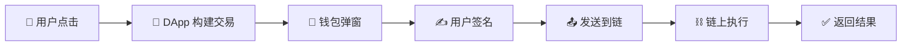
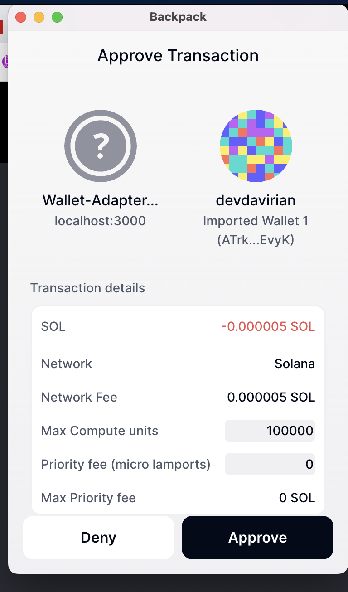
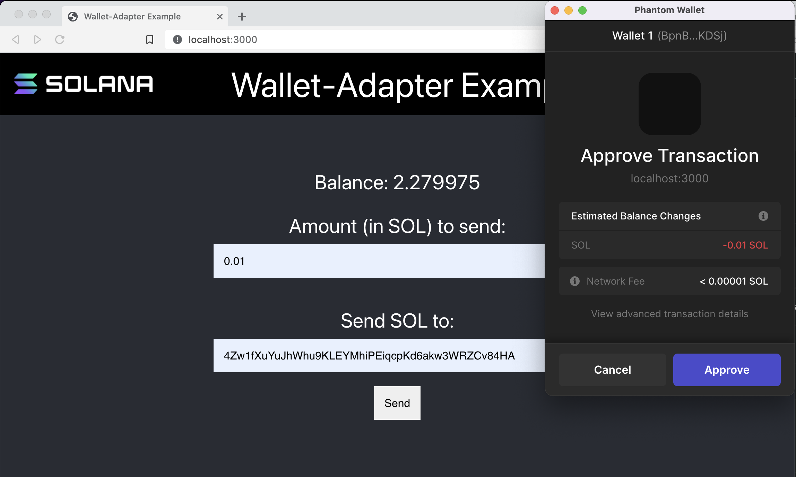

# 🦺 与程序交互 - 让你的 DApp 活起来！

## 🎯 学习目标

现在要让你的 DApp **真正工作**起来了！不再是摆设，而是能与区块链交互的真实应用！🚀

你将学会：
- 🔗 连接钱包与程序
- 📤 发送真实交易
- ✍️ 处理用户签名
- 🎨 构建交互界面

:::tip 🌟 这一课的意义
从"展示型网页"到"功能型 DApp"的飞跃！
就像从**静态海报**变成**互动游戏** 🎮
:::

## 🎭 第一章：理解交互流程

### 🌊 交互的完整流程

让我们看看用户点击按钮后发生了什么：



### 🎯 关键角色分工

| 角色 | 职责 | 比喻 |
|------|------|------|
| **用户** 👤 | 发起操作、批准交易 | 决策者 |
| **DApp** 📱 | 构建交易、展示结果 | 助手 |
| **钱包** 👛 | 管理密钥、签名交易 | 保险箱 |
| **区块链** ⛓️ | 验证执行、存储状态 | 公证处 |

## 🎮 第二章：构建 Ping 按钮

### 🏓 完整的 PingButton 组件

让我们创建一个功能完整的 Ping 按钮：

```tsx
// 📁 components/PingButton.tsx

import { FC, useState } from 'react';
import { useConnection, useWallet } from '@solana/wallet-adapter-react';
import * as Web3 from '@solana/web3.js';
import styles from '../styles/PingButton.module.css';

// 🏭 程序地址常量
const PROGRAM_ID = new Web3.PublicKey(
    "ChT1B39WKLS8qUrkLvFDXMhEJ4F1XZzwUNHUt4AU9aVa"
);
const PROGRAM_DATA_PUBLIC_KEY = new Web3.PublicKey(
    "Ah9K7dQ8EHaZqcAsgBW8w37yN2eAy3koFmUn4x3CJtod"
);

export const PingButton: FC = () => {
    // 🪝 React Hooks
    const { connection } = useConnection();
    const { publicKey, sendTransaction } = useWallet();

    // 🎨 状态管理
    const [loading, setLoading] = useState(false);
    const [txSignature, setTxSignature] = useState('');

    // 🎯 点击处理函数
    const onClick = async () => {
        // 🔍 Step 1: 检查连接状态
        if (!connection || !publicKey) {
            alert("🔌 请先连接钱包！");
            return;
        }

        try {
            setLoading(true);
            console.log("🏓 开始 Ping 操作...");

            // 📝 Step 2: 创建交易
            const transaction = new Web3.Transaction();

            // 🎯 Step 3: 构建指令
            const instruction = new Web3.TransactionInstruction({
                // 涉及的账户
                keys: [
                    {
                        pubkey: PROGRAM_DATA_PUBLIC_KEY,  // 数据账户
                        isSigner: false,                  // 不需要签名
                        isWritable: true                  // 需要写入
                    },
                ],
                // 目标程序
                programId: PROGRAM_ID,
                // 指令数据（这里不需要）
                // data: Buffer.alloc(0)
            });

            // ➕ Step 4: 添加指令到交易
            transaction.add(instruction);
            console.log("📦 交易构建完成");

            // 🚀 Step 5: 发送交易
            console.log("📤 发送交易到钱包...");
            const signature = await sendTransaction(transaction, connection);

            // 💾 Step 6: 保存签名
            setTxSignature(signature);
            console.log("✅ 交易已发送!");
            console.log(`🔗 签名: ${signature}`);

            // ⏳ Step 7: 等待确认
            console.log("⏳ 等待链上确认...");
            const confirmation = await connection.confirmTransaction(signature);

            if (confirmation.value.err) {
                throw new Error("交易失败");
            }

            console.log("🎉 交易确认成功!");

            // 🎯 Step 8: 显示结果
            const explorerUrl = `https://explorer.solana.com/tx/${signature}?cluster=devnet`;
            console.log(`🔍 查看交易: ${explorerUrl}`);

            // 可选：在新窗口打开
            window.open(explorerUrl, '_blank');

        } catch (error) {
            console.error("❌ 错误:", error);
            alert(`交易失败: ${error.message}`);
        } finally {
            setLoading(false);
        }
    };

    // 🎨 渲染界面
    return (
        <div className={styles.buttonContainer}>
            <button
                className={`${styles.button} ${loading ? styles.loading : ''}`}
                onClick={onClick}
                disabled={loading}
            >
                {loading ? '⏳ 处理中...' : '🏓 Ping!'}
            </button>

            {txSignature && (
                <div className={styles.result}>
                    <p>✅ 最近交易:</p>
                    <a
                        href={`https://explorer.solana.com/tx/${txSignature}?cluster=devnet`}
                        target="_blank"
                        rel="noopener noreferrer"
                    >
                        {txSignature.slice(0, 8)}...
                    </a>
                </div>
            )}
        </div>
    );
};
```

### 🎨 添加样式

```css
/* 📁 styles/PingButton.module.css */

.buttonContainer {
    display: flex;
    flex-direction: column;
    align-items: center;
    gap: 1rem;
}

.button {
    background: linear-gradient(135deg, #667eea 0%, #764ba2 100%);
    color: white;
    border: none;
    border-radius: 8px;
    padding: 12px 24px;
    font-size: 16px;
    font-weight: bold;
    cursor: pointer;
    transition: all 0.3s ease;
    box-shadow: 0 4px 15px rgba(102, 126, 234, 0.4);
}

.button:hover:not(:disabled) {
    transform: translateY(-2px);
    box-shadow: 0 6px 20px rgba(102, 126, 234, 0.6);
}

.button:disabled {
    opacity: 0.5;
    cursor: not-allowed;
}

.button.loading {
    animation: pulse 1.5s infinite;
}

@keyframes pulse {
    0% { opacity: 0.6; }
    50% { opacity: 1; }
    100% { opacity: 0.6; }
}

.result {
    margin-top: 1rem;
    padding: 10px;
    background: rgba(102, 126, 234, 0.1);
    border-radius: 8px;
    text-align: center;
}

.result a {
    color: #667eea;
    text-decoration: none;
}

.result a:hover {
    text-decoration: underline;
}
```

## 🔍 第三章：深入理解代码

### 🪝 Hooks 详解

```typescript
// 🌐 useConnection - 获取网络连接
const { connection } = useConnection();
// connection 提供了与区块链交互的方法

// 👛 useWallet - 获取钱包功能
const {
    publicKey,        // 用户公钥
    sendTransaction,  // 发送交易函数
    signTransaction,  // 签名交易函数
    connected,        // 是否已连接
    wallet           // 钱包信息
} = useWallet();
```

### 📝 交易构建详解

```typescript
// 🎯 为什么要这样构建交易？

// 1️⃣ 创建空白交易（像信封）
const transaction = new Transaction();

// 2️⃣ 创建指令（像信件内容）
const instruction = new TransactionInstruction({
    // 告诉程序要操作哪些账户
    keys: [/* ... */],
    // 告诉网络调用哪个程序
    programId: PROGRAM_ID,
    // 传递给程序的数据（可选）
    data: Buffer.from([])
});

// 3️⃣ 装入信封
transaction.add(instruction);

// 4️⃣ 让用户签名并发送
await sendTransaction(transaction, connection);
```

### ⚠️ 错误处理最佳实践

```typescript
const handleTransaction = async () => {
    try {
        // 预检查
        if (!publicKey) throw new Error("钱包未连接");
        if (!connection) throw new Error("网络未连接");

        // 构建交易
        const tx = buildTransaction();

        // 发送前日志
        console.log("📤 发送交易...");

        // 发送交易
        const sig = await sendTransaction(tx, connection);

        // 确认交易
        const { value: { err } } = await connection.confirmTransaction(sig);
        if (err) throw new Error(`交易失败: ${err}`);

        // 成功处理
        onSuccess(sig);

    } catch (error) {
        // 错误分类处理
        if (error.message.includes("用户拒绝")) {
            console.log("👤 用户取消了交易");
        } else if (error.message.includes("余额不足")) {
            alert("💰 SOL 余额不足，请充值");
        } else {
            console.error("❌ 未知错误:", error);
        }
    }
};
```

## 🧪 第四章：测试你的 DApp

### 🔧 设置测试环境

1. **切换到 Devnet** 🌐
   ```bash
   # 在 Backpack 钱包中
   设置 → 网络 → Devnet
   ```

2. **获取测试币** 💰
   ```bash
   # 命令行
   solana airdrop 2 <你的地址> --url devnet

   # 或使用水龙头
   https://solfaucet.com/
   ```

3. **运行应用** 🚀
   ```bash
   npm run dev
   ```

### 🎮 测试流程

```
1. 打开应用 → http://localhost:3000
2. 点击连接钱包 → 选择 Backpack
3. 批准连接 → 看到地址显示
4. 点击 Ping 按钮 → 钱包弹窗
5. 确认交易 → 等待确认
6. 查看结果 → Explorer 链接
```

### 🔍 验证结果

在 Explorer 中你应该看到：



检查要点：
- ✅ 交易状态：Success
- ✅ 程序日志：计数器增加
- ✅ 账户变化：数据更新

## 🏆 挑战任务：SOL 转账应用

### 🎯 任务目标

创建一个完整的 SOL 转账应用，包含：
- 💸 转账功能
- 📊 余额显示
- 📜 交易历史
- 🎨 美观界面

### 🚀 起始代码

```bash
# 克隆起始项目
git clone https://github.com/all-in-one-solana/solana-send-sol-frontend.git
cd solana-send-sol-frontend
git checkout starter
npm install
```

### 📝 实现步骤

#### Step 1: 设置钱包提供者

```tsx
// _app.tsx
import { WalletModalProvider } from "@solana/wallet-adapter-react-ui";
import { ConnectionProvider, WalletProvider } from "@solana/wallet-adapter-react";

// 包装你的应用
<ConnectionProvider endpoint={endpoint}>
    <WalletProvider wallets={wallets}>
        <WalletModalProvider>
            <Component {...pageProps} />
        </WalletModalProvider>
    </WalletProvider>
</ConnectionProvider>
```

#### Step 2: 实现转账功能

```tsx
// components/SendSolForm.tsx
const SendSolForm: FC = () => {
    const { connection } = useConnection();
    const { publicKey, sendTransaction } = useWallet();
    const [recipient, setRecipient] = useState('');
    const [amount, setAmount] = useState('');

    const handleSubmit = async (e: FormEvent) => {
        e.preventDefault();

        // 验证输入
        if (!publicKey) {
            alert('请连接钱包');
            return;
        }

        try {
            // 验证接收地址
            const recipientPubkey = new PublicKey(recipient);

            // 创建转账指令
            const transaction = new Transaction().add(
                SystemProgram.transfer({
                    fromPubkey: publicKey,
                    toPubkey: recipientPubkey,
                    lamports: parseFloat(amount) * LAMPORTS_PER_SOL
                })
            );

            // 发送交易
            const signature = await sendTransaction(transaction, connection);

            // 确认交易
            await connection.confirmTransaction(signature);

            alert(`✅ 转账成功！\n签名: ${signature}`);

        } catch (error) {
            alert(`❌ 转账失败: ${error.message}`);
        }
    };

    return (
        <form onSubmit={handleSubmit}>
            {/* 表单内容 */}
        </form>
    );
};
```

### 🎨 最终效果



### ✅ 完成标准

- [ ] 钱包连接功能正常
- [ ] 地址验证有效
- [ ] 转账功能完整
- [ ] 错误处理完善
- [ ] 界面美观友好

### 💡 进阶功能

1. **批量转账** - 一次发送给多人
2. **转账备注** - 添加 Memo
3. **手续费估算** - 显示预计费用
4. **交易历史** - 显示最近交易

## 📚 学习资源

### 官方文档
- 📖 [Wallet Adapter 文档](https://github.com/solana-labs/wallet-adapter)
- 🔧 [Web3.js 文档](https://solana-labs.github.io/solana-web3.js/)
- 💡 [Solana Cookbook](https://solanacookbook.com/)

### 示例代码
- 🎯 [完整解决方案](https://github.com/all-in-one-solana/solana-send-sol-frontend.git)
- 📦 [更多示例](https://github.com/solana-labs/wallet-adapter/tree/master/packages/starter)

## 🎊 总结

恭喜你完成了这一课！你已经掌握了：

✅ **钱包交互** - 连接、签名、发送
✅ **交易构建** - 指令、账户、数据
✅ **错误处理** - 预检、捕获、反馈
✅ **用户体验** - 加载状态、结果展示

你的 DApp 已经从 **$10,000** 升级到 **$1,000,000** 的价值！🚀

---

**下一步：学习如何部署你的 DApp 到生产环境！** 🌟
