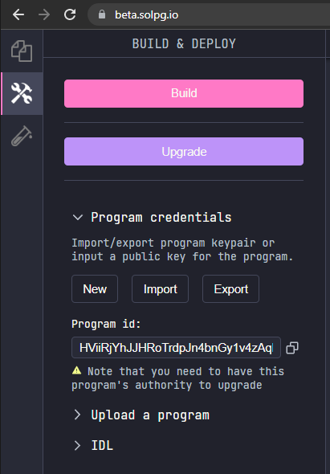
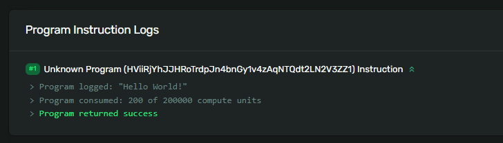
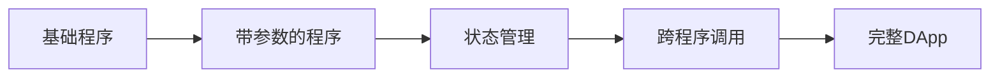

# 👋 与你部署的程序互动 - 让区块链听见你的声音! 🎤

> 🎯 **本章目标**: 学会与你部署的程序对话，见证你的代码在区块链上活起来！

---

## 🌟 开篇：是时候召唤你的程序了！

还记得刚刚部署的Hello World程序吗？它现在正静静地躺在区块链上，等待着你的召唤！🎭 就像阿拉丁神灯一样，我们需要正确的咒语（客户端代码）来唤醒它！

### 🎮 今天的冒险地图

```
📍 你在这里
    ↓
🔍 获取程序ID → 📝 编写客户端 → 🚀 发送交易 → 🎉 查看结果
    ↓                ↓               ↓              ↓
  找到地址      写召唤咒语      施展魔法      见证奇迹！
```

> 💡 **有趣的事实**: 每次调用程序都会在区块链上留下永久记录，就像在历史书上签名！

---

## 🏠 第一步：找到你程序的家 - 获取程序ID

### 🔍 寻找程序ID

你的程序已经有了自己的家（地址），让我们找到它！

```bash
# 🎯 在Solana Playground中
1. 点击左侧 "Program Credentials" 标签
2. 看到类似这样的地址：
   7xKXtg2CW87d3PJnDVp8bDkzSBQSRJcnKLCr4PWiWpVk
   ↑
   这就是你程序的身份证号！
```



> 🎭 **比喻时间**: 程序ID就像是你程序的手机号码，知道了号码就能给它"打电话"！

### 📋 保存你的程序ID

```javascript
// 🏷️ 把这个地址保存起来，一会儿要用！
const MY_PROGRAM_ID = "你的程序ID放这里";

// 💡 专业提示：可以创建一个常量文件专门存放
// constants.ts
export const PROGRAM_IDS = {
    HELLO_WORLD: "7xKXtg2...",
    // 未来的其他程序...
};
```

---

## 💻 第二步：编写客户端代码 - 召唤咒语！

### 📝 创建客户端脚本

打开 `client.ts` 文件，让我们编写召唤程序的魔法咒语！

```typescript
// 🎯 完整的客户端代码，每行都有详细注释！

// 📦 导入必要的工具（我们的魔法道具）
import * as web3 from '@solana/web3.js';

// 🏷️ 第一步：设置程序ID（你程序的地址）
// 记得替换成你自己的程序ID！
const programId = new web3.PublicKey(
  "REPLACE_WITH_YOUR_PROGRAM_ID"  // 👈 在这里粘贴你的程序ID
);

/**
 * 🎤 向区块链说Hello的函数
 * @param payer - 支付交易费用的账户（就是你！）
 * @returns 交易签名（就像收据一样）
 */
async function sayHello(
  payer: web3.Keypair
): Promise<web3.TransactionSignature> {

  // 📝 步骤1: 创建一个新交易（就像创建一个信封）
  const transaction = new web3.Transaction();
  console.log("📮 创建新交易...");

  // 🎯 步骤2: 创建指令（信封里的信）
  const instruction = new web3.TransactionInstruction({
    keys: [],        // 📭 账户列表（这个程序不需要账户）
    programId,       // 🏠 目标程序的地址
    // data: Buffer.alloc(0)  // 📦 数据（可选，现在不需要）
  });
  console.log("✍️ 创建指令完成！");

  // 📬 步骤3: 把指令放进交易里
  transaction.add(instruction);
  console.log("📨 指令已添加到交易！");

  // 🚀 步骤4: 发送交易并等待确认
  console.log("🚀 正在发送交易到Solana网络...");
  const transactionSignature = await web3.sendAndConfirmTransaction(
    pg.connection,    // 🌐 网络连接（Playground提供的）
    transaction,      // 📨 要发送的交易
    [payer]          // 🔑 签名者（支付gas费的人）
  );

  console.log("✅ 交易成功！签名：", transactionSignature);
  return transactionSignature;
}

/**
 * 🎬 主函数 - 程序的起点
 */
async function main() {
  console.log("🎭 开始与程序互动...");
  console.log("📍 程序ID:", programId.toString());

  try {
    // 🎯 调用sayHello函数
    const transactionSignature = await sayHello(pg.wallet.keypair);

    // 🔗 生成浏览器链接
    const explorerUrl = `https://explorer.solana.com/tx/${transactionSignature}?cluster=devnet`;

    console.log("🎉 成功！");
    console.log(`🔍 在浏览器查看交易: ${explorerUrl}`);
    console.log("💡 提示：向下滚动查看'Program Logs'部分！");

  } catch (error) {
    console.error("❌ 出错了:", error);
  }
}

// 🚀 启动主函数
main()
  .then(() => console.log("✨ 程序执行完毕！"))
  .catch((error) => console.error("💥 程序崩溃:", error));
```

### 🎨 代码解析 - 理解每一行

| 组件 | 作用 | 类比 |
|------|------|------|
| `Transaction` | 交易容器 | 📮 信封 |
| `TransactionInstruction` | 具体指令 | ✉️ 信件内容 |
| `programId` | 目标程序 | 📬 收件地址 |
| `payer` | 付款人 | 💳 邮资支付者 |
| `signature` | 交易凭证 | 📜 快递单号 |

---

## 🚀 第三步：运行客户端 - 施展魔法！

### ▶️ 执行你的代码

```bash
# 🎯 在Solana Playground中
1. 确保在 "Client" 标签下
2. 点击 "Run" 按钮（或按 Ctrl+Shift+Enter）
3. 观察控制台输出！
```

### 📊 预期输出

```bash
🎭 开始与程序互动...
📍 程序ID: 7xKXtg2CW87d3PJnDVp8...
📮 创建新交易...
✍️ 创建指令完成！
📨 指令已添加到交易！
🚀 正在发送交易到Solana网络...
✅ 交易成功！签名：3xHRJ9k...
🎉 成功！
🔍 在浏览器查看交易: https://explorer.solana.com/tx/3xHRJ9k...?cluster=devnet
💡 提示：向下滚动查看'Program Logs'部分！
✨ 程序执行完毕！
```

---

## 🔍 第四步：查看结果 - 见证奇迹时刻！

### 🌐 在Solana Explorer中查看

1. **点击控制台中的链接** 🔗
2. **向下滚动找到 "Program Logs"** 📜
3. **看到你的消息了吗？** 🎉

```bash
# 🎯 你应该看到类似这样的日志：
> Program 7xKXtg2CW87d3PJnDVp8... invoke [1]
> Program log: Hello, World! 🌍    # 👈 这就是你的消息！
> Program 7xKXtg2CW87d3PJnDVp8... consumed 1234 units
> Program 7xKXtg2CW87d3PJnDVp8... success
```



> 🎊 **恭喜！** 你刚刚完成了你的第一次区块链程序调用！

---

## 🚢 挑战任务 - 创造你自己的魔法！

### 🎯 基础挑战：创建个性化程序

不要只是复制粘贴！让我们创建一个独特的程序：

```rust
// 🎨 挑战1: 个性化消息
pub fn process_instruction(
    _program_id: &Pubkey,
    _accounts: &[AccountInfo],
    _instruction_data: &[u8]
) -> ProgramResult {
    // 🌟 添加你的个性签名！
    msg!("🚀 [你的名字] was here at {}",
         clock::Clock::get()?.unix_timestamp);
    msg!("💎 Building on Solana is awesome!");

    Ok(())
}
```

### 🏆 进阶挑战：随机消息生成器

创建一个能生成随机消息的程序！

```rust
// 🎲 挑战2: 随机消息生成器
pub fn process_instruction(
    _program_id: &Pubkey,
    _accounts: &[AccountInfo],
    instruction_data: &[u8]
) -> ProgramResult {
    // 🎯 词汇库
    let greetings = ["Hello", "Hola", "Bonjour", "你好"];
    let subjects = ["World", "Solana", "Blockchain", "Web3"];
    let emojis = ["🌍", "🚀", "💎", "⚡"];

    // 🎲 使用指令数据作为随机种子
    let seed = if instruction_data.len() > 0 {
        instruction_data[0] as usize
    } else {
        42  // 默认值
    };

    // 🎨 组合消息
    let greeting_idx = seed % greetings.len();
    let subject_idx = (seed / 3) % subjects.len();
    let emoji_idx = (seed / 7) % emojis.len();

    msg!("{} {}, {} ",
         greetings[greeting_idx],
         subjects[subject_idx],
         emojis[emoji_idx]);

    Ok(())
}
```

### 🎮 终极挑战：交互式程序

创建一个能根据输入做不同事情的程序！

```rust
// 🎮 挑战3: 命令处理器
pub fn process_instruction(
    program_id: &Pubkey,
    accounts: &[AccountInfo],
    instruction_data: &[u8]
) -> ProgramResult {

    // 🎯 解析命令
    let command = if instruction_data.len() > 0 {
        instruction_data[0]
    } else {
        0  // 默认命令
    };

    // 🎮 执行不同的操作
    match command {
        0 => msg!("👋 Hello! Use command 1-3 for different actions"),
        1 => msg!("🚀 Launching rocket to the moon!"),
        2 => msg!("💎 Diamond hands activated!"),
        3 => msg!("🎉 Party mode enabled!"),
        _ => msg!("❓ Unknown command: {}", command),
    }

    // 📊 记录一些统计信息
    msg!("📍 Program ID: {}", program_id);
    msg!("🏦 Accounts provided: {}", accounts.len());
    msg!("📦 Data length: {}", instruction_data.len());

    Ok(())
}
```

---

## 💡 专业技巧大礼包

### 🛠️ 调试技巧

| 技巧 | 用途 | 示例 |
|------|------|------|
| **使用msg!调试** | 打印变量值 | `msg!("Value: {}", my_var)` |
| **检查交易日志** | 查看完整执行流程 | Explorer的日志部分 |
| **测试不同输入** | 验证各种场景 | 发送不同的instruction_data |

### 🎯 最佳实践

```typescript
// ✅ 好的做法：错误处理
try {
    const tx = await sayHello(payer);
    console.log("✅ 成功:", tx);
} catch (error) {
    console.error("❌ 失败:", error);
    // 可以添加重试逻辑
}

// ✅ 好的做法：配置管理
const CONFIG = {
    NETWORK: "devnet",
    PROGRAM_ID: process.env.PROGRAM_ID || "default_id",
    MAX_RETRIES: 3
};

// ✅ 好的做法：日志记录
function log(level: string, message: string) {
    const timestamp = new Date().toISOString();
    console.log(`[${timestamp}] [${level}] ${message}`);
}
```

### 🚀 性能优化

```typescript
// 💡 批量处理交易
async function batchSayHello(count: number) {
    const promises = [];
    for (let i = 0; i < count; i++) {
        promises.push(sayHello(pg.wallet.keypair));
    }
    return await Promise.all(promises);
}

// 💡 添加重试逻辑
async function sayHelloWithRetry(maxRetries = 3) {
    for (let i = 0; i < maxRetries; i++) {
        try {
            return await sayHello(pg.wallet.keypair);
        } catch (error) {
            if (i === maxRetries - 1) throw error;
            await new Promise(r => setTimeout(r, 1000 * (i + 1)));
        }
    }
}
```

---

## 📚 学习资源

### 🎓 推荐学习路径



### 🔗 有用链接

- 📖 [Rust Book中文版](https://kaisery.github.io/trpl-zh-cn/)
- 🦀 [Rust Playground](https://play.rust-lang.org/) - 在线练习Rust
- 🎮 [Rustlings](https://github.com/rust-lang/rustlings) - 互动式Rust练习
- 📚 [Solana Cookbook](https://solanacookbook.com/) - Solana开发食谱
- 💬 [Discord社区](https://discord.gg/solana) - 获取帮助

---

## 🎊 章节总结

### ✅ 你学会了

- 🔍 如何找到程序ID
- 📝 编写客户端调用程序
- 🚀 发送交易到区块链
- 🔎 在浏览器中查看结果
- 🎨 创建自定义程序

### 🏆 成就解锁

```
🏅 新手召唤师 - 成功调用第一个程序
🎖️ 区块链对话者 - 与智能合约成功通信
🏆 Web3开发者 - 完整的程序开发周期
```

### 🚀 下一步

- 学习如何传递和解析指令数据
- 探索账户和状态管理
- 构建更复杂的程序逻辑
- 创建完整的DApp

---

> 🌟 **鼓励的话**: "每一次成功的程序调用，都是你在Web3世界留下的足迹。继续探索，继续创造！" 🚀

**#SolanaClient #Web3Dev #BlockchainCalling** 🎤✨🚀
