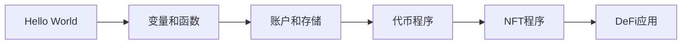

# ✨ 魔法互联网计算机 - 开启你的Solana智能合约之旅! 🚀

> 🎯 **本章任务**: 编写你的第一个Solana程序，迈入Web3魔法世界的大门！

---

## 🌟 序章：从使用者到创造者的华丽转身！

恭喜你走到这里！🎊 到目前为止，你已经是个Solana高手了：

- ✅ 创建了炫酷的NFT收藏品
- ✅ 铸造了自己的SPL代币
- ✅ 构建了精美的用户界面
- ✅ 玩转了各种现有程序

但是...你有没有想过："**我能不能创造自己的魔法？**" 🪄

答案是：**当然可以！** 今天，我们将从程序使用者升级为程序创造者！

---

## 🎮 什么是Solana程序？

想象一下，如果互联网是一个巨大的游戏世界...

```
传统互联网 = 单机游戏 🎮
  ↓
区块链 = 大型多人在线游戏 🌍
  ↓
Solana = 超高性能服务器，每个人都能创建游戏规则！⚡
```

### 🤯 为什么Solana如此特别？

| 特性 | 传统服务器 | Solana |
|------|-----------|---------|
| **谁能运行代码** | 只有服务器主人 | 任何人！🌟 |
| **代码透明度** | 黑盒子📦 | 完全开源📖 |
| **运行速度** | 取决于服务器 | 65,000 TPS！🚀 |
| **信任需求** | 必须信任公司 | 代码即法律⚖️ |
| **永久性** | 公司倒闭=GG | 永远在线♾️ |

> 💡 **震撼事实**: Solana就像一个永不关机、人人可用、极速运行的世界计算机！

### 🎯 我们今天要做什么？

```javascript
// 🎯 目标：创建一个简单但意义非凡的Hello World程序
// 意义：这将是你在区块链上的第一行代码！
"Hello, Web3!" → 区块链 → 永恒存在 ✨
```

---

## 🦀 Rust语言 - 你的新超能力！

### 😱 "听说Rust很难？"

让我用游戏来类比，让你秒懂Rust的学习曲线：

```
🎮 游戏难度对比：

简单模式 (Python/JavaScript)：
  - 马里奥 🍄
  - 愤怒的小鸟 🐦
  - 糖果粉碎传奇 🍬

困难模式 (Rust)：
  - 黑暗之魂 ⚔️
  - 星际争霸 🌌
  - DOTA 2 🗡️
```

### 🤔 为什么Rust感觉难？

```rust
// 🎯 Rust的"严格老师"特性

// ❌ 其他语言："随便写，能跑就行！"
let data = get_data();
modify(data);  // 😱 可能崩溃，但编译通过

// ✅ Rust："不安全的代码休想通过编译！"
let mut data = get_data();  // 明确说明：这个变量可以改
modify(&mut data);           // 明确说明：我要改它
// 💪 编译通过 = 基本不会崩溃！
```

### 🎯 Rust的超能力清单

| 超能力 | 描述 | 好处 |
|--------|------|------|
| ⚡ **极速** | 接近C的性能 | 省Gas费！ |
| 🛡️ **内存安全** | 编译时检查所有问题 | 无漏洞！ |
| 🔒 **线程安全** | 并发无忧 | 高性能！ |
| 📦 **零成本抽象** | 高级特性不影响性能 | 又快又优雅！ |

> 🎮 **游戏化思维**: 把学Rust当成打怪升级！每个错误都是经验值，每次编译通过都是等级提升！

---

## 🎓 Rust速成班 - 只学必要的！

今天我们只需要掌握这些概念（其他的以后再说）：

### 📚 必学概念清单

```rust
// 🎯 今日学习清单
✅ 1. 模块系统 - 代码的文件夹
✅ 2. 程序入口 - main函数
✅ 3. 函数基础 - 功能块
✅ 4. 引用&借用 - 共享数据

// 🚫 暂时不学（太复杂）
❌ 生命周期
❌ 泛型
❌ 宏
❌ unsafe代码
```

---

## 🛹 Solana Playground - 你的云端IDE！

### 🎨 什么是Solana Playground？

想象一下，如果你能在浏览器里直接写代码并部署到区块链...等等，这不是想象，这是现实！🤯

```
Solana Playground = VSCode + 区块链部署工具 + 免费服务器
                    全部在浏览器里！🌐
```

### 🚀 快速开始指南

#### 步骤 1️⃣: 打开魔法大门

```bash
# 🌐 在浏览器输入
https://beta.solpg.io/

# 🎉 恭喜！你已经拥有了一个云端开发环境！
```

#### 步骤 2️⃣: 创建新项目

```javascript
点击 "Create a new project"
   ↓
选择 "Native" (原生框架)  // 🎯 不要选Anchor，我们要从零开始！
   ↓
项目名称: "my-first-solana-program"  // 🏷️ 给它起个酷名字！
   ↓
点击 "Create" 🎨
```

> 💡 **为什么选Native而不是Anchor？**
> - Native = 原汁原味的Rust，像学开手动挡
> - Anchor = 框架加持的Rust，像开自动挡
> - 先学手动挡，以后开自动挡就简单了！

#### 步骤 3️⃣: 设置你的钱包 💰

看到左下角的状态了吗？

```
未连接 ❌ → 点击它！ → 已连接 ✅
```

**🎯 详细步骤：**

1. **点击"未连接"按钮**
   ```
   位置：左下角
   图标：🔴 红色小圆点
   ```

2. **系统自动操作**
   ```javascript
   // 🪄 Playground会自动：
   ✅ 生成新钱包
   ✅ 保存密钥对
   ✅ 空投测试币（2 SOL）
   ✅ 连接到Devnet
   ```

3. **验证连接成功**
   ```
   状态：已连接 🟢
   余额：~2 SOL
   网络：Devnet
   ```

> 🎁 **免费福利**: Playground自动给你空投了2个测试SOL！这在主网上价值约$200！（当然这是测试币😅）

### 🎯 界面介绍

```
┌─────────────────────────────────────────┐
│  📁 文件浏览器  │  📝 代码编辑器        │
│                 │                       │
│  lib.rs         │  // 你的代码在这里    │
│  Cargo.toml     │                       │
│                 │                       │
├─────────────────┴───────────────────────┤
│  🖥️ 终端 / 📊 日志 / 🔧 构建输出        │
└─────────────────────────────────────────┘
```

### 📝 初始代码解析

打开`lib.rs`，你会看到一些示例代码：

```rust
// 🚫 先忽略这些复杂的代码！
use solana_program::{
    account_info::AccountInfo,
    entrypoint,
    entrypoint::ProgramResult,
    msg,
    pubkey::Pubkey,
};

// 😵 看起来很复杂对吧？
entrypoint!(process_instruction);

pub fn process_instruction(
    program_id: &Pubkey,
    accounts: &[AccountInfo],
    _instruction_data: &[u8],
) -> ProgramResult {
    msg!("Hello, world!");
    Ok(())
}
```

**先别慌！** 我们会简化它，一步步来！🎯

---

## 💡 专业建议和技巧

### 🚀 快速上手技巧

| 技巧 | 说明 | 快捷键 |
|------|------|--------|
| **自动格式化** | 让代码整洁 | `Shift+Alt+F` |
| **智能提示** | 自动补全 | `Ctrl+Space` |
| **快速修复** | 解决错误 | `Ctrl+.` |
| **查看文档** | 悬停查看 | 鼠标悬停 |

### 🎯 学习路径建议



### 🐛 常见问题解决

```rust
// ❌ 问题1: 编译失败
// 解决：检查分号和括号

// ❌ 问题2: 连接超时
// 解决：刷新页面，重新连接钱包

// ❌ 问题3: 余额不足
// 解决：使用水龙头获取测试币
solana airdrop 2
```

---

## 🎮 小游戏：Rust vs 其他语言

让我们用一个小游戏来理解Rust的特点：

```javascript
// 🎯 场景：管理一个变量

// JavaScript玩家：
let treasure = "💎";
treasure = "💰";  // 随便改！
treasure = null;  // 哦不，宝藏消失了！
// 结果：🐛 运行时错误

// Python玩家：
treasure = "💎"
treasure = 123  // 类型都能变！
del treasure    // 删掉了
print(treasure) # 💥 崩溃！
// 结果：😱 NameError

// Rust玩家：
let mut treasure = "💎";  // 明确说可以改
treasure = "💰";         // OK，类型相同
treasure = 123;          // ❌ 编译错误！类型不匹配
// 结果：✅ 编译时就发现问题！
```

> 🏆 **胜者：Rust！** 虽然严格，但是安全！

---

## 🎊 章节总结

### ✅ 你今天学到了

- 🌍 Solana是个"魔法互联网计算机"
- 🦀 Rust虽难但强大
- 🛹 Solana Playground是你的好朋友
- 💡 编程思维的转变

### 🚀 下一步预告

在下一章，我们将：
1. 编写真正的Hello World程序
2. 理解Solana程序结构
3. 部署到测试网
4. 与程序交互

### 📚 推荐资源

- 🦀 [Rust圣经（中文）](https://course.rs/)
- 📖 [Solana官方文档](https://docs.solana.com/)
- 🎮 [Rust练习游戏](https://github.com/rust-lang/rustlings)
- 💬 [Solana开发者社区](https://discord.gg/solana)

---

## 🎯 作业挑战

1. **🥉 铜牌挑战**：成功连接Solana Playground钱包
2. **🥈 银牌挑战**：创建并保存你的第一个项目
3. **🥇 金牌挑战**：尝试修改示例代码中的消息

---

> 🌟 **激励语录**: "每个伟大的程序员都是从Hello World开始的。今天，你开始了你的Web3传奇！" 🚀

准备好了吗？让我们一起踏上这段激动人心的Rust编程之旅！💪

**#SolanaDev #RustLang #Web3Builder** 🦀🚀✨
