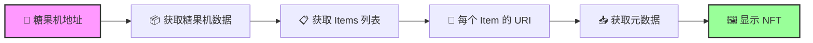
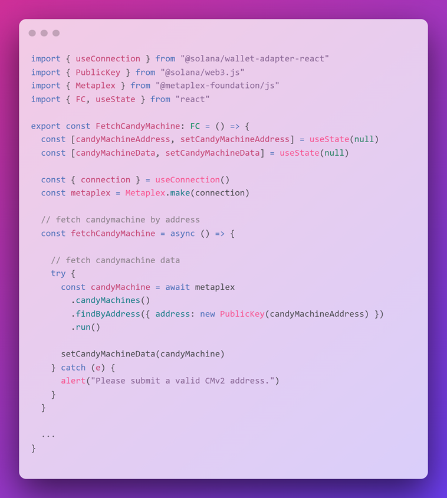
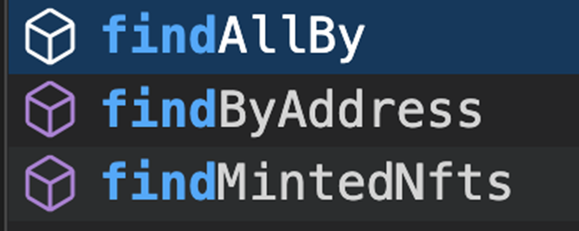
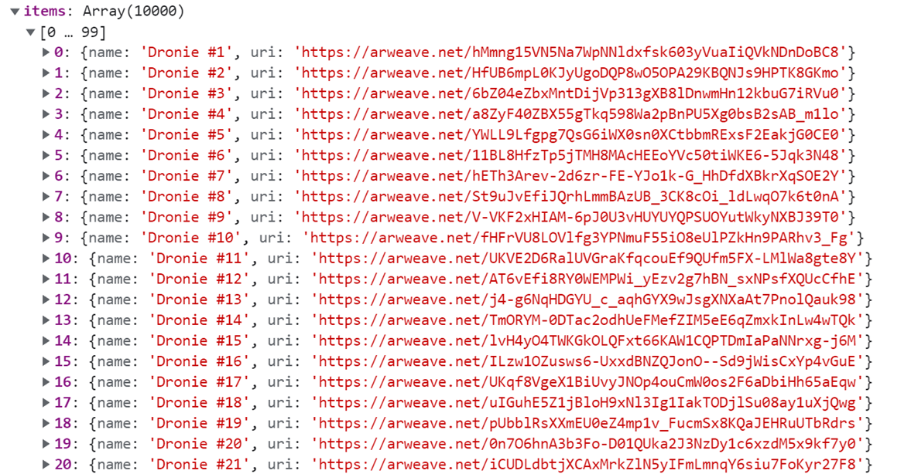

# 🖼 从糖果机展示 NFTs - 打造你的 NFT 展览馆！

## 🎯 项目目标

有了糖果机，但用户看不到里面有什么？就像有了自动售货机却没有橱窗！今天我们要创建一个**超酷的 NFT 展示界面** 🏛️

你将学会：
- 🍭 从糖果机获取 NFT 数据
- 📄 实现分页展示
- 🎨 加载并显示 NFT 图片
- 🔄 创建浏览功能

:::tip 🌟 为什么这很重要？
想象这个场景：
- 用户："你的糖果机里有什么？"
- 你："呃...去 Explorer 看吧..."
- 用户："...😑"

**展示功能让用户在铸造前就能预览！** = 更多销售！💰
:::

## 🎭 第一章：理解糖果机数据结构

### 🍬 糖果机 vs 钱包 NFT 的区别

```
👛 钱包 NFT 获取
├── 已铸造的 NFT
├── 完整的元数据
└── 直接可用

🍭 糖果机 NFT 获取
├── 未铸造的 NFT
├── 只有 URI 引用
├── 需要额外获取元数据
└── 可能有成千上万个！
```

### 📊 数据获取流程



## 🛠️ 第二章：项目设置

### 📦 使用现有项目或创建新项目

```bash
# 选项 1：继续之前的项目
cd your-nft-project

# 选项 2：克隆模板
git clone https://github.com/all-in-one-solana/solana-display-nfts-frontend
cd solana-display-nfts-frontend
git checkout starter
npm install
npm run dev
```

### 📁 打开核心文件

打开 `FetchCandyMachine.tsx`，让我们开始施展魔法！

## 💻 第三章：构建糖果机展示器

### 🔧 Step 1: 初始化 Metaplex

```tsx
import { FC, useEffect, useState } from 'react';
import { useConnection } from '@solana/wallet-adapter-react';
import { Metaplex } from '@metaplex-foundation/js';
import { PublicKey } from '@solana/web3.js';

export const FetchCandyMachine: FC = () => {
  // 🍭 糖果机地址（替换成你的！）
  const [candyMachineAddress, setCandyMachineAddress] = useState("YOUR_CM_ADDRESS_HERE");

  // 📊 状态管理
  const [candyMachineData, setCandyMachineData] = useState(null);
  const [pageItems, setPageItems] = useState(null);
  const [page, setPage] = useState(1);
  const [loading, setLoading] = useState(false);
  const [error, setError] = useState(null);

  // 🔗 获取连接
  const { connection } = useConnection();

  // 🛠️ 初始化 Metaplex（注意：不需要钱包！）
  const metaplex = Metaplex.make(connection);

  console.log("🎨 Metaplex 初始化完成（无需钱包连接）");

  // 继续下面的函数...
}
```

:::info 💡 为什么不需要钱包？
展示糖果机内容是**只读操作**：
- ✅ 不需要签名
- ✅ 不需要私钥
- ✅ 任何人都能查看
- = 更安全！
:::

### 🔍 Step 2: 获取糖果机数据



```tsx
// 🍭 获取糖果机数据
const fetchCandyMachine = async () => {
  // 🔄 重置页面到第一页
  setPage(1);
  setLoading(true);
  setError(null);

  console.log(`🔍 获取糖果机: ${candyMachineAddress}`);

  try {
    // 🎯 使用 findByAddress 方法
    const candyMachine = await metaplex
      .candyMachinesV2()
      .findByAddress({
        address: new PublicKey(candyMachineAddress)
      });

    console.log("✅ 糖果机数据获取成功！");
    console.log(`📦 总共 ${candyMachine.items.length} 个 NFT`);
    console.log(`💰 价格: ${candyMachine.price.basisPoints / 1e9} SOL`);
    console.log(`📊 已铸造: ${candyMachine.itemsMinted}/${candyMachine.items.length}`);

    setCandyMachineData(candyMachine);

  } catch (error) {
    console.error("❌ 获取失败:", error);
    setError("请输入有效的糖果机地址");
    alert("⚠️ 无效的糖果机地址，请重新输入！");
  } finally {
    setLoading(false);
  }
};
```



### 📄 Step 3: 实现分页系统



```tsx
// 📄 分页获取 NFT
const getPage = async (page: number, perPage: number = 9) => {
  if (!candyMachineData) {
    console.log("⚠️ 糖果机数据未加载");
    return;
  }

  console.log(`📄 获取第 ${page} 页（每页 ${perPage} 个）`);
  setLoading(true);

  try {
    // 🔪 切片获取当前页的 items
    const startIndex = (page - 1) * perPage;
    const endIndex = page * perPage;
    const pageItems = candyMachineData.items.slice(startIndex, endIndex);

    console.log(`📦 本页包含 ${pageItems.length} 个 NFT`);

    // 🖼️ 获取每个 NFT 的元数据
    const nftData = [];

    for (let i = 0; i < pageItems.length; i++) {
      try {
        console.log(`  📥 加载 NFT ${i + 1}/${pageItems.length}...`);

        // 获取元数据
        const response = await fetch(pageItems[i].uri);
        const metadata = await response.json();

        // 添加额外信息
        nftData.push({
          ...metadata,
          index: startIndex + i,
          uri: pageItems[i].uri,
          minted: startIndex + i < candyMachineData.itemsMinted
        });

      } catch (err) {
        console.error(`  ❌ NFT #${i} 加载失败:`, err);
        // 添加占位数据
        nftData.push({
          name: `NFT #${startIndex + i}`,
          image: '/placeholder.png',
          description: 'Loading failed'
        });
      }
    }

    console.log("✅ 页面数据加载完成！");
    setPageItems(nftData);

  } catch (error) {
    console.error("❌ 页面加载失败:", error);
    setError("加载 NFT 数据失败");
  } finally {
    setLoading(false);
  }
};
```

:::tip 💡 为什么要分页？
想象一个有 **10,000 个 NFT** 的糖果机：
- ❌ 一次加载全部 = 等待很久 + 页面卡顿
- ✅ 分页加载 = 快速响应 + 流畅体验
:::

### 🔄 Step 4: 翻页功能

```tsx
// ⬅️ 上一页
const prev = async () => {
  console.log("⬅️ 切换到上一页");

  if (page > 1) {
    setPage(page - 1);
  } else {
    console.log("📍 已经是第一页了");
    // 可选：添加提示
    alert("已经是第一页了！");
  }
};

// ➡️ 下一页
const next = async () => {
  console.log("➡️ 切换到下一页");

  const totalPages = Math.ceil(candyMachineData.items.length / 9);

  if (page < totalPages) {
    setPage(page + 1);
  } else {
    console.log("📍 已经是最后一页了");
    alert("已经是最后一页了！");
  }
};

// 🎯 计算总页数
const getTotalPages = () => {
  if (!candyMachineData) return 0;
  return Math.ceil(candyMachineData.items.length / 9);
};
```

### 🔄 Step 5: 添加 useEffect 钩子

```tsx
// 🎯 页面加载时获取糖果机
useEffect(() => {
  if (candyMachineAddress) {
    console.log("🚀 初始加载糖果机数据");
    fetchCandyMachine();
  }
}, []); // 只在组件挂载时运行

// 🔄 当糖果机数据或页面改变时重新加载
useEffect(() => {
  if (!candyMachineData) {
    console.log("⏳ 等待糖果机数据...");
    return;
  }

  console.log(`🔄 加载页面数据（第 ${page} 页）`);
  getPage(page, 9);
}, [candyMachineData, page]); // 监听这两个变化
```

## 🎨 第四章：创建展示界面

### 🖼️ 完整的组件界面

```tsx
return (
  <div className={styles.container}>
    {/* 🎯 标题部分 */}
    <div className={styles.header}>
      <h1>🍭 糖果机 NFT 展示</h1>

      {/* 📝 地址输入 */}
      <div className={styles.inputGroup}>
        <input
          type="text"
          placeholder="输入糖果机地址..."
          value={candyMachineAddress}
          onChange={(e) => setCandyMachineAddress(e.target.value)}
          className={styles.addressInput}
        />
        <button
          onClick={fetchCandyMachine}
          className={styles.fetchButton}
          disabled={loading}
        >
          {loading ? '⏳ 加载中...' : '🔍 查询'}
        </button>
      </div>
    </div>

    {/* 📊 糖果机信息 */}
    {candyMachineData && (
      <div className={styles.info}>
        <div className={styles.infoCard}>
          <span>💰 价格</span>
          <strong>{candyMachineData.price.basisPoints / 1e9} SOL</strong>
        </div>
        <div className={styles.infoCard}>
          <span>📦 总量</span>
          <strong>{candyMachineData.items.length}</strong>
        </div>
        <div className={styles.infoCard}>
          <span>✅ 已铸造</span>
          <strong>{candyMachineData.itemsMinted}</strong>
        </div>
        <div className={styles.infoCard}>
          <span>📄 当前页</span>
          <strong>{page} / {getTotalPages()}</strong>
        </div>
      </div>
    )}

    {/* 🔄 加载状态 */}
    {loading && (
      <div className={styles.loading}>
        <div className={styles.spinner}>🔄</div>
        <p>正在加载 NFT...</p>
      </div>
    )}

    {/* ❌ 错误提示 */}
    {error && (
      <div className={styles.error}>
        <p>😢 {error}</p>
      </div>
    )}

    {/* 🎨 NFT 网格 */}
    {pageItems && !loading && (
      <div className={styles.nftGrid}>
        {pageItems.map((nft, index) => (
          <NFTCard key={index} nft={nft} index={index} />
        ))}
      </div>
    )}

    {/* 🔄 分页控制 */}
    {candyMachineData && pageItems && (
      <div className={styles.pagination}>
        <button
          onClick={prev}
          disabled={page === 1}
          className={styles.pageButton}
        >
          ⬅️ 上一页
        </button>

        <span className={styles.pageInfo}>
          第 {page} 页 / 共 {getTotalPages()} 页
        </span>

        <button
          onClick={next}
          disabled={page >= getTotalPages()}
          className={styles.pageButton}
        >
          下一页 ➡️
        </button>
      </div>
    )}
  </div>
);
```

### 🎴 NFT 卡片组件

```tsx
// 🎨 NFT 卡片组件
const NFTCard = ({ nft, index }) => {
  const [imageLoaded, setImageLoaded] = useState(false);

  return (
    <div className={`${styles.nftCard} ${nft.minted ? styles.minted : ''}`}>
      {/* 🏷️ 铸造状态标签 */}
      {nft.minted && (
        <div className={styles.mintedBadge}>已铸造</div>
      )}

      {/* 🖼️ NFT 图片 */}
      <div className={styles.imageContainer}>
        {!imageLoaded && (
          <div className={styles.imagePlaceholder}>
            ⏳ 加载中...
          </div>
        )}
         setImageLoaded(true)}
          style={{ display: imageLoaded ? 'block' : 'none' }}
        />
      </div>

      {/* 📝 NFT 信息 */}
      <div className={styles.nftInfo}>
        <h3>{nft.name}</h3>
        <p className={styles.description}>
          {nft.description?.substring(0, 100)}
          {nft.description?.length > 100 && '...'}
        </p>

        {/* 🏷️ 属性 */}
        {nft.attributes && (
          <div className={styles.attributes}>
            {nft.attributes.slice(0, 3).map((attr, i) => (
              <span key={i} className={styles.attribute}>
                {attr.trait_type}: {attr.value}
              </span>
            ))}
          </div>
        )}

        {/* 🔢 编号 */}
        <div className={styles.nftNumber}>
          #{nft.index + 1}
        </div>
      </div>
    </div>
  );
};
```

## 💅 第五章：样式美化

```css
/* 📁 styles/CandyMachine.module.css */

.container {
  max-width: 1400px;
  margin: 0 auto;
  padding: 2rem;
}

.header {
  text-align: center;
  margin-bottom: 3rem;
}

.header h1 {
  font-size: 3rem;
  background: linear-gradient(135deg, #ff6b6b 0%, #ffd93d 100%);
  -webkit-background-clip: text;
  -webkit-text-fill-color: transparent;
  margin-bottom: 2rem;
}

.inputGroup {
  display: flex;
  gap: 1rem;
  justify-content: center;
  max-width: 600px;
  margin: 0 auto;
}

.addressInput {
  flex: 1;
  padding: 1rem;
  border-radius: 10px;
  border: 2px solid #333;
  background: rgba(255, 255, 255, 0.1);
  color: white;
  font-size: 1rem;
}

.fetchButton {
  padding: 1rem 2rem;
  background: linear-gradient(135deg, #667eea 0%, #764ba2 100%);
  border: none;
  border-radius: 10px;
  color: white;
  font-weight: bold;
  cursor: pointer;
  transition: all 0.3s;
}

.fetchButton:hover:not(:disabled) {
  transform: translateY(-2px);
  box-shadow: 0 10px 20px rgba(102, 126, 234, 0.4);
}

.fetchButton:disabled {
  opacity: 0.5;
  cursor: not-allowed;
}

.info {
  display: grid;
  grid-template-columns: repeat(auto-fit, minmax(150px, 1fr));
  gap: 1rem;
  margin: 2rem 0;
}

.infoCard {
  background: rgba(255, 255, 255, 0.1);
  padding: 1rem;
  border-radius: 10px;
  text-align: center;
  backdrop-filter: blur(10px);
}

.infoCard span {
  display: block;
  color: #888;
  font-size: 0.9rem;
  margin-bottom: 0.5rem;
}

.infoCard strong {
  color: white;
  font-size: 1.5rem;
}

.nftGrid {
  display: grid;
  grid-template-columns: repeat(auto-fill, minmax(300px, 1fr));
  gap: 2rem;
  margin: 3rem 0;
}

.nftCard {
  background: rgba(255, 255, 255, 0.1);
  border-radius: 15px;
  overflow: hidden;
  transition: all 0.3s;
  position: relative;
  backdrop-filter: blur(10px);
}

.nftCard:hover {
  transform: translateY(-10px);
  box-shadow: 0 20px 40px rgba(0, 0, 0, 0.3);
}

.nftCard.minted {
  opacity: 0.7;
}

.mintedBadge {
  position: absolute;
  top: 10px;
  right: 10px;
  background: #4caf50;
  color: white;
  padding: 0.3rem 0.8rem;
  border-radius: 20px;
  font-size: 0.8rem;
  z-index: 10;
}

.imageContainer {
  width: 100%;
  height: 300px;
  background: linear-gradient(135deg, #667eea 0%, #764ba2 100%);
  position: relative;
  overflow: hidden;
}

.imageContainer img {
  width: 100%;
  height: 100%;
  object-fit: cover;
}

.imagePlaceholder {
  position: absolute;
  top: 50%;
  left: 50%;
  transform: translate(-50%, -50%);
  color: white;
  font-size: 1.2rem;
}

.nftInfo {
  padding: 1.5rem;
}

.nftInfo h3 {
  margin: 0 0 0.5rem;
  color: white;
  font-size: 1.5rem;
}

.description {
  color: #aaa;
  margin: 0.5rem 0;
  line-height: 1.6;
}

.attributes {
  display: flex;
  flex-wrap: wrap;
  gap: 0.5rem;
  margin-top: 1rem;
}

.attribute {
  background: rgba(102, 126, 234, 0.3);
  padding: 0.3rem 0.8rem;
  border-radius: 15px;
  font-size: 0.85rem;
  color: white;
}

.nftNumber {
  margin-top: 1rem;
  color: #666;
  font-size: 0.9rem;
}

.pagination {
  display: flex;
  justify-content: center;
  align-items: center;
  gap: 2rem;
  margin: 3rem 0;
}

.pageButton {
  padding: 0.8rem 1.5rem;
  background: linear-gradient(135deg, #667eea 0%, #764ba2 100%);
  border: none;
  border-radius: 10px;
  color: white;
  font-weight: bold;
  cursor: pointer;
  transition: all 0.3s;
}

.pageButton:hover:not(:disabled) {
  transform: scale(1.05);
  box-shadow: 0 10px 20px rgba(102, 126, 234, 0.4);
}

.pageButton:disabled {
  opacity: 0.3;
  cursor: not-allowed;
}

.pageInfo {
  color: white;
  font-size: 1.2rem;
  font-weight: bold;
}

.loading {
  text-align: center;
  padding: 4rem;
  color: white;
}

.spinner {
  font-size: 3rem;
  animation: spin 1s linear infinite;
  display: inline-block;
}

@keyframes spin {
  from { transform: rotate(0deg); }
  to { transform: rotate(360deg); }
}

.error {
  text-align: center;
  padding: 2rem;
  color: #ff6b6b;
  background: rgba(255, 107, 107, 0.1);
  border-radius: 10px;
  margin: 2rem 0;
}
```

## 💡 专业技巧

### 🚀 性能优化

```typescript
// 🎯 并发加载元数据（更快！）
const getPageOptimized = async (page: number, perPage: number = 9) => {
  const startIndex = (page - 1) * perPage;
  const endIndex = page * perPage;
  const pageItems = candyMachineData.items.slice(startIndex, endIndex);

  // 使用 Promise.all 并发加载
  const promises = pageItems.map(async (item, index) => {
    try {
      const response = await fetch(item.uri);
      const metadata = await response.json();
      return {
        ...metadata,
        index: startIndex + index,
        uri: item.uri
      };
    } catch {
      return {
        name: `NFT #${startIndex + index}`,
        image: '/placeholder.png'
      };
    }
  });

  const nftData = await Promise.all(promises);
  setPageItems(nftData);
};
```

### 🔍 添加搜索功能

```typescript
// 🔍 搜索和筛选
const [searchTerm, setSearchTerm] = useState('');

const filteredItems = useMemo(() => {
  if (!pageItems) return [];

  return pageItems.filter(nft =>
    nft.name?.toLowerCase().includes(searchTerm.toLowerCase()) ||
    nft.description?.toLowerCase().includes(searchTerm.toLowerCase())
  );
}, [pageItems, searchTerm]);

// 搜索框
<input
  type="text"
  placeholder="🔍 搜索 NFT..."
  value={searchTerm}
  onChange={(e) => setSearchTerm(e.target.value)}
/>
```

### 📊 显示铸造进度

```typescript
// 📊 进度条组件
const MintProgress = ({ minted, total }) => {
  const percentage = (minted / total) * 100;

  return (
    <div className={styles.progress}>
      <div className={styles.progressBar}>
        <div
          className={styles.progressFill}
          style={{ width: `${percentage}%` }}
        />
      </div>
      <span>{percentage.toFixed(1)}% 已铸造</span>
    </div>
  );
};
```

## 🏆 挑战任务

### 🎯 Level 1: 基础增强
- 添加刷新按钮
- 显示铸造进度条
- 美化加载动画

### 🎯 Level 2: 功能扩展
- 实现网格/列表视图切换
- 添加排序功能（按稀有度、编号）
- 显示剩余数量

### 🎯 Level 3: 专业功能
- 集成铸造功能
- 添加收藏功能
- 实现 3D 卡片翻转效果

## 🎊 恭喜完成！

你已经创建了一个专业的糖果机 NFT 展示系统！

### ✅ 你掌握了什么

- 🍭 **糖果机数据** - 获取和解析
- 📄 **分页系统** - 高效加载大量数据
- 🎨 **展示优化** - 用户体验设计
- 🔄 **状态管理** - React hooks 高级应用

### 🚀 下一步

1. **集成铸造** - 让用户直接铸造
2. **添加筛选** - 按属性筛选
3. **社交分享** - 分享喜欢的 NFT
4. **数据分析** - 稀有度分析

---

**你的 NFT 展览馆已经开放！** 🏛️ **让全世界看到你的糖果机收藏！** 🍭
