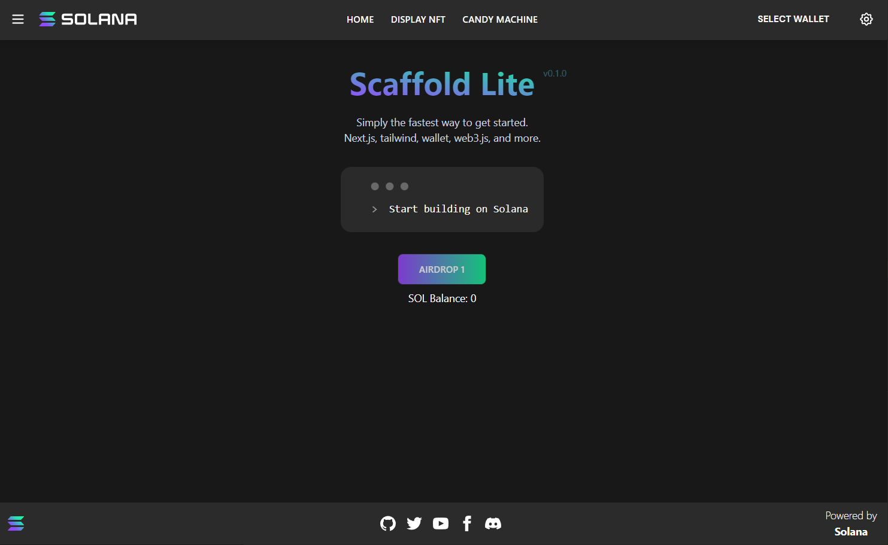
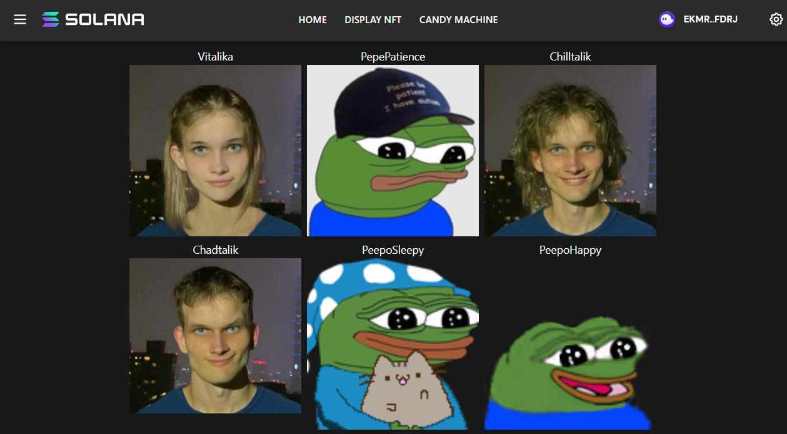

# 📱 在钱包中展示 NFTs - 打造你的数字艺术馆！

## 🎯 项目目标

还记得那些藏在钱包里的 NFT 吗？今天我们要把它们**全部展示出来**！就像把收藏品摆在展示柜里一样 🏺

你将学会：
- 🔍 从钱包获取所有 NFT
- 🖼️ 加载并展示 NFT 图片
- 📊 显示 NFT 元数据
- 🎨 创建美观的展示界面

:::tip 🌟 这个项目的意义
想象一下：
- 朋友："我有多少个 NFT？"
- 钱包："...（沉默）"
- 你的应用："让我来展示给你看！" ✨

**你的应用将成为 NFT 的展示窗口！**
:::

## 🚀 第一章：项目初始化

### 📦 克隆高级模板

这次我们使用更强大的模板 - **Solana dApp Scaffold**！

```bash
# 🎬 克隆项目
git clone https://github.com/all-in-one-solana/solana-display-nfts-frontend

# 📁 进入项目
cd solana-display-nfts-frontend

# 🌿 切换到起始分支
git checkout starter

# 📦 安装 Metaplex SDK（最新版）
npm install @metaplex-foundation/js@latest

# 📦 安装其他依赖
npm install

# 🚀 启动开发服务器
npm run dev
```

:::info 💡 为什么用这个模板？
**Solana dApp Scaffold** 提供了：
- ✅ 钱包连接（已配置）
- ✅ 路由系统（已设置）
- ✅ UI 组件（已美化）
- ✅ TypeScript（类型安全）
- = 你专注于核心功能！
:::

### 👀 初始界面

访问 `http://localhost:3000`，你会看到：



"展示 NFT" 页面现在是空的 - **这就是你要填充的画布！** 🎨

## 🏗️ 第二章：构建 NFT 获取器

### 📁 打开核心文件

打开 `src/components/FetchNFT.tsx`，让我们开始施展魔法！

### 🔧 Step 1: 设置 Metaplex

```tsx
import { FC, useEffect, useState } from 'react';
import { useConnection, useWallet } from '@solana/wallet-adapter-react';
import { Metaplex, walletAdapterIdentity } from '@metaplex-foundation/js';
import styles from '../styles/custom.module.css';

export const FetchNft: FC = () => {
  // 🎨 状态管理 - 存储 NFT 数据
  const [nftData, setNftData] = useState(null);
  const [loading, setLoading] = useState(false);
  const [error, setError] = useState(null);

  // 🔗 获取连接和钱包
  const { connection } = useConnection();
  const wallet = useWallet();

  // 🛠️ 初始化 Metaplex
  const metaplex = Metaplex.make(connection)
    .use(walletAdapterIdentity(wallet));

  console.log("🎨 Metaplex 已初始化！");

  // 🎯 获取 NFT 的核心函数
  const fetchNfts = async () => {
    // 稍后实现
  }

  return <div>准备展示 NFT...</div>
}
```

### 🔍 Step 2: 实现获取函数

```tsx
const fetchNfts = async () => {
  // 🔌 检查钱包连接
  if (!wallet.connected) {
    console.log("⚠️ 钱包未连接");
    return;
  }

  console.log("🔍 开始获取 NFT...");
  setLoading(true);
  setError(null);

  try {
    // 🎯 Step 1: 获取所有 NFT 的基本信息
    console.log(`📍 查询钱包: ${wallet.publicKey.toBase58()}`);
    const nfts = await metaplex
      .nfts()
      .findAllByOwner({ owner: wallet.publicKey });

    console.log(`✅ 找到 ${nfts.length} 个 NFT！`);

    // 🖼️ Step 2: 获取每个 NFT 的完整元数据
    console.log("📥 加载元数据...");
    const nftData = [];

    for (let i = 0; i < nfts.length; i++) {
      try {
        console.log(`  加载 NFT ${i + 1}/${nfts.length}: ${nfts[i].name}`);

        // 获取链下元数据
        const response = await fetch(nfts[i].uri);
        const metadata = await response.json();

        // 添加额外信息
        nftData.push({
          ...metadata,
          mintAddress: nfts[i].mintAddress.toBase58(),
          updateAuthority: nfts[i].updateAuthorityAddress?.toBase58()
        });

      } catch (err) {
        console.error(`❌ 加载 NFT #${i} 失败:`, err);
        // 添加占位数据
        nftData.push({
          name: nfts[i].name || 'Unknown NFT',
          image: '/placeholder.png',
          description: 'Metadata unavailable'
        });
      }
    }

    // 💾 Step 3: 保存到状态
    console.log("✨ NFT 数据加载完成！");
    setNftData(nftData);

  } catch (error) {
    console.error("❌ 获取 NFT 失败:", error);
    setError(error.message);
  } finally {
    setLoading(false);
  }
}
```

### 🔄 Step 3: 自动更新

```tsx
// 🎯 当钱包改变时自动获取 NFT
useEffect(() => {
  if (wallet.connected) {
    console.log("👛 钱包已连接，开始获取 NFT...");
    fetchNfts();
  } else {
    console.log("👛 钱包未连接");
    setNftData(null);
  }
}, [wallet.connected, wallet.publicKey]); // 监听钱包变化
```

## 🎨 第三章：创建展示界面

### 🖼️ 基础展示组件

```tsx
return (
  <div className={styles.container}>
    {/* 🎯 标题部分 */}
    <div className={styles.header}>
      <h1>🖼️ 我的 NFT 收藏</h1>
      {wallet.connected && (
        <p>👛 钱包: {wallet.publicKey?.toBase58().slice(0, 4)}...{wallet.publicKey?.toBase58().slice(-4)}</p>
      )}
    </div>

    {/* 🔄 加载状态 */}
    {loading && (
      <div className={styles.loading}>
        <div className={styles.spinner}>⏳</div>
        <p>正在加载你的 NFT...</p>
      </div>
    )}

    {/* ❌ 错误提示 */}
    {error && (
      <div className={styles.error}>
        <p>😢 加载失败: {error}</p>
        <button onClick={fetchNfts}>🔄 重试</button>
      </div>
    )}

    {/* 🎨 NFT 网格展示 */}
    {nftData && !loading && (
      <div>
        <p className={styles.count}>共 {nftData.length} 个 NFT</p>
        <div className={styles.gridNFT}>
          {nftData.map((nft, index) => (
            <NFTCard key={index} nft={nft} />
          ))}
        </div>
      </div>
    )}

    {/* 📭 空状态 */}
    {!loading && !error && nftData?.length === 0 && (
      <div className={styles.empty}>
        <h2>📭 还没有 NFT</h2>
        <p>快去铸造一些吧！</p>
      </div>
    )}
  </div>
);
```

### 🎴 NFT 卡片组件

```tsx
// 🎨 单个 NFT 卡片组件
const NFTCard = ({ nft }) => {
  const [imageError, setImageError] = useState(false);

  return (
    <div className={styles.nftCard}>
      {/* 🖼️ NFT 图片 */}
      <div className={styles.nftImage}>
        {!imageError ? (
           setImageError(true)}
          />
        ) : (
          <div className={styles.imagePlaceholder}>
            🖼️ 图片加载失败
          </div>
        )}
      </div>

      {/* 📝 NFT 信息 */}
      <div className={styles.nftInfo}>
        <h3>{nft.name}</h3>
        <p className={styles.symbol}>{nft.symbol}</p>
        <p className={styles.description}>
          {nft.description?.substring(0, 100)}
          {nft.description?.length > 100 && '...'}
        </p>

        {/* 🏷️ 属性展示 */}
        {nft.attributes && (
          <div className={styles.attributes}>
            {nft.attributes.slice(0, 3).map((attr, i) => (
              <span key={i} className={styles.attribute}>
                {attr.trait_type}: {attr.value}
              </span>
            ))}
          </div>
        )}

        {/* 🔗 操作按钮 */}
        <div className={styles.actions}>
          <a
            href={`https://explorer.solana.com/address/${nft.mintAddress}?cluster=devnet`}
            target="_blank"
            rel="noopener noreferrer"
            className={styles.explorerLink}
          >
            🔍 查看详情
          </a>
        </div>
      </div>
    </div>
  );
};
```

## 💅 第四章：美化样式

### 🎨 添加样式

```css
/* 📁 styles/custom.module.css */

.container {
  max-width: 1200px;
  margin: 0 auto;
  padding: 2rem;
}

.header {
  text-align: center;
  margin-bottom: 3rem;
}

.header h1 {
  font-size: 3rem;
  background: linear-gradient(135deg, #667eea 0%, #764ba2 100%);
  -webkit-background-clip: text;
  -webkit-text-fill-color: transparent;
}

.gridNFT {
  display: grid;
  grid-template-columns: repeat(auto-fill, minmax(280px, 1fr));
  gap: 2rem;
  margin-top: 2rem;
}

.nftCard {
  background: rgba(255, 255, 255, 0.1);
  border-radius: 20px;
  overflow: hidden;
  transition: all 0.3s ease;
  backdrop-filter: blur(10px);
  border: 1px solid rgba(255, 255, 255, 0.2);
}

.nftCard:hover {
  transform: translateY(-10px);
  box-shadow: 0 20px 40px rgba(102, 126, 234, 0.3);
}

.nftImage {
  width: 100%;
  height: 280px;
  overflow: hidden;
  background: linear-gradient(135deg, #667eea 0%, #764ba2 100%);
}

.nftImage img {
  width: 100%;
  height: 100%;
  object-fit: cover;
  transition: transform 0.3s ease;
}

.nftCard:hover .nftImage img {
  transform: scale(1.1);
}

.nftInfo {
  padding: 1.5rem;
}

.nftInfo h3 {
  font-size: 1.5rem;
  margin-bottom: 0.5rem;
  color: #fff;
}

.attributes {
  display: flex;
  flex-wrap: wrap;
  gap: 0.5rem;
  margin: 1rem 0;
}

.attribute {
  background: rgba(102, 126, 234, 0.3);
  padding: 0.3rem 0.8rem;
  border-radius: 15px;
  font-size: 0.85rem;
  color: #fff;
}

.loading {
  text-align: center;
  padding: 4rem;
}

.spinner {
  font-size: 3rem;
  animation: spin 1s linear infinite;
}

@keyframes spin {
  from { transform: rotate(0deg); }
  to { transform: rotate(360deg); }
}

.empty {
  text-align: center;
  padding: 4rem;
  color: #888;
}

.explorerLink {
  display: inline-block;
  margin-top: 1rem;
  padding: 0.5rem 1rem;
  background: linear-gradient(135deg, #667eea 0%, #764ba2 100%);
  color: white;
  border-radius: 10px;
  text-decoration: none;
  transition: opacity 0.3s;
}

.explorerLink:hover {
  opacity: 0.8;
}
```

## 💡 第五章：高级功能

### 🔍 添加搜索和筛选

```tsx
// 🎯 添加搜索和筛选功能
const [searchTerm, setSearchTerm] = useState('');
const [selectedCollection, setSelectedCollection] = useState('all');

// 获取所有系列
const collections = useMemo(() => {
  if (!nftData) return [];
  const uniqueCollections = new Set(nftData.map(nft => nft.collection?.name).filter(Boolean));
  return Array.from(uniqueCollections);
}, [nftData]);

// 过滤 NFT
const filteredNFTs = useMemo(() => {
  if (!nftData) return [];

  return nftData.filter(nft => {
    const matchesSearch = nft.name.toLowerCase().includes(searchTerm.toLowerCase());
    const matchesCollection = selectedCollection === 'all' || nft.collection?.name === selectedCollection;
    return matchesSearch && matchesCollection;
  });
}, [nftData, searchTerm, selectedCollection]);

// 搜索界面
return (
  <div className={styles.filters}>
    <input
      type="text"
      placeholder="🔍 搜索 NFT..."
      value={searchTerm}
      onChange={(e) => setSearchTerm(e.target.value)}
      className={styles.searchInput}
    />

    <select
      value={selectedCollection}
      onChange={(e) => setSelectedCollection(e.target.value)}
      className={styles.filterSelect}
    >
      <option value="all">所有系列</option>
      {collections.map(collection => (
        <option key={collection} value={collection}>
          {collection}
        </option>
      ))}
    </select>
  </div>
);
```

### 📊 添加统计信息

```tsx
// 🎯 NFT 统计组件
const NFTStats = ({ nfts }) => {
  const stats = useMemo(() => {
    if (!nfts) return null;

    const collections = {};
    nfts.forEach(nft => {
      const collection = nft.collection?.name || 'Unknown';
      collections[collection] = (collections[collection] || 0) + 1;
    });

    return {
      total: nfts.length,
      collections: Object.keys(collections).length,
      topCollection: Object.entries(collections).sort((a, b) => b[1] - a[1])[0]
    };
  }, [nfts]);

  if (!stats) return null;

  return (
    <div className={styles.stats}>
      <div className={styles.statCard}>
        <span className={styles.statNumber}>{stats.total}</span>
        <span className={styles.statLabel}>总 NFT 数</span>
      </div>
      <div className={styles.statCard}>
        <span className={styles.statNumber}>{stats.collections}</span>
        <span className={styles.statLabel}>系列数</span>
      </div>
      {stats.topCollection && (
        <div className={styles.statCard}>
          <span className={styles.statNumber}>{stats.topCollection[1]}</span>
          <span className={styles.statLabel}>{stats.topCollection[0]}</span>
        </div>
      )}
    </div>
  );
};
```

### 🎯 分页加载

```tsx
// 🎯 实现分页
const ITEMS_PER_PAGE = 12;
const [currentPage, setCurrentPage] = useState(1);

const paginatedNFTs = useMemo(() => {
  const start = (currentPage - 1) * ITEMS_PER_PAGE;
  const end = start + ITEMS_PER_PAGE;
  return filteredNFTs.slice(start, end);
}, [filteredNFTs, currentPage]);

const totalPages = Math.ceil(filteredNFTs.length / ITEMS_PER_PAGE);

// 分页控件
<div className={styles.pagination}>
  <button
    onClick={() => setCurrentPage(p => Math.max(1, p - 1))}
    disabled={currentPage === 1}
  >
    ← 上一页
  </button>

  <span>{currentPage} / {totalPages}</span>

  <button
    onClick={() => setCurrentPage(p => Math.min(totalPages, p + 1))}
    disabled={currentPage === totalPages}
  >
    下一页 →
  </button>
</div>
```

## 🎮 最终效果

运行应用后，你会看到：



## 🏆 挑战任务

### 🎯 Level 1: 基础改进
- 添加加载动画
- 处理错误状态
- 美化卡片样式

### 🎯 Level 2: 功能增强
- 实现搜索功能
- 添加系列筛选
- 显示稀有度

### 🎯 Level 3: 专业功能
- 导出 NFT 列表
- 批量操作
- 3D 展示模式

## 🎊 恭喜完成！

你已经创建了一个专业的 NFT 展示应用！

### ✅ 你掌握了什么

- 🔍 **获取 NFT** - 使用 Metaplex SDK
- 📊 **加载元数据** - 处理链下数据
- 🎨 **展示界面** - 创建美观的 UI
- 🔄 **状态管理** - React hooks 应用

### 🚀 下一步

1. **性能优化** - 虚拟滚动、懒加载
2. **社交功能** - 分享、评论
3. **交易功能** - 买卖、转让
4. **数据分析** - 价值评估、趋势图表

---

**你的 NFT 画廊已经开张！** 🎨 **让全世界看到你的收藏！** 🌍
