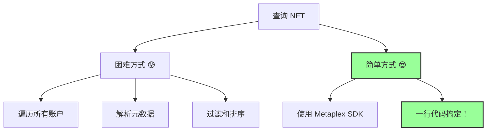
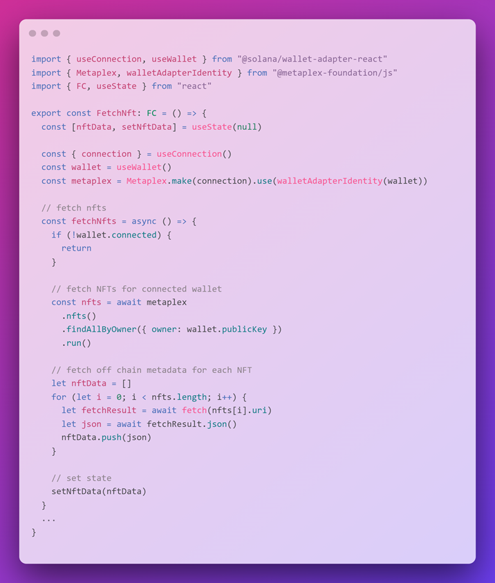
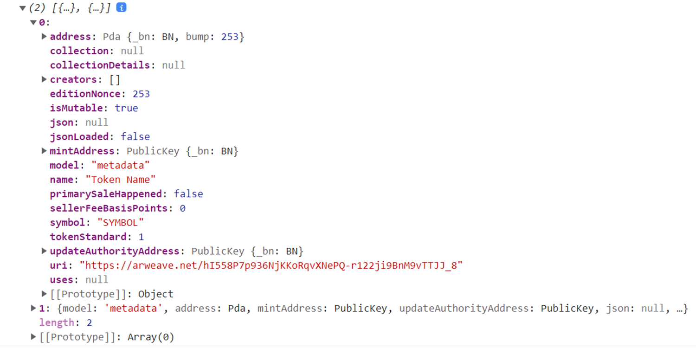

# 💃 展示 NFTs - 让你的收藏闪闪发光！

## 🎯 学习目标

铸造了 NFT 却不知道怎么展示？就像买了法拉利却藏在车库！今天我们要让你的 NFT **大放异彩** ✨

你将学会：
- 🔍 查询钱包中的所有 NFT
- 🎨 展示 NFT 的元数据和图片
- 🏛️ 创建 NFT 画廊
- 🎭 按系列筛选 NFT

:::tip 🌟 为什么展示很重要？
想象这个场景：
- 朋友："我刚铸造了你的 NFT！"
- 你："太棒了！是哪一个？"
- 朋友："呃...我钱包里有 100 个 NFT..."
- 你："...😅"

**展示功能让用户找到并欣赏他们的 NFT！**
:::

## 🎭 第一章：理解 NFT 展示原理

### 🗂️ NFT 存储在哪里？

让我们回顾一下 Solana 的存储模型：

```
👤 用户钱包
├── 💳 代币账户 1 → NFT #1
├── 💳 代币账户 2 → NFT #2
├── 💳 代币账户 3 → NFT #3
└── 💳 ... 更多 NFT

每个 NFT = 一个独立的代币账户
```

### 🔍 查询 NFT 的两种方式



## 🛠️ 第二章：使用 Metaplex SDK

### 📦 SDK 方法概览



```typescript
// 🎯 Metaplex 提供的查询方法
metaplex.nfts().findAllByOwner()     // 获取所有 NFT
metaplex.nfts().findAllByCreator()   // 按创建者筛选
metaplex.nfts().findAllByMint()      // 按铸币地址查询
metaplex.nfts().findByMint()         // 获取单个 NFT
metaplex.nfts().load()               // 加载完整元数据
```

### 🔧 初始化 Metaplex（钱包版）

```typescript
import { Metaplex, walletAdapterIdentity } from "@metaplex-foundation/js";
import { Connection } from "@solana/web3.js";
import { useWallet } from "@solana/wallet-adapter-react";

// 🎨 设置 Metaplex（用于展示，不需要私钥）
const setupMetaplex = () => {
    const { wallet } = useWallet();
    const connection = new Connection("https://api.devnet.solana.com");

    // 🔑 使用 walletAdapterIdentity 而不是 keypairIdentity
    const metaplex = Metaplex.make(connection)
        .use(walletAdapterIdentity(wallet));

    console.log("✅ Metaplex 已配置用于展示 NFT");
    return metaplex;
};
```

:::info 💡 为什么用 walletAdapterIdentity？
- **keypairIdentity**：需要私钥，用于铸造/更新
- **walletAdapterIdentity**：只需钱包连接，用于查询/展示
- 更安全：不暴露私钥！
:::

## 💻 第三章：获取和展示 NFT

### 🔍 获取用户的所有 NFT

```typescript
// 🎯 获取钱包中的所有 NFT
async function fetchUserNFTs(
    metaplex: Metaplex,
    walletAddress: PublicKey
) {
    console.log("🔍 正在查询 NFT...");

    try {
        // 🎨 获取所有 NFT（包括元数据）
        const nfts = await metaplex
            .nfts()
            .findAllByOwner({ owner: walletAddress });

        console.log(`✅ 找到 ${nfts.length} 个 NFT！`);

        // 📊 打印每个 NFT 的基本信息
        nfts.forEach((nft, index) => {
            console.log(`\n🎨 NFT #${index + 1}:`);
            console.log(`  📝 名称: ${nft.name}`);
            console.log(`  🏷️ 符号: ${nft.symbol}`);
            console.log(`  🔗 URI: ${nft.uri}`);
            console.log(`  📍 地址: ${nft.mintAddress.toBase58()}`);
        });

        return nfts;

    } catch (error) {
        console.error("❌ 获取 NFT 失败:", error);
        return [];
    }
}
```

### 📊 加载完整元数据



```typescript
// 🎯 加载 NFT 的完整元数据
async function loadNFTMetadata(
    metaplex: Metaplex,
    nft: Metadata
) {
    console.log(`📋 加载 ${nft.name} 的完整数据...`);

    // 🔄 加载链下元数据
    const fullNFT = await metaplex.nfts().load({ metadata: nft });

    console.log("✅ 元数据加载完成:");
    console.log({
        name: fullNFT.name,
        description: fullNFT.json?.description,
        image: fullNFT.json?.image,
        attributes: fullNFT.json?.attributes,
        creators: fullNFT.creators,
        collection: fullNFT.collection?.address.toBase58()
    });

    return fullNFT;
}
```

### 🎨 过滤特定系列的 NFT

```typescript
// 🎯 按系列过滤 NFT
async function filterNFTsByCollection(
    nfts: Metadata[],
    collectionAddress: string
) {
    console.log(`🔍 筛选系列: ${collectionAddress}`);

    const filtered = nfts.filter(nft => {
        // 检查是否属于指定系列
        return nft.collection?.address.toBase58() === collectionAddress;
    });

    console.log(`✅ 找到 ${filtered.length} 个该系列的 NFT`);
    return filtered;
}

// 🎯 按创建者过滤
async function filterNFTsByCreator(
    nfts: Metadata[],
    creatorAddress: string
) {
    const filtered = nfts.filter(nft => {
        return nft.creators?.some(
            creator => creator.address.toBase58() === creatorAddress
        );
    });

    return filtered;
}
```

## 🎨 第四章：创建 NFT 画廊

### 🖼️ React 组件示例

```tsx
// 📁 components/NFTGallery.tsx

import { FC, useEffect, useState } from 'react';
import { useWallet, useConnection } from '@solana/wallet-adapter-react';
import { Metaplex, walletAdapterIdentity } from '@metaplex-foundation/js';

interface NFTData {
    name: string;
    symbol: string;
    image: string;
    description: string;
    mintAddress: string;
    attributes: any[];
}

const NFTGallery: FC = () => {
    const wallet = useWallet();
    const { connection } = useConnection();
    const [nfts, setNfts] = useState<NFTData[]>([]);
    const [loading, setLoading] = useState(false);

    // 🔍 获取 NFT
    const fetchNFTs = async () => {
        if (!wallet.publicKey) return;

        setLoading(true);
        console.log("🎨 开始加载 NFT 画廊...");

        try {
            // 初始化 Metaplex
            const metaplex = Metaplex.make(connection)
                .use(walletAdapterIdentity(wallet));

            // 获取所有 NFT
            const nfts = await metaplex
                .nfts()
                .findAllByOwner({ owner: wallet.publicKey });

            // 加载元数据
            const nftData: NFTData[] = [];

            for (const nft of nfts) {
                try {
                    const metadata = await fetch(nft.uri);
                    const json = await metadata.json();

                    nftData.push({
                        name: nft.name,
                        symbol: nft.symbol,
                        image: json.image,
                        description: json.description || '',
                        mintAddress: nft.mintAddress.toBase58(),
                        attributes: json.attributes || []
                    });
                } catch (error) {
                    console.error(`加载 ${nft.name} 失败:`, error);
                }
            }

            setNfts(nftData);
            console.log(`✅ 成功加载 ${nftData.length} 个 NFT`);

        } catch (error) {
            console.error("❌ 加载失败:", error);
        } finally {
            setLoading(false);
        }
    };

    // 钱包连接时自动加载
    useEffect(() => {
        if (wallet.publicKey) {
            fetchNFTs();
        }
    }, [wallet.publicKey]);

    // 🎨 渲染画廊
    return (
        <div className="nft-gallery">
            <h2>🖼️ 我的 NFT 收藏</h2>

            {loading ? (
                <div className="loading">
                    <span>⏳ 加载中...</span>
                </div>
            ) : (
                <div className="nft-grid">
                    {nfts.map((nft, index) => (
                        <NFTCard key={index} nft={nft} />
                    ))}
                </div>
            )}

            {nfts.length === 0 && !loading && (
                <div className="empty-state">
                    <p>😢 还没有 NFT</p>
                    <p>去铸造一些吧！</p>
                </div>
            )}
        </div>
    );
};

// 🎴 NFT 卡片组件
const NFTCard: FC<{ nft: NFTData }> = ({ nft }) => {
    return (
        <div className="nft-card">
            <div className="nft-image">
                
            </div>

            <div className="nft-info">
                <h3>{nft.name}</h3>
                <p className="symbol">{nft.symbol}</p>
                <p className="description">{nft.description}</p>

                <div className="attributes">
                    {nft.attributes.map((attr, i) => (
                        <span key={i} className="attribute">
                            {attr.trait_type}: {attr.value}
                        </span>
                    ))}
                </div>

                <a
                    href={`https://explorer.solana.com/address/${nft.mintAddress}?cluster=devnet`}
                    target="_blank"
                    rel="noopener noreferrer"
                    className="explorer-link"
                >
                    🔍 在 Explorer 查看
                </a>
            </div>
        </div>
    );
};
```

### 🎨 样式美化

```css
/* 📁 styles/NFTGallery.module.css */

.nft-gallery {
    padding: 2rem;
    max-width: 1200px;
    margin: 0 auto;
}

.nft-grid {
    display: grid;
    grid-template-columns: repeat(auto-fill, minmax(250px, 1fr));
    gap: 2rem;
    margin-top: 2rem;
}

.nft-card {
    background: linear-gradient(135deg, #667eea 0%, #764ba2 100%);
    border-radius: 15px;
    overflow: hidden;
    transition: transform 0.3s;
    box-shadow: 0 10px 30px rgba(0,0,0,0.3);
}

.nft-card:hover {
    transform: translateY(-10px);
    box-shadow: 0 15px 40px rgba(102,126,234,0.4);
}

.nft-image img {
    width: 100%;
    height: 250px;
    object-fit: cover;
}

.nft-info {
    padding: 1.5rem;
    color: white;
}

.nft-info h3 {
    margin: 0 0 0.5rem 0;
    font-size: 1.5rem;
}

.attributes {
    display: flex;
    flex-wrap: wrap;
    gap: 0.5rem;
    margin-top: 1rem;
}

.attribute {
    background: rgba(255,255,255,0.2);
    padding: 0.25rem 0.75rem;
    border-radius: 20px;
    font-size: 0.9rem;
}

.loading {
    text-align: center;
    padding: 3rem;
    font-size: 1.5rem;
}

.empty-state {
    text-align: center;
    padding: 3rem;
    color: #666;
}
```

## 💡 专业技巧

### 🚀 性能优化

```typescript
// 🎯 批量加载元数据（更快）
async function batchLoadMetadata(nfts: Metadata[]) {
    const promises = nfts.map(nft =>
        fetch(nft.uri).then(res => res.json())
    );

    return Promise.all(promises);
}

// 🎯 分页加载（避免一次加载太多）
async function loadNFTsWithPagination(
    metaplex: Metaplex,
    owner: PublicKey,
    page: number = 1,
    pageSize: number = 20
) {
    const allNFTs = await metaplex.nfts().findAllByOwner({ owner });

    const start = (page - 1) * pageSize;
    const end = start + pageSize;

    return {
        nfts: allNFTs.slice(start, end),
        totalPages: Math.ceil(allNFTs.length / pageSize),
        currentPage: page,
        total: allNFTs.length
    };
}
```

### 🔍 高级查询

```typescript
// 🎯 多条件筛选
interface NFTFilter {
    collection?: string;
    creator?: string;
    name?: string;
    attributes?: { trait_type: string; value: string }[];
}

async function advancedNFTFilter(
    nfts: Metadata[],
    filters: NFTFilter
) {
    return nfts.filter(nft => {
        // 系列筛选
        if (filters.collection &&
            nft.collection?.address.toBase58() !== filters.collection) {
            return false;
        }

        // 创建者筛选
        if (filters.creator &&
            !nft.creators?.some(c => c.address.toBase58() === filters.creator)) {
            return false;
        }

        // 名称筛选
        if (filters.name &&
            !nft.name.toLowerCase().includes(filters.name.toLowerCase())) {
            return false;
        }

        return true;
    });
}
```

### ⚠️ 错误处理

```typescript
// 🛡️ 健壮的错误处理
async function safeLoadNFT(uri: string) {
    try {
        const response = await fetch(uri);

        if (!response.ok) {
            throw new Error(`HTTP error! status: ${response.status}`);
        }

        const data = await response.json();

        // 验证必要字段
        if (!data.name || !data.image) {
            throw new Error("Invalid metadata format");
        }

        return data;

    } catch (error) {
        console.error(`Failed to load metadata from ${uri}:`, error);

        // 返回默认值
        return {
            name: "Unknown NFT",
            image: "/placeholder.png",
            description: "Metadata unavailable",
            attributes: []
        };
    }
}
```

## 🏆 挑战任务

### 🎯 Level 1: 基础展示
创建一个简单的 NFT 列表展示

### 🎯 Level 2: 筛选功能
添加按系列、创建者筛选

### 🎯 Level 3: 专业画廊
- 网格/列表视图切换
- 搜索功能
- 排序选项
- 详情弹窗

## 🎊 恭喜完成！

你已经掌握了 NFT 展示的核心技能！

### ✅ 你学会了什么

- 🔍 **查询 NFT** - 使用 Metaplex SDK
- 📊 **加载元数据** - 获取完整信息
- 🎨 **创建画廊** - 展示 NFT
- 🔧 **优化性能** - 批量加载、分页

### 🚀 下一步

1. **添加 3D 展示** - Three.js 集成
2. **社交功能** - 分享、点赞
3. **交易功能** - 列出出售
4. **AR 展示** - 增强现实体验

---

**你的 NFT 现在可以闪亮登场了！** ✨ **让世界看到你的收藏！** 🌍
