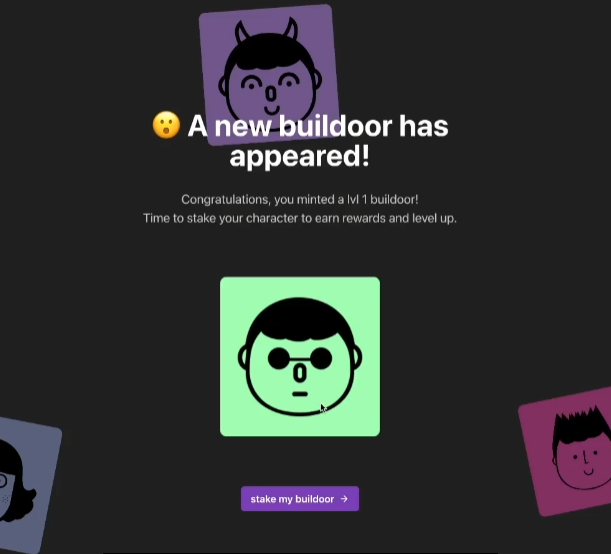

# 🎨 创建铸币用户界面 - 让你的NFT铸造变得超级炫酷! 💎

> 🎯 **本章任务**: 打造一个让人眼前一亮的NFT铸造界面，让用户体验如丝般顺滑！

---

## 🌟 开篇：从按钮到魔法！

还记得网站上那个寂寞的 `minting` 按钮吗？它就像一辆没有引擎的跑车 —— 看着很酷，但啥也干不了！😅 今天，我们要给它注入灵魂，让它变成一个真正的NFT铸造神器！

### 🎭 我们要实现什么？

```
用户点击按钮 → 钱包确认 → NFT铸造 → 展示炫酷的NFT → 用户开心 😊
```

> 💡 **小剧透**: 完成后，你的朋友们都能在你的网站上铸造NFT了！超酷的，对吧？

### 📦 准备工作

如果你还没有起始代码，别担心！克隆这个仓库即可：

```bash
# 🚀 快速开始
git clone https://github.com/buildspace/buildoors/tree/solution-core-2-candy-machine
cd buildoors
npm install

# ☕ 泡杯咖啡，等待安装完成...
```

---

## 🎨 第一步：改造 newMint.tsx - 让按钮活起来！

### 📝 添加必要的导入和函数

打开 `newMint.tsx` 文件，让我们开始施展魔法！✨

```tsx
// 🎯 文件顶部：导入我们需要的超级武器
import { Button, Text, HStack } from "@chakra-ui/react";  // UI组件库
import { MouseEventHandler, useCallback } from "react";    // React钩子
import { ArrowForwardIcon } from "@chakra-ui/icons";      // 炫酷的箭头图标

const Home: NextPage = () => {
  // 🎮 创建点击处理函数 - 这是按钮的大脑！
  const handleClick: MouseEventHandler<HTMLButtonElement> = useCallback(
    async (event) => {
      // 🚀 这里即将发生神奇的事情！
      console.log("🎉 按钮被点击了！准备铸造NFT...");
      // 暂时留空，马上就要添加铸造逻辑
    },
    [] // 依赖数组，确保函数不会重复创建
  );

  return (
    <MainLayout>
      {/* 📍 你的其他代码保持不变 */}

      {/* 🖼️ NFT图片展示区域 - 现在还是空的，但很快就会有内容！ */}
      <Image src="" alt="" />

      {/* 🎯 核心按钮 - 用户的铸造入口！ */}
      <Button
        bgColor="accent"        // 🎨 使用主题色
        color="white"          // ⚪ 白色文字
        maxWidth="380px"       // 📏 限制最大宽度
        onClick={handleClick}  // 🎮 绑定点击事件
        _hover={{             // ✨ 悬停效果
          transform: "scale(1.05)",
          boxShadow: "xl"
        }}
        _active={{            // 🔽 点击效果
          transform: "scale(0.95)"
        }}
      >
        <HStack>
          <Text>stake my buildoor</Text>
          <ArrowForwardIcon />
        </HStack>
      </Button>
    </MainLayout>
  );
};
```

> 🎯 **设计小贴士**: 添加 `_hover` 和 `_active` 效果让按钮更有交互感！用户会爱上这种反馈的！

---

## 🔗 第二步：连接 Connected.tsx - 打通任督二脉！

现在让我们让 `Connected.tsx` 和 `newMint.tsx` 手牵手！🤝

```tsx
// 🎯 在文件顶部添加路由导入
import { useRouter } from "next/router";  // Next.js的路由神器

const Connected: FC = () => {
  // 🚀 初始化路由器 - 我们的导航员
  const router = useRouter();

  // 🎮 超级重要的点击处理函数！
  const handleClick: MouseEventHandler<HTMLButtonElement> = useCallback(
    async (event) => {
      // 🛡️ 安全检查区域
      if (event.defaultPrevented) return;  // 防止重复点击
      if (!walletAdapter.connected) {      // 检查钱包连接
        alert("😅 请先连接钱包！");
        return;
      }
      if (!candyMachine) {                 // 检查Candy Machine
        alert("🍬 Candy Machine还没准备好！");
        return;
      }

      try {
        // 🎬 开始铸造动画
        setIsMinting(true);
        console.log("🔨 开始铸造NFT...");

        // 🪄 魔法时刻 - 调用Candy Machine铸造NFT！
        const nft = await metaplex
          .candyMachinesV2()
          .mint({ candyMachine });

        // 🎉 铸造成功！
        console.log("✅ NFT铸造成功！", nft);

        // 🚀 带着新铸造的NFT地址跳转到展示页面
        router.push(`/newMint?mint=${nft.nft.address.toBase58()}`);

      } catch (error) {
        // 😱 出错了，告诉用户
        console.error("❌ 铸造失败：", error);
        alert(`铸造失败了！😢 错误信息：${error}`);
      } finally {
        // 🎬 结束铸造状态
        setIsMinting(false);
      }
    },
    [metaplex, walletAdapter, candyMachine, router]  // 📦 依赖项
  );

  // ... 其余代码
};
```

> 💡 **专业提示**:
> - 总是添加错误处理！用户体验的关键在于优雅地处理错误
> - 使用 `console.log` 调试，但记得在生产环境中删除它们
> - `finally` 块确保无论成功还是失败，都会重置加载状态

---

## 🖼️ 第三步：展示NFT - 让艺术品闪亮登场！

### 🎨 创建 NFT 数据接口

回到 `newMint.tsx`，让我们添加展示NFT的超能力！

```tsx
// 🎯 导入Solana相关的库
import { PublicKey } from "@solana/web3.js";
import { Metaplex, walletAdapterIdentity } from "@metaplex-foundation/js";
import { useConnection, useWallet } from "@solana/wallet-adapter-react";
import { useState, useEffect, useMemo } from "react";

// 📝 定义Props接口 - TypeScript的类型安全保障！
interface NewMintProps {
  mint: PublicKey;  // NFT的铸造地址
}

// 🎨 主组件 - 现在接收mint作为prop
const Home: NextPage<NewMintProps> = ({ mint }) => {
  // 🎭 状态管理 - 存储NFT元数据
  const [metadata, setMetadata] = useState<any>();
  const [isLoading, setIsLoading] = useState(true);  // 加载状态

  // 🔌 获取连接和钱包
  const { connection } = useConnection();
  const walletAdapter = useWallet();

  // 🏗️ 创建Metaplex实例 - 只创建一次！
  const metaplex = useMemo(() => {
    return Metaplex.make(connection)
      .use(walletAdapterIdentity(walletAdapter));
  }, [connection, walletAdapter]);

  // 🎬 获取NFT元数据的副作用
  useEffect(() => {
    // 🚀 异步获取NFT数据
    const fetchNftMetadata = async () => {
      try {
        console.log("🔍 正在查找NFT...");
        setIsLoading(true);

        // 🎯 步骤1: 根据mint地址查找NFT
        const nft = await metaplex.nfts()
          .findByMint({ mintAddress: new PublicKey(mint) });

        console.log("📦 找到NFT对象:", nft);

        // 🎯 步骤2: 获取NFT的元数据URI
        const response = await fetch(nft.uri);

        // 🎯 步骤3: 解析JSON元数据
        const metadata = await response.json();

        console.log("🎨 NFT元数据:", metadata);
        setMetadata(metadata);

      } catch (error) {
        console.error("❌ 获取NFT失败:", error);
      } finally {
        setIsLoading(false);
      }
    };

    // 只有当mint地址存在时才执行
    if (mint) {
      fetchNftMetadata();
    }
  }, [mint, metaplex, walletAdapter]);

  return (
    <MainLayout>
      {/* 🎨 NFT展示区域 */}
      <VStack spacing={8}>
        {/* 标题 */}
        <Heading>🎉 恭喜！你的NFT已铸造成功！</Heading>

        {/* NFT图片 */}
        {isLoading ? (
          <Spinner size="xl" />  // 加载动画
        ) : (
          <Box
            borderRadius="lg"
            overflow="hidden"
            boxShadow="2xl"
            transition="all 0.3s"
            _hover={{ transform: "scale(1.05)" }}
          >
            <Image
              src={metadata?.image ?? "/placeholder.png"}
              alt={metadata?.name ?? "NFT"}
              width={400}
              height={400}
            />
          </Box>
        )}

        {/* NFT信息 */}
        {metadata && (
          <VStack align="start" spacing={2}>
            <Text fontSize="xl" fontWeight="bold">
              📛 {metadata.name}
            </Text>
            <Text color="gray.600">
              📝 {metadata.description}
            </Text>
            {/* 显示属性 */}
            {metadata.attributes?.map((attr: any, index: number) => (
              <Badge key={index} colorScheme="purple">
                {attr.trait_type}: {attr.value}
              </Badge>
            ))}
          </VStack>
        )}

        {/* 质押按钮 */}
        <Button
          bgColor="accent"
          color="white"
          maxWidth="380px"
          onClick={handleClick}
          isDisabled={!metadata}  // 元数据加载前禁用
        >
          <HStack>
            <Text>stake my buildoor</Text>
            <ArrowForwardIcon />
          </HStack>
        </Button>
      </VStack>
    </MainLayout>
  );
};
```

---

## 🔧 第四步：处理URL参数 - 让数据流动起来！

### 📡 添加 getInitialProps 处理

在文件底部添加这个神奇的函数：

```tsx
// 🎯 Next.js的服务端/客户端数据获取
NewMint.getInitialProps = async ({ query }) => {
  // 📦 从URL查询参数中获取mint地址
  const { mint } = query;

  // 🛡️ 错误处理 - 没有mint地址就报错
  if (!mint) {
    console.error("❌ URL中没有mint参数！");
    throw { error: "No mint" };
  }

  try {
    // 🔄 将字符串转换为PublicKey对象
    const mintPubkey = new PublicKey(mint as string);
    console.log("✅ Mint地址有效:", mintPubkey.toString());

    // 🚀 返回props给组件
    return { mint: mintPubkey };

  } catch (error) {
    // 😱 无效的mint地址
    console.error("❌ 无效的mint地址:", mint);
    throw { error: "Invalid mint" };
  }
};
```

> 🎓 **知识点**: `getInitialProps` 是Next.js的特殊方法，可以在服务端或客户端运行，用于获取页面需要的初始数据！

---

## 🐛 第五步：修复钱包断连问题 - 让体验丝滑如巧克力！

### 🔧 优化 WalletContextProvider.tsx

打开 `WalletContextProvider.tsx`，让我们修复那个烦人的钱包断连问题：

```tsx
import { useMemo } from "react";  // 导入useMemo钩子

const WalletContextProvider: FC<{ children: ReactNode }> = ({ children }) => {
  // ❌ 旧代码（会导致重复创建）
  // const phantom = new PhantomWalletAdapter();

  // ✅ 新代码（使用useMemo缓存）
  const phantom = useMemo(() => {
    console.log("🔌 创建Phantom钱包适配器");
    return new PhantomWalletAdapter();
  }, []);  // 空数组意味着只创建一次！

  return (
    <ConnectionProvider endpoint={endpoint}>
      <WalletProvider
        wallets={[phantom]}
        autoConnect={true}  // 🔄 自动连接！超级重要！
      >
        <WalletModalProvider>
          {children}
        </WalletModalProvider>
      </WalletProvider>
    </ConnectionProvider>
  );
};
```

### 🎯 为什么要用 useMemo？

```javascript
// 📚 useMemo 的魔力解释

// ❌ 没有useMemo - 每次渲染都创建新对象
function BadExample() {
  const wallet = new PhantomWalletAdapter();  // 😱 每次都新建！
  // 导致：钱包断连、状态丢失、性能差
}

// ✅ 使用useMemo - 只创建一次
function GoodExample() {
  const wallet = useMemo(() => {
    return new PhantomWalletAdapter();  // 😊 只创建一次！
  }, []);
  // 结果：钱包保持连接、状态稳定、性能好
}
```

---

## 🎉 最终效果展示

完成所有步骤后，你应该能看到这样的效果：

```
1️⃣ 用户点击"铸造"按钮
    ↓
2️⃣ Phantom钱包弹出确认
    ↓
3️⃣ 确认后开始铸造
    ↓
4️⃣ 页面跳转到展示页
    ↓
5️⃣ 显示精美的NFT图片！
```



---

## 💡 专业技巧大放送！

### 🚀 性能优化技巧

| 技巧 | 说明 | 代码示例 |
|------|------|----------|
| **懒加载图片** | 只在需要时加载 | `loading="lazy"` |
| **缓存元数据** | 避免重复请求 | 使用`localStorage` |
| **优化渲染** | 减少不必要的重渲染 | `React.memo()` |
| **错误边界** | 优雅处理错误 | `ErrorBoundary` |

### 🎨 UI/UX 提升建议

```tsx
// 🌈 添加加载动画
{isMinting && (
  <VStack>
    <Spinner size="xl" color="purple.500" />
    <Text>正在铸造你的NFT...</Text>
    <Progress size="xs" isIndeterminate />
  </VStack>
)}

// 🎉 添加成功提示
import { useToast } from "@chakra-ui/react";

const toast = useToast();
// 铸造成功后
toast({
  title: "铸造成功！🎉",
  description: "你的NFT已经铸造完成！",
  status: "success",
  duration: 5000,
  isClosable: true,
});
```

### 🐛 常见问题解决

```typescript
// 问题1: 钱包频繁断连
解决: 使用useMemo和autoConnect

// 问题2: 图片加载失败
解决: 添加fallback图片
<Image
  src={metadata?.image}
  fallbackSrc="/default-nft.png"
  onError={(e) => console.error("图片加载失败", e)}
/>

// 问题3: 元数据获取超时
解决: 添加超时处理
const fetchWithTimeout = (url, timeout = 5000) => {
  return Promise.race([
    fetch(url),
    new Promise((_, reject) =>
      setTimeout(() => reject(new Error('超时')), timeout)
    )
  ]);
};
```

---

## 🎓 进阶扩展

### 🎮 添加更多功能

1. **批量铸造** - 一次铸造多个NFT
2. **铸造历史** - 显示用户的铸造记录
3. **稀有度显示** - 展示NFT的稀有属性
4. **分享功能** - 让用户分享他们的NFT到社交媒体

### 🔗 有用的资源

- 📖 [Next.js文档](https://nextjs.org/docs)
- 🎨 [Chakra UI组件库](https://chakra-ui.com/)
- 🔧 [Solana Web3.js](https://solana-labs.github.io/solana-web3.js/)
- 🍬 [Metaplex JS SDK](https://github.com/metaplex-foundation/js)

---

## 🎊 恭喜完成！

你已经成功创建了一个功能完整的NFT铸造界面！🎉

### ✅ 你学到了什么

- 🎮 创建交互式UI组件
- 🔗 连接前端与区块链
- 🖼️ 展示NFT元数据
- 🐛 解决常见的开发问题
- 💅 优化用户体验

### 🚀 下一步

- 添加质押功能
- 实现NFT市场
- 创建排行榜系统
- 集成社交功能

记住：**好的用户界面是成功DApp的关键！** 继续迭代，不断改进，让你的应用脱颖而出！

---

> 🌟 **最后的话**: 编程就像艺术创作，每一行代码都是你的画笔。保持好奇心，勇于尝试，你会创造出令人惊叹的作品！加油！💪

**#BuildInPublic #Web3UI #SolanaDev** 🚀🎨✨
