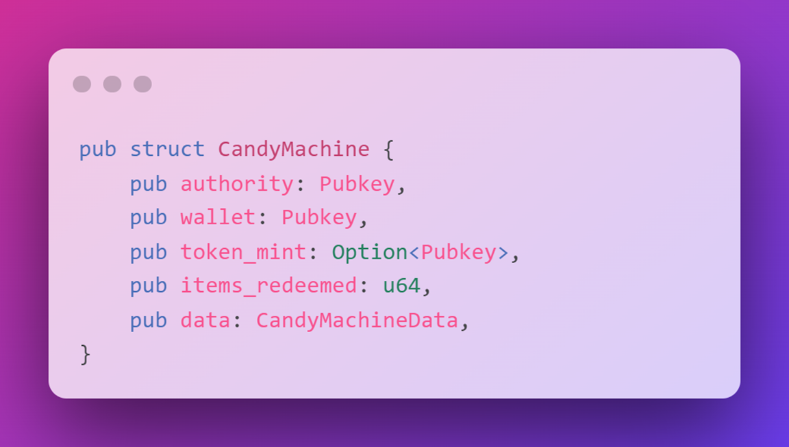
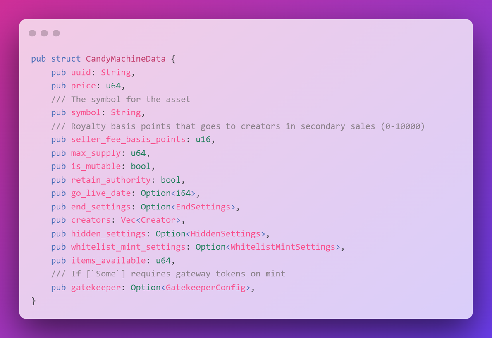
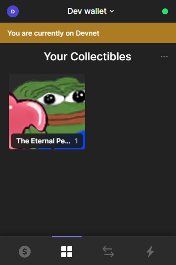

# 🍭 Candy Machine - 批量铸造 NFT 的甜蜜工厂！

## 🎯 项目目标

单个 NFT 不够过瘾？今天我们要创建一个完整的 **NFT 系列**！就像开糖果工厂一样甜蜜 🏭

你将学会：
- 🍬 使用 Candy Machine 批量铸造
- 🛠️ 掌握 Sugar CLI 工具
- 📦 准备和上传 NFT 资产
- 🎨 搭建铸造网站

:::tip 🌟 为什么选择 Candy Machine？
**Candy Machine = Solana NFT 发行的行业标准**
- ⚡ **高效**：一次配置，批量铸造
- 🤖 **防机器人**：内置保护机制
- 🎲 **随机公平**：确保铸造的随机性
- 💰 **收益管理**：自动分配版税
:::

## 🏗️ 第一章：理解 Candy Machine

### 🎭 什么是 Candy Machine？

把 Candy Machine 想象成一个**自动售货机** 🎰：

```
🍭 Candy Machine 售货机
├── 💰 投币（支付 SOL）
├── 🎲 按钮（铸造）
├── 🎁 出货（获得随机 NFT）
└── 📦 库存（你的 NFT 系列）
```

### 📊 账户结构详解



```typescript
// 🏭 Candy Machine 账户
interface CandyMachine {
    authority: PublicKey;        // 👤 谁控制这台机器
    wallet: PublicKey;          // 💰 收钱的钱包
    tokenMint: PublicKey;       // 🪙 接受的代币
    config: Config;             // ⚙️ 配置信息
    data: CandyMachineData;     // 📦 NFT 数据
    itemsRedeemed: number;      // 📊 已铸造数量
    itemsAvailable: number;     // 🎁 总供应量
}
```



## 🛠️ 第二章：环境准备

### 📦 安装必要工具

```bash
# 1️⃣ 安装 Solana CLI（如果还没装）
sh -c "$(curl -sSfL https://release.anza.xyz/stable/install)"

# 验证安装
solana --version
# 输出: solana-cli 1.x.x ✅

# 2️⃣ 安装 Sugar CLI（糖果机的命令行工具）
bash <(curl -sSf https://sugar.metaplex.com/install.sh)

# 验证安装
sugar --version
# 输出: sugar-cli 2.x.x ✅
```

:::info 💡 Sugar CLI 是什么？
**Sugar = Candy Machine 的瑞士军刀** 🔧
- 上传资产
- 创建糖果机
- 验证配置
- 铸造测试
- 一键部署
:::

### 🔑 配置钱包

```bash
# 🌐 设置网络为 Devnet
solana config set --url devnet

# 🔑 创建新钱包（如果需要）
solana-keygen new --outfile ~/.config/solana/devnet.json

# 💰 获取测试币
solana airdrop 2
echo "💰 当前余额："
solana balance

# 应该看到: 2 SOL ✅
```

## 🎨 第三章：准备 NFT 资产

### 📁 创建项目结构

```bash
# 🏗️ 创建项目文件夹
mkdir my-nft-collection
cd my-nft-collection

# 📁 创建资产文件夹
mkdir assets
```

### 🖼️ 准备图片和元数据

你的 `assets` 文件夹需要这样的结构：

```
📁 assets/
├── 🖼️ 0.png       # NFT #1 的图片
├── 📝 0.json      # NFT #1 的元数据
├── 🖼️ 1.png       # NFT #2 的图片
├── 📝 1.json      # NFT #2 的元数据
├── 🖼️ 2.png       # NFT #3 的图片
├── 📝 2.json      # NFT #3 的元数据
├── ...更多...
├── 🖼️ collection.png   # 系列封面（可选）
└── 📝 collection.json  # 系列信息（可选）
```

:::warning ⚠️ 重要规则
- 文件必须从 **0** 开始编号
- 每个图片必须有对应的 JSON
- 文件名必须匹配（0.png ↔ 0.json）
- 建议图片尺寸：1000x1000px
:::

### 📝 元数据 JSON 模板

```json
{
  "name": "Pepe #1",
  "symbol": "PEPE",
  "description": "最稀有的 Pepe，传说中的钻石手持有者",
  "image": "0.png",
  "attributes": [
    {
      "trait_type": "Background",
      "value": "Moon"
    },
    {
      "trait_type": "Eyes",
      "value": "Laser"
    },
    {
      "trait_type": "Rarity",
      "value": "Legendary"
    }
  ],
  "properties": {
    "category": "image",
    "files": [
      {
        "uri": "0.png",
        "type": "image/png"
      }
    ],
    "creators": [
      {
        "address": "你的钱包地址",
        "share": 100
      }
    ]
  }
}
```

### 🎯 系列元数据（可选但推荐）

`collection.json`:
```json
{
  "name": "Diamond Pepes Collection",
  "symbol": "PEPE",
  "description": "100 个最稀有的 Pepe，只给真正的钻石手 💎🙌",
  "image": "collection.png",
  "attributes": [],
  "properties": {
    "files": [
      {
        "uri": "collection.png",
        "type": "image/png"
      }
    ]
  }
}
```

### 🎨 批量生成脚本（可选）

如果你有很多 NFT，可以用脚本批量生成：

```javascript
// 📁 generateMetadata.js
const fs = require('fs');

const generateNFTs = (count) => {
  for (let i = 0; i < count; i++) {
    const metadata = {
      name: `Diamond Pepe #${i + 1}`,
      symbol: "PEPE",
      description: `Pepe #${i + 1} of the legendary collection`,
      image: `${i}.png`,
      attributes: [
        {
          trait_type: "Number",
          value: i + 1
        },
        {
          trait_type: "Rarity",
          value: i < 10 ? "Legendary" : i < 30 ? "Rare" : "Common"
        }
      ],
      properties: {
        category: "image",
        files: [{
          uri: `${i}.png`,
          type: "image/png"
        }],
        creators: [{
          address: "你的钱包地址",
          share: 100
        }]
      }
    };

    fs.writeFileSync(
      `assets/${i}.json`,
      JSON.stringify(metadata, null, 2)
    );

    console.log(`✅ 生成 ${i}.json`);
  }
};

generateNFTs(100);  // 生成 100 个 NFT 的元数据
```

## 🍬 第四章：配置和启动 Candy Machine

### 🚀 使用 Sugar Launch（最简单的方式）

```bash
# 🎯 在项目根目录运行
sugar launch
```

Sugar 会引导你完成配置：

```bash
🍭 Sugar 配置向导

✔ What is the price of each NFT? · 0.5
  # 每个 NFT 的价格（SOL）

✔ Found 10 file pairs in "assets". Is this how many NFTs you will have? · yes
  # 确认 NFT 数量

✔ What is the symbol of your collection? · PEPE
  # 系列符号

✔ What is the seller fee basis points? · 500
  # 版税（500 = 5%）

✔ What is your go live date? · now
  # 开始时间（now = 立即）

✔ How many creator wallets do you have? · 1
  # 创作者钱包数量

✔ Enter creator wallet address #1 · 你的钱包地址
  # 输入钱包地址

✔ Enter royalty percentage share for creator #1 · 100
  # 版税分配比例

✔ What is your SOL treasury address? · 你的钱包地址
  # 收款钱包

✔ What upload method do you want to use? · Bundlr
  # 上传方式（Bundlr 最稳定）

✔ Do you want to retain update authority? · yes
  # 保留更新权限

✔ Do you want your NFTs to remain mutable? · yes
  # NFT 可更新
```

### ⚙️ 高级配置选项

生成的 `config.json`:
```json
{
  "price": 0.5,
  "number": 100,
  "symbol": "PEPE",
  "sellerFeeBasisPoints": 500,
  "goLiveDate": "2024-01-01T00:00:00Z",
  "creators": [
    {
      "address": "你的钱包地址",
      "share": 100
    }
  ],
  "solTreasuryAccount": "收款钱包地址",
  "whitelistMintSettings": {
    "mode": { "burnEveryTime": true },
    "mint": "白名单代币地址",
    "presale": true,
    "discountPrice": 0.3
  },
  "guards": {
    "botTax": {
      "value": 0.01,
      "lastInstruction": true
    },
    "mintLimit": {
      "id": 1,
      "limit": 5
    },
    "startDate": {
      "date": "2024-01-01T00:00:00Z"
    },
    "endDate": {
      "date": "2024-12-31T23:59:59Z"
    }
  }
}
```

### 🎯 启动成功输出

```bash
🍭 Sugar Launch 成功！

✅ 验证资产... 完成
✅ 上传资产... 完成 (10/10)
✅ 创建 Candy Machine... 完成
✅ 更新 Candy Machine... 完成
✅ 设置系列... 完成

🎉 Candy Machine 创建成功！

📍 Candy Machine ID: GNfbQEfMA1u1irEFnThTcrzDyefJsoa7sndACShaS5vC
🔗 查看: https://www.solaneyes.com/address/GNfbQEfMA1u1irEFnThTcrzDyefJsoa7sndACShaS5vC?cluster=devnet

💡 下一步：
- 使用 'sugar mint' 测试铸造
- 使用 'sugar verify' 验证上传
```

### 🧪 测试铸造

```bash
# 🎯 铸造一个 NFT 测试
sugar mint

# 输出：
🍬 铸造中...
✅ NFT 铸造成功！
🎨 铸造的 NFT: Pepe #7
📍 NFT 地址: 7xKXtg2CW87d3AqLCzoVHcXfQ4z9XrNGX8ZPvWN9d5vS
🔗 查看: https://explorer.solana.com/address/7xKXtg2CW87d3AqLCzoVHcXfQ4z9XrNGX8ZPvWN9d5vS?cluster=devnet
```

## 🌐 第五章：创建铸造网站

### 🎨 使用官方模板

```bash
# 📦 克隆官方 UI 模板
git clone https://github.com/metaplex-foundation/candy-machine-ui
cd candy-machine-ui

# 📦 安装依赖
npm install

# ⚙️ 配置环境变量
cp .env.example .env
```

### 🔧 配置 .env 文件

```bash
# 📁 .env
REACT_APP_CANDY_MACHINE_ID=你的CandyMachine地址
REACT_APP_SOLANA_NETWORK=devnet
REACT_APP_SOLANA_RPC_HOST=https://api.devnet.solana.com
```

### 🚀 启动网站

```bash
# Mac 用户可能需要：
export NODE_OPTIONS=--openssl-legacy-provider

# 🌐 启动开发服务器
npm start
```

访问 `http://localhost:3000`，你会看到：



### 🎨 自定义界面

```jsx
// 📁 src/Home.tsx - 自定义样式示例

const Home = () => {
  return (
    <Container>
      <Header>
        <h1>🍭 Diamond Pepes Collection</h1>
        <p>最稀有的 Pepe，只给真正的钻石手 💎🙌</p>
      </Header>

      <MintSection>
        <MintInfo>
          <p>💰 价格: 0.5 SOL</p>
          <p>📦 总供应: 100</p>
          <p>🎯 已铸造: {itemsRedeemed}/100</p>
        </MintInfo>

        <MintButton />
      </MintSection>

      <Gallery>
        {/* 展示已铸造的 NFT */}
      </Gallery>
    </Container>
  );
};
```

## 💡 专业技巧

### 🛠️ Sugar CLI 实用命令

```bash
# 📊 验证上传
sugar verify

# 🔄 更新配置
sugar update -c new-config.json

# 📋 查看糖果机信息
sugar show

# 🗑️ 提取租金（关闭糖果机）
sugar withdraw

# 📝 下载铸造列表
sugar download

# 🎯 批量铸造
sugar mint -n 10  # 铸造 10 个
```

### ⚙️ 高级功能配置

| 功能 | 用途 | 配置示例 |
|------|------|----------|
| **白名单** | 预售阶段 | `whitelistMintSettings` |
| **机器人税** | 防机器人 | `botTax: 0.01 SOL` |
| **铸造限制** | 每人限量 | `mintLimit: 5` |
| **时间门** | 定时开启 | `startDate/endDate` |
| **代币支付** | SPL代币支付 | `splToken: "代币地址"` |

### ⚠️ 常见问题解决

| 问题 | 原因 | 解决方案 |
|------|------|----------|
| "上传失败" | 余额不足 | 充值 SOL 到钱包 |
| "验证失败" | 元数据错误 | 检查 JSON 格式 |
| "铸造失败" | 时间未到 | 检查 goLiveDate |
| "价格错误" | 配置不匹配 | 运行 `sugar update` |

## 🏆 挑战任务

### 🎯 Level 1: 基础配置
创建一个 10 个 NFT 的简单系列

### 🎯 Level 2: 高级功能
实现以下功能之一：
- ⏰ 设置预售时间
- 🎫 添加白名单
- 🤖 启用验证码
- 💰 使用自定义代币支付

### 🎯 Level 3: 专业部署
- 创建 100+ NFT 系列
- 自定义铸造网站
- 部署到主网

## 🎊 恭喜完成！

你已经掌握了 Candy Machine 的核心功能！

### ✅ 你学会了什么

- 🍬 **Candy Machine** - 批量铸造系统
- 🛠️ **Sugar CLI** - 命令行工具
- 📦 **资产准备** - 图片和元数据
- 🌐 **铸造网站** - 用户界面
- ⚙️ **高级配置** - 各种功能

### 🚀 下一步

1. **优化资产** - 使用生成艺术
2. **添加稀有度** - 设计属性系统
3. **营销推广** - 建立社区
4. **二级市场** - 上架 Magic Eden

---

**你的 NFT 糖果工厂已经准备就绪！** 🏭 **开始批量生产你的艺术品吧！** 🍭
