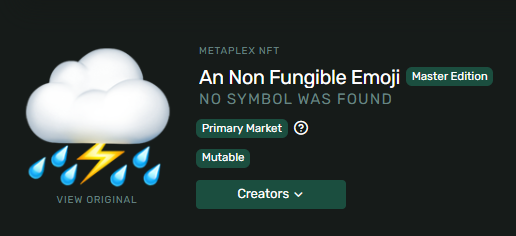
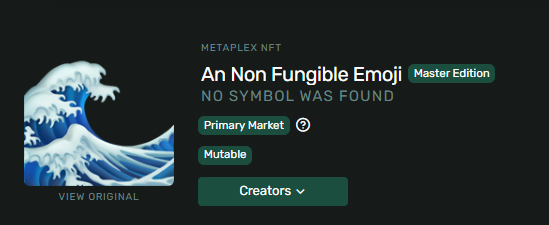

# 🤨 NFT 你的脸 - 把自己永久上链！

## 🎯 项目目标

准备好把你的脸**永久保存在区块链**上了吗？今天我们要创建最特别的 NFT - 你自己！🎭

你将学会：
- 📸 把照片变成 NFT
- 🔄 更新 NFT 图片
- 🎨 设置元数据
- 💎 成为链上永恒

:::tip 🌟 为什么要 NFT 你的脸？
- **历史见证**：成为早期 Web3 先驱的证明
- **独一无二**：世界上只有一个你
- **炫耀资本**：告诉妈妈你在区块链上了！
- **技术实践**：最有趣的学习方式
:::

## 🚀 第一步：项目初始化

### 🎬 创建项目

```bash
# 🏗️ 创建新项目（给它起个酷名字！）
npx create-solana-client my-face-nft --initialize-keypair

# 📁 进入项目
cd my-face-nft

# 📦 安装必要的包
npm install @metaplex-foundation/js fs
```

### 📸 准备你的照片

```bash
# 在 src 文件夹中准备两张图片
src/
├── face-v1.png   # 📸 初始照片（正常的你）
└── face-v2.png   # 😎 更新照片（戴墨镜的你）
```

:::info 💡 照片建议
- **尺寸**：建议 1000x1000 正方形
- **大小**：< 500KB
- **格式**：PNG 或 JPG
- **内容**：你最帅/最美的照片！
:::

## 📝 第二步：设置代码框架

### 🎨 导入必要的库

```typescript
// 📁 src/index.ts

// 🔧 Solana 基础库
import { Connection, clusterApiUrl, PublicKey } from "@solana/web3.js"

// 🎨 Metaplex NFT 工具
import {
  Metaplex,
  keypairIdentity,
  bundlrStorage,
  toMetaplexFile,
  NftWithToken,
} from "@metaplex-foundation/js"

// 📂 文件系统
import * as fs from "fs"

console.log("🎨 NFT 创建程序启动！");
```

### 🏷️ 定义 NFT 属性

```typescript
// 🎯 NFT 的基本信息（改成你自己的！）
const tokenName = "Diamond Hands #001"           // NFT 名称
const description = "永远的钻石手，永远的HODL!" // 描述
const symbol = "DIAMOND"                        // 符号
const sellerFeeBasisPoints = 100               // 版税 1%
const imageFile = "face-v1.png"               // 初始图片

// 🌈 可以添加更多属性
const attributes = [
    { trait_type: "Coolness", value: "100" },
    { trait_type: "Diamond Level", value: "Max" },
    { trait_type: "HODL Power", value: "9000" }
];
```

## 🏗️ 第三步：构建主函数

### 🔧 初始化 Metaplex

```typescript
async function main() {
    console.log("🚀 开始创建你的专属 NFT...\n");

    // 🌐 连接到 Solana 网络
    const connection = new Connection(clusterApiUrl("devnet"));
    console.log("✅ 已连接到 Devnet");

    // 🔑 初始化钱包
    const user = await initializeKeypair(connection);
    console.log("👤 创作者地址:", user.publicKey.toBase58());

    // 🎨 配置 Metaplex
    console.log("\n🔧 配置 Metaplex SDK...");
    const metaplex = Metaplex.make(connection)
        .use(keypairIdentity(user))
        .use(
            bundlrStorage({
                address: "https://devnet.bundlr.network",
                providerUrl: "https://api.devnet.solana.com",
                timeout: 60000,
            })
        );
    console.log("✅ Metaplex 配置完成！");
}
```

### 📤 上传图片流程

```typescript
async function main() {
    // ... 前面的代码 ...

    // 📸 Step 1: 读取图片文件
    console.log("\n📸 Step 1: 读取你的照片...");
    const buffer = fs.readFileSync("src/" + imageFile);
    console.log(`✅ 照片大小: ${(buffer.length / 1024).toFixed(2)} KB`);

    // 🔄 Step 2: 转换为 Metaplex 格式
    console.log("\n🔄 Step 2: 转换文件格式...");
    const file = toMetaplexFile(buffer, imageFile);
    console.log("✅ 转换成功！");

    // ☁️ Step 3: 上传到 Arweave
    console.log("\n☁️ Step 3: 上传照片到永久存储...");
    const imageUri = await metaplex.storage().upload(file);
    console.log("✅ 照片已永久保存！");
    console.log("🔗 图片链接:", imageUri);
    console.log("   (这个链接永远有效！)");
}
```

### 📋 创建元数据

```typescript
async function main() {
    // ... 前面的代码 ...

    // 📝 Step 4: 创建并上传元数据
    console.log("\n📝 Step 4: 创建 NFT 元数据...");
    const { uri } = await metaplex
        .nfts()
        .uploadMetadata({
            name: tokenName,
            description: description,
            image: imageUri,
            attributes: [
                { trait_type: "Type", value: "Legend" },
                { trait_type: "Power", value: "Over 9000" },
                { trait_type: "Rarity", value: "One of One" }
            ],
            properties: {
                category: "image",
                creators: [{
                    address: user.publicKey,
                    share: 100
                }]
            }
        });

    console.log("✅ 元数据已上传！");
    console.log("🔗 元数据链接:", uri);
}
```

## 🎨 第四步：铸造 NFT

### 🏭 创建 NFT 函数

```typescript
// 🎨 铸造 NFT 的核心函数
async function createNft(
    metaplex: Metaplex,
    uri: string
): Promise<NftWithToken> {
    console.log("\n🎨 开始铸造 NFT...");
    console.log("⏳ 这可能需要几秒钟...");

    const { nft } = await metaplex
        .nfts()
        .create({
            uri: uri,                            // 元数据链接
            name: tokenName,                     // NFT 名称
            sellerFeeBasisPoints: sellerFeeBasisPoints,  // 版税
            symbol: symbol,                      // 符号
            maxSupply: 0                        // 0 = 只有一个，真正的 1/1
        });

    console.log("\n🎉 恭喜！NFT 铸造成功！");
    console.log("🎨 NFT 地址:", nft.address.toString());
    console.log("👤 拥有者:", nft.updateAuthorityAddress.toString());
    console.log(
        `🔍 在浏览器查看: https://explorer.solana.com/address/${nft.address.toString()}?cluster=devnet`
    );

    return nft;
}
```

### 🚀 执行铸造

```typescript
async function main() {
    // ... 前面的代码 ...

    // 🎨 Step 5: 铸造你的 NFT！
    console.log("\n" + "=".repeat(60));
    const nft = await createNft(metaplex, uri);

    // 🎊 庆祝时刻！
    console.log("\n" + "=".repeat(60));
    console.log("🎊 你已经永远在区块链上了！");
    console.log("📸 你的脸现在是 NFT 了！");
    console.log("💎 保存这个地址，这是你的数字身份：");
    console.log(`   ${nft.address.toString()}`);
}
```

运行程序：
```bash
npm run start
```

### ✅ 成功输出示例

```
🎨 NFT 创建程序启动！
🚀 开始创建你的专属 NFT...

✅ 已连接到 Devnet
👤 创作者地址: 7cVfgArCheMR6Cs4t6vz5rfnqd56vZq...

🔧 配置 Metaplex SDK...
✅ Metaplex 配置完成！

📸 Step 1: 读取你的照片...
✅ 照片大小: 145.67 KB

☁️ Step 3: 上传照片到永久存储...
✅ 照片已永久保存！
🔗 图片链接: https://arweave.net/7sDCnvGRJAqfgEu...

🎨 开始铸造 NFT...
⏳ 这可能需要几秒钟...

🎉 恭喜！NFT 铸造成功！
🎨 NFT 地址: EPd324PkQx53Cx2g2B9ZfxVmu6m6gyne...
🔍 在浏览器查看: https://explorer.solana.com/address/EPd324...

============================================================
🎊 你已经永远在区块链上了！
📸 你的脸现在是 NFT 了！
💎 保存这个地址，这是你的数字身份：
   EPd324PkQx53Cx2g2B9ZfxVmu6m6gyneMaoWTy2hk2bW
```



## 🔄 第五步：更新你的 NFT

### 😎 换个更酷的照片

```typescript
// 🔄 更新 NFT 的函数
async function updateNft(
    metaplex: Metaplex,
    uri: string,
    mintAddress: PublicKey
) {
    console.log("\n🔄 准备更新 NFT...");

    // 🔍 查找现有的 NFT
    console.log("🔍 查找 NFT...");
    const nft = await metaplex.nfts().findByMint({ mintAddress });
    console.log("✅ 找到 NFT:", nft.name);

    // 🎨 更新 NFT
    console.log("🎨 更新中...");
    await metaplex
        .nfts()
        .update({
            nftOrSft: nft,
            name: tokenName + " (更酷版)",  // 新名称
            symbol: symbol,
            uri: uri,                       // 新元数据
            sellerFeeBasisPoints: sellerFeeBasisPoints,
        });

    console.log("✅ NFT 更新成功！");
    console.log("😎 你的 NFT 现在更酷了！");
    console.log(
        `🔍 查看更新: https://explorer.solana.com/address/${nft.address.toString()}?cluster=devnet`
    );
}
```

### 🚀 执行更新

```typescript
async function main() {
    // ... 前面的代码 ...

    // 💡 第一次运行：创建 NFT
    // const nft = await createNft(metaplex, uri);

    // 💡 第二次运行：更新 NFT
    // 把 imageFile 改成 "face-v2.png"
    // 然后取消下面的注释：

    const mintAddress = new PublicKey("你的NFT地址");
    await updateNft(metaplex, uri, mintAddress);
}
```



## 💡 专业技巧

### 🎨 添加更多元数据

```typescript
// 🌟 丰富的元数据示例
const metadata = {
    name: "Diamond Hands #001",
    symbol: "DIAMOND",
    description: "永远的钻石手，永远的HODL!",
    image: imageUri,
    external_url: "https://twitter.com/yourhandle",
    attributes: [
        { trait_type: "Background", value: "Moon" },
        { trait_type: "Eyes", value: "Laser" },
        { trait_type: "Hands", value: "Diamond" },
        { trait_type: "Power Level", value: "9000" }
    ],
    properties: {
        category: "image",
        files: [{
            type: "image/png",
            uri: imageUri,
        }],
        creators: [{
            address: wallet.publicKey,
            share: 100,
        }]
    }
};
```

### ⚠️ 常见问题解决

| 问题 | 原因 | 解决方案 |
|------|------|----------|
| 图片太大 | > 1MB | 压缩图片到 500KB 以下 |
| 上传失败 | 网络问题 | 重试或检查网络 |
| 余额不足 | 没有 SOL | 空投：`solana airdrop 2` |
| 地址无效 | 复制错误 | 仔细复制完整地址 |

## 🏆 挑战任务

### 🎯 Level 1: 基础版
创建你的第一个自拍 NFT

### 🎯 Level 2: 进化版
创建 3 个版本展示你的变化：
- 早上的你 ☕
- 工作中的你 💻
- 周末的你 🎉

### 🎯 Level 3: 专业版
创建一个 NFT 系列：
- 10 个不同表情的你
- 添加稀有度属性
- 设置版税

## 🎊 恭喜完成！

你已经成功把自己永久保存在区块链上了！

### ✅ 你达成的成就

- 📸 **永恒存在** - 你的脸永远在链上
- 🎨 **NFT 创作者** - 掌握了 NFT 铸造
- 🔄 **元数据管理** - 学会更新 NFT
- 💎 **Web3 先驱** - 成为早期建设者

### 🚀 可以做什么

1. **社交展示** - 在 Twitter 上分享你的 NFT
2. **收藏品** - 为朋友创建 NFT
3. **纪念品** - 记录重要时刻
4. **实验** - 尝试动态 NFT

### 📢 分享你的成果

```
我刚把自己做成了 NFT！🎨
现在我永远在 @solana 区块链上了！

查看我的 NFT：[你的链接]
#Solana #NFT #Web3 #WAGMI
```

---

**恭喜，你现在是链上永恒的存在了！** 🎭 **Welcome to the Blockchain!** 🚀
