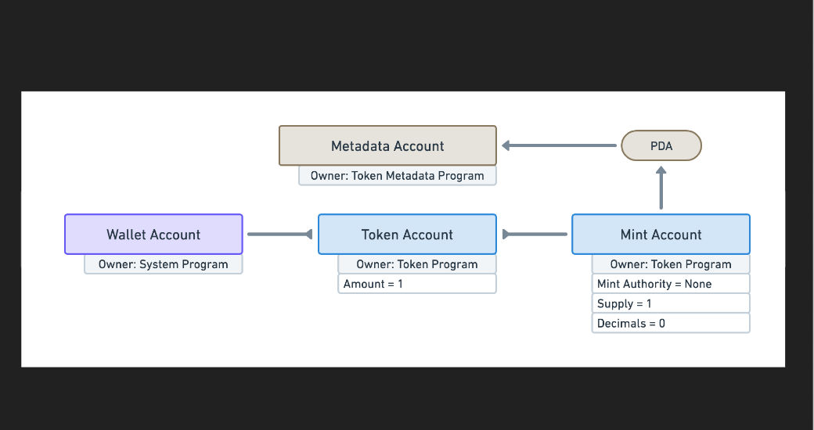
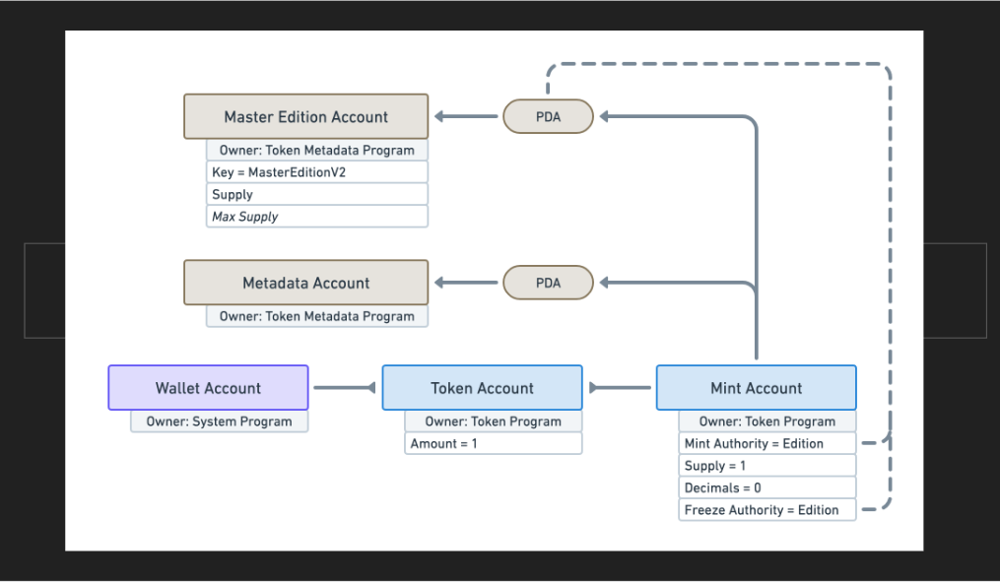
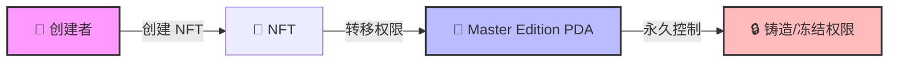
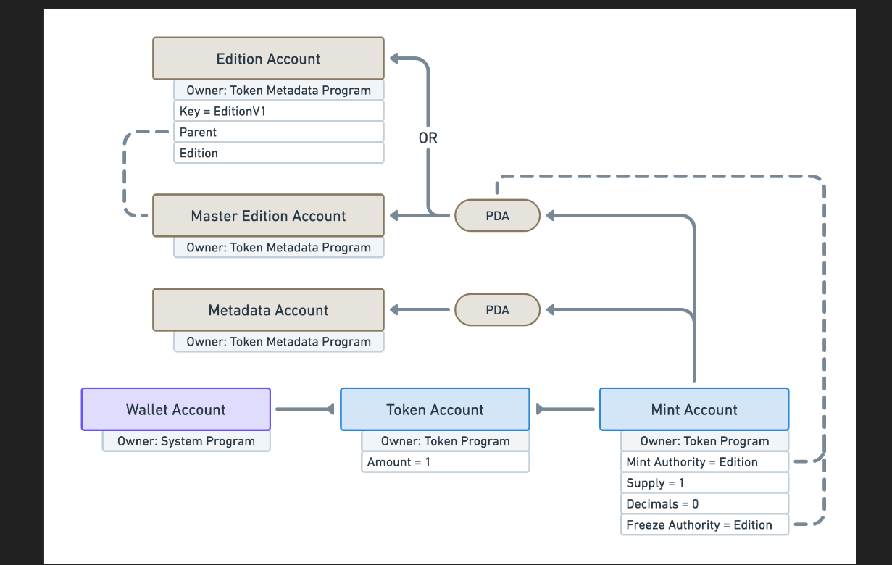
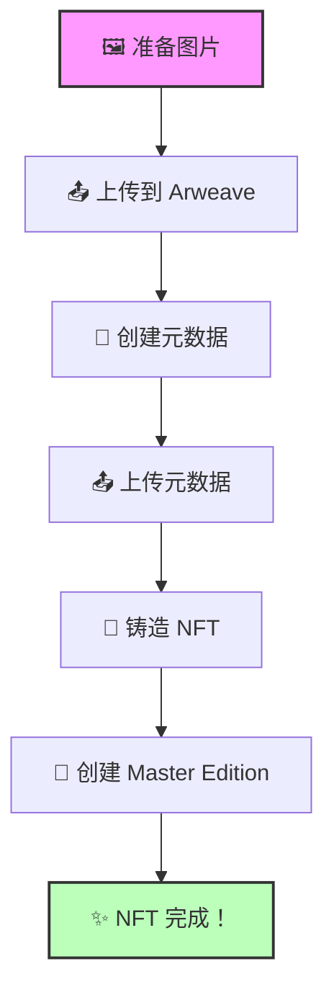

# 🎨 Solana NFT - 创造你的数字艺术帝国！

## 🎯 学习目标

准备好进入 **NFT 的奇妙世界**了吗？今天我们要学习如何在 Solana 上创建 NFT！🚀

你将掌握：
- 🖼️ 理解 NFT 的本质
- 🏭 创建 Master Edition
- 📝 设置 NFT 元数据
- 🎨 铸造你的第一个 NFT

:::tip 🌟 为什么选择 Solana NFT？
**成本对比**：
- 以太坊铸造：$5-50 💸
- Solana 铸造：$0.01-0.1 😎
- 速度：400ms vs 15秒
- 环保：碳中和 🌱

在 Solana 上，你可以把任何东西变成 NFT，包括你的表情包！
:::

## 🤔 第一章：NFT 的真相

### 🎭 揭开 NFT 的神秘面纱

让我们打破一个迷思：

```
❌ 常见误解："NFT 是特殊的智能合约"

✅ 真相："NFT 就是加了限制的普通代币"
```

### 🧬 NFT vs 普通代币

| 特征 | 🪙 普通代币 | 🎨 NFT |
|------|------------|--------|
| **供应量** | 可以很多（百万、十亿） | 永远只有 1 个 |
| **小数位** | 有（0.5 SOL） | 没有（不能有 0.5 个猴子） |
| **可分割** | ✅ 可以 | ❌ 不可以 |
| **铸造权** | 可保留 | 永久放弃 |
| **用途** | 货币、积分 | 艺术品、身份、游戏道具 |

:::info 💡 核心理解
**NFT = Non-Fungible Token（非同质化代币）**

想象两种物品：
- 💵 **一美元**：任何一美元都一样（同质化）
- 🖼️ **蒙娜丽莎**：世界上只有一幅（非同质化）
:::

### 📊 NFT 的账户结构



```typescript
// 🎨 NFT 铸币账户的特点
interface NFTMint {
    supply: 1;              // 永远只有 1
    decimals: 0;            // 没有小数
    mintAuthority: null;    // 没有铸造权限
    freezeAuthority: null;  // 通常也没有冻结权限
}
```

## 🐙 第二章：Master Edition - NFT 的灵魂

### 🎯 什么是 Master Edition？

Master Edition 是 NFT 的"出生证明"和"防伪标签"：



```
🏆 Master Edition 账户
├── 🔒 接管铸造权限
├── 📜 证明唯一性
├── 🖨️ 控制复制品
└── 🎯 版本管理
```

### 🔐 权限转移机制



:::success 🎯 关键理解
**权限转移 = 永久保证**

一旦创建 Master Edition：
- ❌ 没人能再铸造更多
- ❌ 没人能修改供应量
- ✅ NFT 永远是独一无二的
:::

### 💻 Master Edition 数据结构

```typescript
interface MasterEdition {
    key: Key;                    // 账户类型标识
    supply: number;              // 已打印的副本数
    maxSupply?: number;          // 最大副本数（可选）
}

// 🎯 maxSupply 的含义
maxSupply = 0;        // 不能打印副本
maxSupply = 100;      // 最多 100 个副本
maxSupply = null;     // 无限副本
```

## 🪰 第三章：Editions - NFT 的复制品

### 📖 什么是 Edition？

Edition 就像**限量版印刷品**：



```
🖼️ 原画 vs 印刷品
├── 🎨 Master Edition = 原画（只有一幅）
├── 📄 Edition #1 = 第一份印刷品
├── 📄 Edition #2 = 第二份印刷品
└── 📄 Edition #N = 第 N 份印刷品
```

### 🎯 Edition 的使用场景

| 场景 | Master Edition | Edition 设置 | 例子 |
|------|---------------|--------------|------|
| **1/1 艺术品** | ✅ | maxSupply = 0 | 独特的数字艺术 |
| **限量收藏** | ✅ | maxSupply = 100 | 100个限量版 |
| **开放版** | ✅ | maxSupply = null | 音乐专辑 |
| **游戏道具** | ✅ | maxSupply = 1000 | 稀有武器 |

### 💻 创建 Edition 的流程

```typescript
// 🎯 打印 NFT 副本的示例
async function printEdition(
    masterEditionMint: PublicKey,
    editionNumber: number
) {
    console.log(`🖨️ 打印第 ${editionNumber} 份副本...`);

    // 创建新的 mint 账户给副本
    const editionMint = Keypair.generate();

    // 打印副本
    const { nft: edition } = await metaplex
        .nfts()
        .printNewEdition({
            originalMint: masterEditionMint,
            newMint: editionMint,
            newOwner: ownerPublicKey
        });

    console.log(`✅ Edition #${editionNumber} 创建成功！`);
    return edition;
}
```

## 🛠️ 第四章：使用 Metaplex SDK

### 🎨 NFT 创建流程



### 📦 SDK 初始化

```typescript
import { Metaplex, keypairIdentity, bundlrStorage } from "@metaplex-foundation/js";

// 🔧 初始化 Metaplex
const metaplex = Metaplex.make(connection)
    .use(keypairIdentity(wallet))
    .use(bundlrStorage({
        address: "https://devnet.bundlr.network",
        providerUrl: "https://api.devnet.solana.com",
        timeout: 60000,
    }));

console.log("✅ Metaplex SDK 已准备就绪！");
```

### 🎯 创建 NFT 的完整代码

```typescript
async function createNFT(
    metaplex: Metaplex,
    imageFile: string,
    nftData: {
        name: string;
        symbol: string;
        description: string;
        attributes?: Array<{trait_type: string; value: string}>;
    }
) {
    console.log("🚀 开始创建 NFT...\n");

    try {
        // 1️⃣ 上传图片
        console.log("📤 Step 1: 上传图片...");
        const imageBuffer = fs.readFileSync(imageFile);
        const imageMetaplexFile = toMetaplexFile(imageBuffer, imageFile);
        const imageUri = await metaplex.storage().upload(imageMetaplexFile);
        console.log("✅ 图片已上传:", imageUri);

        // 2️⃣ 创建元数据
        console.log("\n📝 Step 2: 创建元数据...");
        const metadata = {
            name: nftData.name,
            symbol: nftData.symbol,
            description: nftData.description,
            image: imageUri,
            attributes: nftData.attributes || [],
            properties: {
                category: "image",
                files: [
                    {
                        type: "image/png",
                        uri: imageUri,
                    },
                ],
                creators: [
                    {
                        address: wallet.publicKey,
                        share: 100,
                    },
                ],
            },
        };

        // 3️⃣ 上传元数据
        const { uri: metadataUri } = await metaplex
            .nfts()
            .uploadMetadata(metadata);
        console.log("✅ 元数据已上传:", metadataUri);

        // 4️⃣ 铸造 NFT
        console.log("\n🎨 Step 3: 铸造 NFT...");
        const { nft } = await metaplex.nfts().create({
            uri: metadataUri,
            name: nftData.name,
            symbol: nftData.symbol,
            sellerFeeBasisPoints: 500, // 5% 版税
            maxSupply: 0,  // 不允许打印副本（真正的 1/1）
        });

        console.log("\n✨ NFT 创建成功！");
        console.log("🎨 NFT 地址:", nft.address.toBase58());
        console.log("🐙 Master Edition:", nft.edition.address.toBase58());
        console.log("📋 元数据:", nft.metadataAddress.toBase58());

        return nft;

    } catch (error) {
        console.error("❌ 创建 NFT 失败:", error);
        throw error;
    }
}

// 🎮 使用示例
const myFirstNFT = await createNFT(metaplex, "./art.png", {
    name: "My Awesome NFT #1",
    symbol: "AWESOME",
    description: "This is my first NFT on Solana!",
    attributes: [
        { trait_type: "Background", value: "Blue" },
        { trait_type: "Rarity", value: "Legendary" },
        { trait_type: "Power", value: "9000" }
    ]
});
```

## 🎮 第五章：实战项目

### 🖼️ 创建 NFT 收藏品系列

```typescript
// 🎯 批量创建 NFT 系列
async function createNFTCollection(
    metaplex: Metaplex,
    collectionSize: number
) {
    console.log(`🎨 创建 ${collectionSize} 个 NFT 系列...\n`);

    const nfts = [];

    for (let i = 1; i <= collectionSize; i++) {
        console.log(`\n📦 创建 NFT #${i}/${collectionSize}`);

        const nft = await createNFT(metaplex, `./images/nft-${i}.png`, {
            name: `Cool Collection #${i}`,
            symbol: "COOL",
            description: `Number ${i} of the exclusive Cool Collection`,
            attributes: [
                { trait_type: "Number", value: i.toString() },
                { trait_type: "Rarity", value: getRarity(i) },
            ]
        });

        nfts.push(nft);

        // 延迟避免速率限制
        await new Promise(resolve => setTimeout(resolve, 1000));
    }

    console.log(`\n🎉 成功创建 ${nfts.length} 个 NFT！`);
    return nfts;
}

// 🎲 随机稀有度
function getRarity(num: number): string {
    if (num <= 10) return "Legendary";
    if (num <= 30) return "Epic";
    if (num <= 60) return "Rare";
    return "Common";
}
```

### 🎯 更新 NFT 元数据

```typescript
async function updateNFT(
    metaplex: Metaplex,
    mintAddress: PublicKey,
    newData: any
) {
    console.log("🔄 更新 NFT...");

    const nft = await metaplex.nfts().findByMint({ mintAddress });

    await metaplex.nfts().update({
        nftOrSft: nft,
        name: newData.name,
        symbol: newData.symbol,
        uri: newData.uri,
    });

    console.log("✅ NFT 更新成功！");
}
```

## 💡 专业技巧

### 🎨 元数据标准

```typescript
// 🎯 标准的 NFT 元数据格式
const standardMetadata = {
    name: "NFT Name",
    symbol: "SYMBOL",
    description: "Description",
    image: "https://...",
    animation_url: "https://...",  // 可选：动画
    external_url: "https://...",   // 可选：外部链接
    attributes: [
        { trait_type: "Background", value: "Blue" },
        { trait_type: "Eyes", value: "Laser" }
    ],
    properties: {
        category: "image",
        creators: [{
            address: "...",
            share: 100
        }]
    }
};
```

### ⚠️ 常见错误处理

| 问题 | 原因 | 解决方案 |
|------|------|----------|
| "余额不足" | 没有足够 SOL | 空投或充值 |
| "元数据太大" | 超过链上限制 | 使用链下存储 |
| "图片上传失败" | 网络或格式问题 | 检查文件和网络 |
| "已存在" | mint 已被使用 | 生成新的 keypair |

## 🏆 挑战任务

### 🎯 Level 1: 创建你的第一个 NFT
创建一个代表你自己的 NFT！

### 🎯 Level 2: 限量版系列
创建 10 个 NFT 的限量系列

### 🎯 Level 3: 动态 NFT
创建可更新元数据的 NFT

## 🎊 恭喜完成！

你已经掌握了 Solana NFT 的核心知识！

### ✅ 你学会了什么

- 🧬 **NFT 本质** - 理解 NFT 就是特殊的代币
- 🐙 **Master Edition** - 掌握版本控制
- 🖨️ **Edition 系统** - 创建限量副本
- 🛠️ **Metaplex SDK** - 使用专业工具

### 🚀 下一步

1. **创建收藏品** - 设计你的 NFT 系列
2. **添加版税** - 设置创作者收益
3. **构建市场** - 创建交易平台
4. **游戏化** - 将 NFT 用于游戏

---

**准备好创造下一个蓝筹 NFT 了吗？** 🎨 **Let's mint!** 🚀
