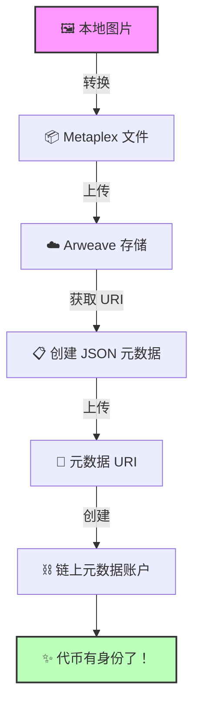
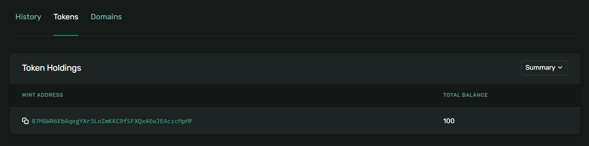
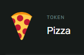
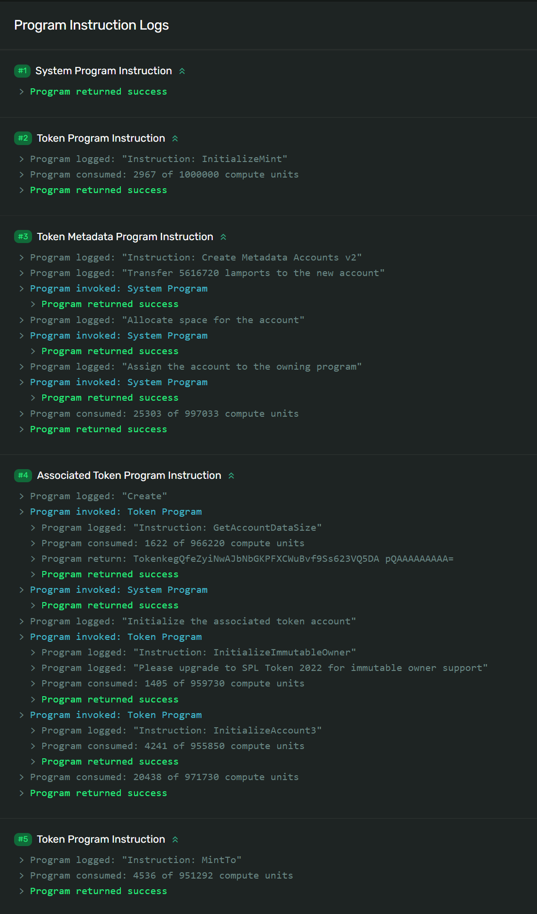

# 🧬 为你的代币赋予身份 - 从"未知"到"明星"！

## 🎯 项目目标

还记得你的代币在钱包里显示为"Unknown Token"吗？今天我们要给它一个**完整的身份**！🎭

你将实现：
- 🖼️ 上传代币图标
- 📝 添加名称和符号
- 🌐 创建元数据账户
- ✨ 让代币专业起来

:::tip 🌟 这一课的意义
就像给新生儿起名字和拍照片一样重要！
- 之前：Unknown Token 😢
- 之后：PizzaCoin 🍕 with Logo！
:::

## 🚀 第一步：项目准备

### 📦 获取起始代码

```bash
# 克隆项目（如果你没有之前的代码）
git clone https://github.com/all-in-one-solana/solana-token-client
cd solana-token-client
git checkout solution-without-burn

# 安装新的依赖
npm install @metaplex-foundation/js fs
npm install @metaplex-foundation/mpl-token-metadata
```

:::info 💡 依赖说明
- **@metaplex-foundation/js** - Metaplex 主 SDK
- **@metaplex-foundation/mpl-token-metadata** - 元数据程序
- **fs** - 文件系统，用于读取图片
:::

### 🎨 准备你的代币图标

```bash
# 创建资源文件夹
mkdir assets

# 添加你的图标（建议 512x512 PNG）
# 例如：assets/pizza.png 🍕
```

选择你的图标：
- 🍕 Pizza 币？用披萨图！
- 🚀 Moon 币？用火箭图！
- 🐕 Doge 2.0？用狗狗图！
- 💎 Diamond？用钻石图！

## 📝 第二步：理解工作流程

### 🗺️ 元数据创建流程图



### 📋 七步创建法

```
1️⃣ 图片 → Metaplex 文件格式
2️⃣ 上传图片到 Arweave
3️⃣ 创建 JSON 元数据
4️⃣ 上传元数据到 Arweave
5️⃣ 生成元数据账户 PDA
6️⃣ 构建链上数据格式
7️⃣ 发送创建交易
```

## 💻 第三步：编写代码

### 📦 添加导入

```typescript
// 📁 src/index.ts 顶部

import {
  Metaplex,
  keypairIdentity,
  bundlrStorage,
  toMetaplexFile,
} from "@metaplex-foundation/js"
import {
  DataV2,
  createCreateMetadataAccountV3Instruction,
} from "@metaplex-foundation/mpl-token-metadata"
import * as fs from "fs"
```

### 🎯 创建元数据函数

```typescript
// 🧬 为代币创建完整身份的函数
async function createTokenMetadata(
  connection: web3.Connection,
  metaplex: Metaplex,
  mint: web3.PublicKey,
  user: web3.Keypair,
  name: string,
  symbol: string,
  description: string
) {
  console.log("🎨 开始创建代币元数据...\n");

  // 1️⃣ 读取图片文件
  console.log("📖 Step 1: 读取图片文件...");
  const buffer = fs.readFileSync("assets/pizza.png"); // 改成你的文件名！
  console.log(`✅ 图片大小: ${(buffer.length / 1024).toFixed(2)} KB`);

  // 2️⃣ 转换为 Metaplex 文件
  console.log("\n🔄 Step 2: 转换文件格式...");
  const file = toMetaplexFile(buffer, "pizza.png");
  console.log("✅ 转换成功！");

  // 3️⃣ 上传图片到 Arweave
  console.log("\n☁️ Step 3: 上传图片到 Arweave...");
  const imageUri = await metaplex.storage().upload(file);
  console.log("✅ 图片已永久存储！");
  console.log("🔗 图片链接:", imageUri);

  // 4️⃣ 创建并上传元数据 JSON
  console.log("\n📋 Step 4: 创建元数据 JSON...");
  const { uri: metadataUri } = await metaplex
    .nfts()
    .uploadMetadata({
      name: name,
      symbol: symbol,
      description: description,
      image: imageUri,
      attributes: [],  // 可选：添加属性
      properties: {
        category: "currency",
        creators: []
      }
    });
  console.log("✅ 元数据已上传！");
  console.log("🔗 元数据链接:", metadataUri);

  // 5️⃣ 生成元数据账户地址 (PDA)
  console.log("\n🔑 Step 5: 生成元数据账户地址...");
  const metadataPDA = metaplex.nfts().pdas().metadata({ mint });
  console.log("📍 元数据 PDA:", metadataPDA.toBase58());

  // 6️⃣ 构建链上数据格式
  console.log("\n🏗️ Step 6: 构建链上数据...");
  const tokenMetadata = {
    name: name,
    symbol: symbol,
    uri: metadataUri,
    sellerFeeBasisPoints: 0,     // 无版税（代币用）
    creators: null,               // 无创作者（代币用）
    collection: null,             // 无集合（代币用）
    uses: null,                   // 无使用限制
  } as DataV2;
  console.log("✅ 数据结构准备完成！");

  // 7️⃣ 创建交易
  console.log("\n📝 Step 7: 创建元数据账户交易...");
  const transaction = new web3.Transaction().add(
    createCreateMetadataAccountV3Instruction(
      {
        metadata: metadataPDA,
        mint: mint,
        mintAuthority: user.publicKey,
        payer: user.publicKey,
        updateAuthority: user.publicKey,
      },
      {
        createMetadataAccountArgsV3: {
          data: tokenMetadata,
          isMutable: true,           // 可更新
          collectionDetails: null     // 非 NFT 集合
        },
      }
    )
  );

  // 8️⃣ 发送交易
  console.log("🚀 发送交易...");
  const transactionSignature = await web3.sendAndConfirmTransaction(
    connection,
    transaction,
    [user]
  );

  console.log("\n✨ 元数据创建成功！");
  console.log(
    `🔍 查看交易: https://explorer.solana.com/tx/${transactionSignature}?cluster=devnet`
  );

  return metadataPDA;
}
```

:::warning ⚠️ 注意事项
- 确保图片文件路径正确
- 图片不要太大（建议 < 500KB）
- `nfts()` 方法名不要困惑，它也用于代币
:::

### 🔧 更新主函数

```typescript
async function main() {
  console.log("🚀 启动代币元数据创建程序...\n");

  // 🌐 连接网络
  const connection = new web3.Connection(web3.clusterApiUrl("devnet"));
  const user = await initializeKeypair(connection);

  console.log("👤 你的地址:", user.publicKey.toBase58());
  console.log("=" .repeat(60));

  // ⚠️ 重要：替换成你的代币地址！
  const MINT_ADDRESS = "替换成你的代币地址";

  // 🎨 初始化 Metaplex
  console.log("\n🔧 配置 Metaplex...");
  const metaplex = Metaplex.make(connection)
    .use(keypairIdentity(user))
    .use(
      bundlrStorage({
        address: "https://devnet.bundlr.network",
        providerUrl: "https://api.devnet.solana.com",
        timeout: 60000,
      })
    );
  console.log("✅ Metaplex 配置完成！");

  // 🧬 创建代币元数据
  console.log("\n" + "=" .repeat(60));
  await createTokenMetadata(
    connection,
    metaplex,
    new web3.PublicKey(MINT_ADDRESS),
    user,
    "Pizza Coin",     // 🍕 代币名称 - 改成你的！
    "PIZZA",          // 🍕 代币符号 - 改成你的！
    "最美味的加密货币，持有者可参加披萨派对！" // 描述 - 改成你的！
  );

  console.log("\n" + "=" .repeat(60));
  console.log("🎉 恭喜！你的代币现在有了完整的身份！");
  console.log("👛 去钱包看看你的专业代币吧！");
}
```

### 🔍 查找你的代币地址

如果忘记了代币地址，可以这样找：

1. 打开 [Solana Explorer](https://explorer.solana.com/?cluster=devnet)
2. 搜索你的钱包地址
3. 点击 "Tokens" 标签
4. 复制代币地址



## 🎮 第四步：运行程序

```bash
npm run start
```

### ✅ 成功输出示例

```
🚀 启动代币元数据创建程序...

👤 你的地址: 5y3G3Rz5vgK9rKRxu3BaC3PvhsMKGyAmtcizgrxojYAA
============================================================

🔧 配置 Metaplex...
✅ Metaplex 配置完成！

============================================================
🎨 开始创建代币元数据...

📖 Step 1: 读取图片文件...
✅ 图片大小: 42.35 KB

🔄 Step 2: 转换文件格式...
✅ 转换成功！

☁️ Step 3: 上传图片到 Arweave...
✅ 图片已永久存储！
🔗 图片链接: https://arweave.net/7sDCnvGRJAqfgEuGOYW...

📋 Step 4: 创建元数据 JSON...
✅ 元数据已上传！
🔗 元数据链接: https://arweave.net/-2vGrM69PNtb2YaH...

✨ 元数据创建成功！
🔍 查看交易: https://explorer.solana.com/tx/4w8XEG...

============================================================
🎉 恭喜！你的代币现在有了完整的身份！
👛 去钱包看看你的专业代币吧！
```

## 🎨 第五步：查看成果

打开钱包或 Explorer，你的代币现在应该显示：



从 "Unknown Token" 到专业代币的蜕变！🎉


## 🏆 挑战任务：一键发币

### 🎯 任务目标

创建一个**单一交易**，包含所有操作：

1. 🏭 创建代币铸造账户
2. 🎨 创建元数据账户
3. 💳 创建代币账户
4. 🖨️ 铸造初始代币

### 💡 实现思路

```typescript
async function createTokenWithMetadata() {
  console.log("🚀 一键创建专业代币！\n");

  const transaction = new web3.Transaction();

  // 1️⃣ 添加创建铸造账户指令
  console.log("添加：创建铸造账户...");
  transaction.add(createMintInstruction(...));

  // 2️⃣ 添加创建元数据指令
  console.log("添加：创建元数据...");
  transaction.add(createMetadataInstruction(...));

  // 3️⃣ 条件性添加代币账户
  const tokenAccount = await getOrCreateTokenAccount(...);
  if (需要创建) {
    console.log("添加：创建代币账户...");
    transaction.add(createTokenAccountInstruction(...));
  }

  // 4️⃣ 添加铸造指令
  console.log("添加：铸造代币...");
  transaction.add(mintToInstruction(...));

  // 🚀 一次性发送！
  console.log("\n🎯 发送批量交易...");
  const signature = await sendAndConfirmTransaction(
    connection,
    transaction,
    [payer]
  );

  console.log("✅ 全部完成！一个交易搞定所有！");
}
```

### 🔍 提示

- 查看 `getOrCreateAssociatedTokenAccount` 的[源码](https://github.com/solana-labs/solana-program-library/blob/48fbb5b7/token/js/src/actions/getOrCreateAssociatedTokenAccount.ts#L35)
- 使用原始指令而不是辅助函数
- 注意指令的顺序很重要！

### 🏅 成功标准



在 Explorer 中应该看到一个交易包含多个指令！

## 💡 专业技巧

### 🎨 图片优化建议

```typescript
// 检查文件大小
const stats = fs.statSync("assets/logo.png");
const fileSizeInMB = stats.size / (1024 * 1024);

if (fileSizeInMB > 0.5) {
  console.warn("⚠️ 图片太大，建议压缩到 500KB 以下");
}

// 支持多种格式
const supportedFormats = ['.png', '.jpg', '.jpeg', '.gif'];
```

### 🔧 调试技巧

```typescript
// 验证元数据
const mint = await metaplex.nfts().findByMint({
  mintAddress: new PublicKey(MINT_ADDRESS)
});
console.log("当前元数据:", mint.json);

// 更新元数据
await metaplex.nfts().update({
  nftOrSft: mint,
  name: "New Name",
  symbol: "NEW"
});
```

## 🎊 恭喜完成！

你的代币现在是个有身份的"人"了！

### ✅ 你学会了什么

- 🖼️ **上传图片** - 永久存储到 Arweave
- 📋 **创建元数据** - JSON 格式规范
- 🔑 **PDA 生成** - 元数据账户地址
- ⛓️ **链上账户** - 创建元数据账户
- 🎯 **批量操作** - 一个交易多个指令

### 🚀 下一步

1. **分享代币** - 发送给朋友们
2. **更新元数据** - 尝试修改信息
3. **创建 NFT** - 学习 NonFungible 标准
4. **构建 DApp** - 创建铸币界面

---

**你的代币已经准备好征服世界了！** 🌍 **分享你的代币地址，让大家来交换！** 🔄
