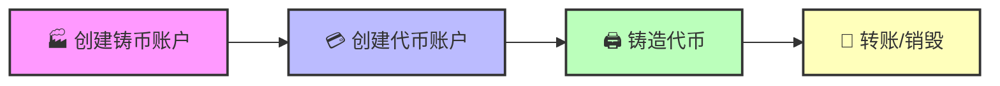

# 🏧 在 Solana 上铸造代币 - 成为你自己的央行行长！

## 🎯 项目目标

准备好创造你自己的**魔法互联网货币**了吗？今天我们要打开印钞机！💵

你将学会：
- 🏭 创建代币铸造厂
- 💳 创建代币账户
- 🖨️ 铸造你的代币
- 💸 转账和销毁代币

:::tip 🌟 发挥创意的时刻
这是你创造历史的机会！你可以创建：
- 🍕 **PizzaCoin** - 因为披萨是永恒的
- 🥷 **HokageCoin** - 火影忍者粉丝专属
- 🐕 **DogeCoin 2.0** - 因为一个狗币不够
- 💎 **DiamondHands** - 钻石手专用币
- 🚀 **ToTheMoonCoin** - 目标月球！
:::

## 🚀 第一步：项目初始化

### 🎬 创建新项目

```bash
# 🏗️ 创建新的 Solana 客户端（替换 [name] 为你的代币名）
npx create-solana-client pizzacoin-minter --initialize-keypair

# 📁 进入项目目录
cd pizzacoin-minter

# 📦 安装依赖
npm install

# 🪙 安装 SPL Token 库
npm install @solana/spl-token
```

:::info 💡 --initialize-keypair 的魔法
这个标志自动为你：
- 生成新密钥对
- 保存到 .env 文件
- 空投测试 SOL
- 设置连接配置
一个命令搞定所有初始化！
:::

### 🎨 测试运行

```bash
npm run start
```

你应该看到：
```
🔑 密钥对生成成功！
💰 空投 2 SOL 成功！
📍 你的地址: 7cVf...
```


*美联储主席鲍威尔：印钞机 goes brrrrr* 🖨️💵

## 🏭 第二步：构建代币铸造器

### 📝 核心功能规划



### 🏗️ Step 1: 创建铸币账户

打开 `src/index.ts`，添加以下代码：

```typescript
// 📦 导入必要的库
import * as token from "@solana/spl-token";
import * as web3 from "@solana/web3.js";

// 🏭 创建新的代币铸造厂
async function createNewMint(
    connection: web3.Connection,
    payer: web3.Keypair,
    mintAuthority: web3.PublicKey,
    freezeAuthority: web3.PublicKey,
    decimals: number
): Promise<web3.PublicKey> {

    console.log("🏭 创建代币铸造厂...");

    // 🎯 创建铸币账户
    const tokenMint = await token.createMint(
        connection,                // 网络连接
        payer,                     // 谁付钱
        mintAuthority,             // 谁能铸币
        freezeAuthority,           // 谁能冻结（null = 没人）
        decimals                   // 小数位数
    );

    console.log(`✅ 代币铸造账户创建成功！`);
    console.log(`🏭 铸币地址: ${tokenMint.toBase58()}`);
    console.log(
        `🔍 查看: https://explorer.solana.com/address/${tokenMint}?cluster=devnet`
    );

    return tokenMint;
}
```

:::success 🎯 关键参数解释
- **mintAuthority**: 控制谁能印钱（通常是你）
- **freezeAuthority**: 控制谁能冻结账户（可以是 null）
- **decimals**: 代币精度（2 = 像美分，9 = 像 SOL）

选择小数位数就像选择货币单位：
- 0 位：只有整数（1, 2, 3...）
- 2 位：像美元（1.00, 1.50...）
- 9 位：像 SOL（超精确）
:::

### 💳 Step 2: 创建代币账户

```typescript
// 💳 为钱包创建代币账户（像开银行账户）
async function createTokenAccount(
    connection: web3.Connection,
    payer: web3.Keypair,
    mint: web3.PublicKey,
    owner: web3.PublicKey
) {
    console.log("💳 创建代币账户...");

    // 🔍 获取或创建关联代币账户
    const tokenAccount = await token.getOrCreateAssociatedTokenAccount(
        connection,         // 网络连接
        payer,             // 谁付账户租金
        mint,              // 哪种代币
        owner              // 谁拥有这个账户
    );

    console.log(`✅ 代币账户创建成功！`);
    console.log(`📍 账户地址: ${tokenAccount.address.toBase58()}`);
    console.log(
        `🔍 查看: https://explorer.solana.com/address/${tokenAccount.address}?cluster=devnet`
    );

    return tokenAccount;
}
```

:::info 💡 智能提示
`getOrCreateAssociatedTokenAccount` 很聪明：
- 如果账户已存在 → 返回现有账户
- 如果账户不存在 → 创建新账户
这避免了重复创建的错误！
:::

### 🖨️ Step 3: 铸造代币

```typescript
// 🖨️ 开动印钞机！
async function mintTokens(
    connection: web3.Connection,
    payer: web3.Keypair,
    mint: web3.PublicKey,
    destination: web3.PublicKey,
    authority: web3.Keypair,
    amount: number
) {
    console.log(`🖨️ 开始铸造 ${amount} 个代币...`);

    // 📊 获取代币信息
    const mintInfo = await token.getMint(connection, mint);

    // 💵 铸造代币
    const transactionSignature = await token.mintTo(
        connection,
        payer,
        mint,
        destination,
        authority,
        amount * 10 ** mintInfo.decimals  // 转换为最小单位
    );

    console.log(`✅ 成功铸造 ${amount} 个代币！`);
    console.log(
        `🔍 交易: https://explorer.solana.com/tx/${transactionSignature}?cluster=devnet`
    );

    return transactionSignature;
}
```

## 🎮 第三步：组装主函数

```typescript
async function main() {
    console.log("🚀 启动代币铸造程序...\n");

    // 🌐 连接到 Devnet
    const connection = new web3.Connection(web3.clusterApiUrl("devnet"));

    // 🔑 初始化密钥对
    const user = await initializeKeypair(connection);
    console.log("👤 铸币厂长地址:", user.publicKey.toBase58());
    console.log("=" .repeat(50));

    // 🏭 Step 1: 创建代币铸造厂
    console.log("\n📌 Step 1: 创建代币铸造厂");
    const mint = await createNewMint(
        connection,
        user,               // 我们付钱
        user.publicKey,     // 我们是铸币权威 👑
        user.publicKey,     // 我们也是冻结权威 ❄️
        2                   // 2位小数（像美分）
    );

    // 💳 Step 2: 创建代币账户
    console.log("\n📌 Step 2: 创建代币账户");
    const tokenAccount = await createTokenAccount(
        connection,
        user,
        mint,
        user.publicKey      // 给自己创建账户
    );

    // 🖨️ Step 3: 铸造 100 个代币
    console.log("\n📌 Step 3: 铸造代币");
    await mintTokens(
        connection,
        user,
        mint,
        tokenAccount.address,
        user,
        100  // 铸造 100 个代币
    );

    console.log("\n🎉 恭喜！你的代币帝国建立成功！");
    console.log("💰 当前余额: 100 个代币");
    console.log("🏭 铸币地址:", mint.toBase58());
    console.log("💳 账户地址:", tokenAccount.address.toBase58());
}
```

运行程序：
```bash
npm run start
```

## 💸 第四步：转账和销毁功能

### 📤 转账代币

```typescript
// 💸 转账代币给其他人
async function transferTokens(
    connection: web3.Connection,
    payer: web3.Keypair,
    source: web3.PublicKey,
    destination: web3.PublicKey,
    owner: web3.PublicKey,
    amount: number,
    mint: web3.PublicKey
) {
    console.log(`💸 转账 ${amount} 个代币...`);

    // 📊 获取代币信息
    const mintInfo = await token.getMint(connection, mint);

    // 💰 执行转账
    const transactionSignature = await token.transfer(
        connection,
        payer,
        source,                             // 从哪转
        destination,                        // 转到哪
        owner,                             // 授权人
        amount * 10 ** mintInfo.decimals  // 数量
    );

    console.log(`✅ 成功转账 ${amount} 个代币！`);
    console.log(`📤 从: ${source.toBase58().substring(0, 8)}...`);
    console.log(`📥 到: ${destination.toBase58().substring(0, 8)}...`);
    console.log(
        `🔍 交易: https://explorer.solana.com/tx/${transactionSignature}?cluster=devnet`
    );
}
```

### 🔥 销毁代币

```typescript
// 🔥 销毁代币（减少供应量）
async function burnTokens(
    connection: web3.Connection,
    payer: web3.Keypair,
    account: web3.PublicKey,
    mint: web3.PublicKey,
    owner: web3.Keypair,
    amount: number
) {
    console.log(`🔥 销毁 ${amount} 个代币...`);

    const mintInfo = await token.getMint(connection, mint);

    const transactionSignature = await token.burn(
        connection,
        payer,
        account,                           // 从哪个账户销毁
        mint,                              // 哪种代币
        owner,                             // 账户所有者
        amount * 10 ** mintInfo.decimals  // 数量
    );

    console.log(`✅ 成功销毁 ${amount} 个代币！`);
    console.log(`🔥 总供应量减少: ${amount}`);
    console.log(
        `🔍 交易: https://explorer.solana.com/tx/${transactionSignature}?cluster=devnet`
    );
}
```

## 🎮 第五步：完整演示

```typescript
async function fullDemo() {
    console.log("🎪 完整代币演示开始！\n");

    // ... 前面的初始化代码 ...

    // 🎯 创建接收者
    console.log("\n📌 Step 4: 创建接收者账户");
    const receiver = web3.Keypair.generate();
    console.log("👤 接收者地址:", receiver.publicKey.toBase58());

    const receiverTokenAccount = await createTokenAccount(
        connection,
        user,                  // 我们付钱创建
        mint,
        receiver.publicKey    // 但归接收者所有
    );

    // 💸 转账 50 个代币
    console.log("\n📌 Step 5: 转账代币");
    await transferTokens(
        connection,
        user,
        tokenAccount.address,
        receiverTokenAccount.address,
        user.publicKey,
        50,
        mint
    );

    // 🔥 销毁 25 个代币
    console.log("\n📌 Step 6: 销毁代币");
    await burnTokens(
        connection,
        user,
        tokenAccount.address,
        mint,
        user,
        25
    );

    // 📊 显示最终余额
    console.log("\n📊 最终统计:");
    console.log("💰 你的余额: 25 个代币（100 - 50 - 25）");
    console.log("💰 接收者余额: 50 个代币");
    console.log("🔥 已销毁: 25 个代币");
    console.log("📈 流通总量: 75 个代币");
}
```

## 🎨 在钱包中查看代币

运行程序后，你可能会在钱包中看到：


😱 显示"未知代币"？别担心，这是正常的！

### 🏷️ 为什么显示未知？

```
新代币 = 没有元数据
没有元数据 = 钱包不知道怎么显示
结果 = "Unknown Token" 😅
```

### 💡 解决方案

下一节我们将学习如何添加：
- 📝 代币名称
- 🖼️ 代币图标
- 💬 代币符号
- 📄 代币描述

## 🏆 挑战任务

### 🎯 Level 1: 创建你的 Meme 币
创建一个有趣的 meme 币，铸造 69,420,000 个！

### 🎯 Level 2: 空投系统
创建一个函数，向 10 个地址空投代币

### 🎯 Level 3: 通缩机制
实现每次转账自动销毁 1% 的机制

## 📚 技巧和最佳实践

### ⚠️ 常见错误和解决方案

| 问题 | 原因 | 解决方案 |
|------|------|----------|
| "账户不存在" | 未创建代币账户 | 先调用 `createTokenAccount` |
| "余额不足" | 代币不够 | 检查余额或铸造更多 |
| "权限错误" | 不是铸币权威 | 使用正确的密钥对 |
| "小数位错误" | 计算错误 | 记得乘以 10^decimals |

### 💡 Pro Tips

```typescript
// 🎯 Tip 1: 批量创建账户
const accounts = await Promise.all(
    addresses.map(addr =>
        createTokenAccount(connection, payer, mint, addr)
    )
);

// 🎯 Tip 2: 检查余额
const balance = await connection.getTokenAccountBalance(
    tokenAccount.address
);
console.log("余额:", balance.value.uiAmount);

// 🎯 Tip 3: 获取所有持有者
const holders = await connection.getProgramAccounts(
    token.TOKEN_PROGRAM_ID,
    {
        filters: [
            { dataSize: 165 },
            { memcmp: { offset: 0, bytes: mint.toBase58() }}
        ]
    }
);
```

## 🎊 恭喜完成！

你已经成功成为代币发行者！

### ✅ 你掌握了什么

- 🏭 **创建铸币账户** - 你的代币工厂
- 💳 **管理代币账户** - 用户的钱包
- 🖨️ **铸造代币** - 创造价值
- 💸 **转账功能** - 流通货币
- 🔥 **销毁机制** - 控制供应

### 🚀 下一步

1. **添加元数据** - 让代币有名字和图标
2. **创建 DApp** - 用户界面
3. **实现 Staking** - 质押奖励
4. **上线主网** - 真正的发行！

---

**准备好成为下一个加密货币大亨了吗？** 💎🙌 **To the Moon!** 🚀
