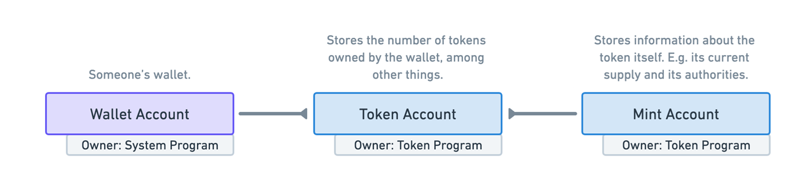
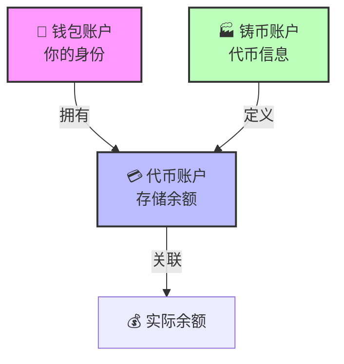

# 💵 Solana Token Program - 创造你自己的代币帝国！

## 🎯 学习目标

准备好创建你自己的代币了吗？无论是 **Meme 币**、**游戏币**还是**治理代币**，今天你将掌握一切！🚀

你将学会：
- 🏗️ 理解 Solana 独特的代币架构
- 🪙 创建自己的 SPL 代币
- 📊 管理代币的供应和分发
- 🔐 控制铸造和冻结权限

:::tip 🌟 为什么学习 Token Program？
代币是区块链的**核心**！
- 💰 **DeFi**：流动性、交易、借贷
- 🎮 **GameFi**：游戏内货币和资产
- 🏛️ **DAO**：治理和投票权
- 🎨 **NFT**：独特的数字资产
:::

## 🎭 第一章：Solana 代币的独特之处

### 🤔 与其他链的对比

让我们先理解 Solana 的与众不同：

```
🔷 以太坊模式（ERC-20）
├── 一个合约 = 一种代币
├── 余额存在合约里
└── 简单但不够灵活

🟣 Solana 模式（SPL Token）
├── 一个程序管理所有代币
├── 账户模型存储余额
└── 复杂但超级灵活！
```

:::info 💡 核心理念
**Solana = 一个程序统治所有代币！**

想象一个超级管理员（Token Program）管理着所有代币的规则，而每种代币和每个用户的余额都存在独立的账户里。
:::

## 🗃️ 第二章：三大核心账户

### 🎯 账户关系全景图

让我们用一个**银行系统**来类比：

```
🏦 Solana 代币银行系统
├── 👤 钱包账户（你的身份证）
├── 🏭 铸币账户（央行印钞机）
└── 💳 代币账户（你的银行卡）
```



### 📊 详细关系解析



## 🏭 第三章：铸币账户 - 代币的出生证明

### 📝 铸币账户结构


让我们深入了解**铸币账户**的属性：

```typescript
interface MintAccount {
    // 🔑 铸造权限 - 谁能印钞？
    mintAuthority: PublicKey | null;

    // 💰 总供应量 - 印了多少钱？
    supply: number;

    // 🔢 小数位数 - 能分多细？
    decimals: number;

    // ✅ 是否初始化
    isInitialized: boolean;

    // 🧊 冻结权限 - 谁能冻结账户？
    freezeAuthority: PublicKey | null;
}
```

### 🎨 形象化理解

```
🏭 铸币账户就像造币厂
├── 📋 印钞许可证（mintAuthority）
├── 💵 已印钞票总量（supply）
├── ✂️ 最小面额（decimals）
├── 🔐 是否开工（isInitialized）
└── ❄️ 紧急冻结权（freezeAuthority）
```

:::warning ⚠️ 小数位陷阱
**链上没有小数！** 一切都是整数！

举例：
- decimals = 2，supply = 100
- 实际代币数 = 100 ÷ 10² = 1 个代币
- 就像美分和美元的关系！
:::

### 💡 实用示例

```typescript
// 🎯 不同小数位的实际意义

// USDC：6 位小数
1_000_000 最小单位 = 1 USDC

// SOL：9 位小数
1_000_000_000 lamports = 1 SOL

// 你的 Meme 币：0 位小数
1 = 1（没有小数，要么 0 要么 1）
```

## 💳 第四章：代币账户 - 你的数字钱包

### 🗂️ 代币账户结构


```typescript
interface TokenAccount {
    // 🏭 对应哪种代币？
    mint: PublicKey;

    // 👤 谁拥有这个账户？
    owner: PublicKey;

    // 💰 有多少余额？
    amount: number;

    // 🔐 其他属性
    state: AccountState;
    // ... 更多
}
```

### 🔑 关联代币账户（ATA）

**ATA = Associated Token Account**，让我们用**邮箱地址**来理解：

```
📮 邮箱地址生成规则
用户地址 + 代币地址 = 唯一邮箱地址

示例：
Alice + USDC = Alice 的 USDC 邮箱
Bob + USDC = Bob 的 USDC 邮箱
Alice + CustomToken = Alice 的 CustomToken 邮箱
```

:::success 🎯 关键理解
**你的钱包不直接持有代币！**

```
❌ 错误理解：钱包 → 代币
✅ 正确理解：钱包 → 代币账户 → 代币余额
```

就像你的身份证（钱包）不是银行卡（代币账户），但银行卡关联着你的身份！
:::

## 🚀 第五章：实战 - 创建你的代币

### 🛠️ 环境准备

```bash
# 安装 SPL Token SDK
npm install @solana/spl-token @solana/web3.js

# 导入必要的库
import {
    createMint,
    getOrCreateAssociatedTokenAccount,
    mintTo,
    transfer,
    TOKEN_PROGRAM_ID
} from "@solana/spl-token";
```

### 🪙 Step 1: 创建代币

```typescript
// 🎯 创建你的第一个代币！

async function createToken() {
    // 🔑 生成代币地址（可选，也可以让程序自动生成）
    const tokenKeypair = Keypair.generate();
    console.log("🎯 代币地址:", tokenKeypair.publicKey.toBase58());

    // 🏭 创建铸币账户
    const tokenMint = await createMint(
        connection,                              // 网络连接
        payer,                                   // 谁付钱
        payer.publicKey,                         // 铸造权限给谁
        payer.publicKey,                         // 冻结权限给谁（或 null）
        9,                                       // 小数位（9 = 像 SOL）
        tokenKeypair,                            // 代币密钥对
        { commitment: 'confirmed' },             // 确认选项
        TOKEN_PROGRAM_ID                         // 程序 ID
    );

    console.log("✅ 代币创建成功！");
    console.log("🪙 代币地址:", tokenMint.toBase58());

    return tokenMint;
}
```

### 💳 Step 2: 创建代币账户

```typescript
// 🎯 为用户创建代币账户

async function createTokenAccount(
    tokenMint: PublicKey,
    owner: PublicKey
) {
    // 🔍 获取或创建关联代币账户
    const tokenAccount = await getOrCreateAssociatedTokenAccount(
        connection,
        payer,
        tokenMint,      // 哪种代币
        owner           // 谁拥有
    );

    console.log("💳 代币账户创建成功！");
    console.log("📍 账户地址:", tokenAccount.address.toBase58());
    console.log("💰 当前余额:", tokenAccount.amount.toString());

    return tokenAccount;
}
```

### 🖨️ Step 3: 铸造代币

```typescript
// 🎯 铸造新代币

async function mintTokens(
    tokenMint: PublicKey,
    destination: PublicKey,
    amount: number
) {
    // 💵 铸造代币
    const signature = await mintTo(
        connection,
        payer,
        tokenMint,                          // 铸造哪种代币
        destination,                        // 发送到哪个账户
        payer.publicKey,                    // 铸造权限
        amount * 10 ** 9                    // 数量（考虑小数）
    );

    console.log("🎉 铸造成功！");
    console.log("💰 铸造数量:", amount);
    console.log("📝 交易签名:", signature);

    return signature;
}
```

### 📤 Step 4: 转账代币

```typescript
// 🎯 转账代币

async function transferTokens(
    tokenMint: PublicKey,
    fromAccount: PublicKey,
    toAccount: PublicKey,
    amount: number
) {
    // 💸 执行转账
    const signature = await transfer(
        connection,
        payer,
        fromAccount,                        // 从哪转
        toAccount,                          // 转到哪
        payer.publicKey,                    // 授权人
        amount * 10 ** 9                    // 数量
    );

    console.log("💸 转账成功！");
    console.log("📤 从:", fromAccount.toBase58());
    console.log("📥 到:", toAccount.toBase58());
    console.log("💰 数量:", amount);

    return signature;
}
```

### 🎮 完整示例：创建 Meme 币

```typescript
// 🚀 创建你的 Meme 币帝国！

async function launchMemeCoin() {
    console.log("🚀 启动 Meme 币项目...\n");

    // Step 1: 创建代币
    console.log("1️⃣ 创建 DOGE2.0 代币...");
    const dogeCoin = await createMint(
        connection,
        payer,
        payer.publicKey,                    // 你控制铸造
        null,                               // 没有冻结权限
        6,                                  // 6 位小数
        undefined,                          // 自动生成地址
        { commitment: 'confirmed' },
        TOKEN_PROGRAM_ID
    );
    console.log("✅ DOGE2.0 地址:", dogeCoin.toBase58());

    // Step 2: 创建你的代币账户
    console.log("\n2️⃣ 创建代币账户...");
    const myAccount = await getOrCreateAssociatedTokenAccount(
        connection,
        payer,
        dogeCoin,
        payer.publicKey
    );
    console.log("✅ 账户地址:", myAccount.address.toBase58());

    // Step 3: 铸造 100 万个代币
    console.log("\n3️⃣ 铸造 1,000,000 DOGE2.0...");
    await mintTo(
        connection,
        payer,
        dogeCoin,
        myAccount.address,
        payer.publicKey,
        1_000_000 * 10 ** 6  // 1M 代币 * 10^6 小数
    );
    console.log("✅ 铸造完成！");

    // Step 4: 撤销铸造权限（可选）
    console.log("\n4️⃣ 撤销铸造权限（总量锁定）...");
    // await setAuthority(...)

    console.log("\n🎉 恭喜！DOGE2.0 成功发射！");
    console.log("📊 总供应量: 1,000,000 DOGE2.0");
    console.log("💎 准备 To The Moon! 🚀");
}
```

## 🎯 第六章：高级技巧

### 🔒 权限管理

```typescript
// 🔑 转移或撤销权限

import { setAuthority, AuthorityType } from "@solana/spl-token";

// 撤销铸造权限（锁定总量）
await setAuthority(
    connection,
    payer,
    tokenMint,
    payer.publicKey,              // 当前权限
    AuthorityType.MintTokens,     // 权限类型
    null                          // 新权限（null = 撤销）
);
```

### 🧊 冻结功能

```typescript
// ❄️ 冻结可疑账户

import { freezeAccount } from "@solana/spl-token";

await freezeAccount(
    connection,
    payer,
    tokenAccount,
    tokenMint,
    freezeAuthority
);
```

### 🔥 销毁代币

```typescript
// 🔥 销毁代币减少供应

import { burn } from "@solana/spl-token";

await burn(
    connection,
    payer,
    tokenAccount,
    tokenMint,
    owner,
    1000 * 10 ** 9  // 销毁数量
);
```

## 🏆 实战项目建议

### 🎯 项目 1：游戏代币系统
```
创建游戏币 → 玩家获得奖励 → 商店消费
```

### 🎯 项目 2：DAO 治理代币
```
发行代币 → 分发给成员 → 投票权重
```

### 🎯 项目 3：稳定币系统
```
1:1 锚定 → 铸造/销毁机制 → 价格稳定
```

## 📚 深入学习资源

### 官方文档
- 📖 [SPL Token 文档](https://spl.solana.com/token)
- 🔧 [Token Program 源码](https://github.com/solana-labs/solana-program-library)
- 🎓 [Solana Cookbook - Tokens](https://solanacookbook.com/references/token.html)

### 工具和 SDK
- 🛠️ [@solana/spl-token](https://www.npmjs.com/package/@solana/spl-token)
- 🔍 [Solana Explorer](https://explorer.solana.com/)
- 🧪 [Token 测试工具](https://www.spl-token-ui.com/)

## 🎊 恭喜完成！

你已经掌握了 Solana Token Program 的核心知识！

### ✅ 你学会了什么

- 🏗️ **账户模型** - 理解三大核心账户
- 🪙 **创建代币** - 从零开始发行代币
- 💰 **管理供应** - 铸造、转账、销毁
- 🔐 **权限控制** - 管理铸造和冻结权限

### 🚀 下一步

1. **创建你的代币** - 实践出真知
2. **集成到 DApp** - 构建代币应用
3. **学习 Token-2022** - 探索新标准
4. **研究 DeFi** - 流动性池、交易等

---

**准备好创建下一个百倍币了吗？** 🚀 **Let's BUIDL!** 🔨
