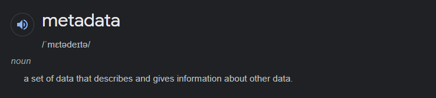
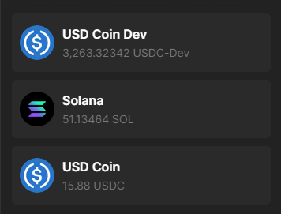
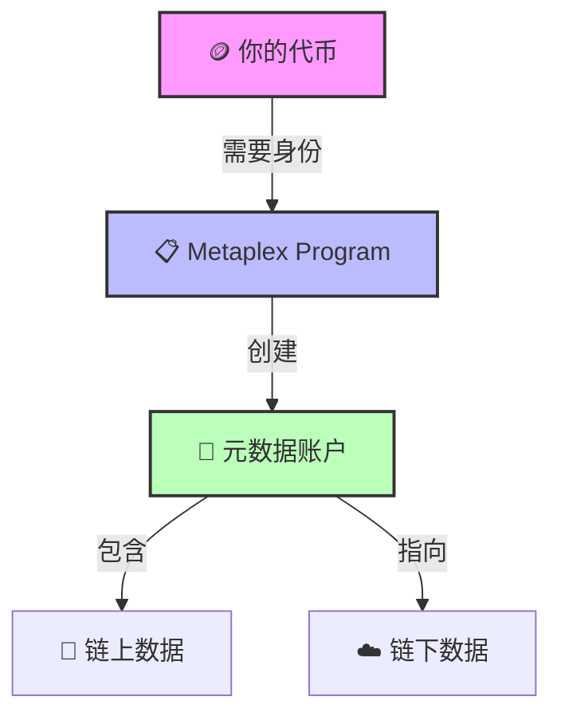
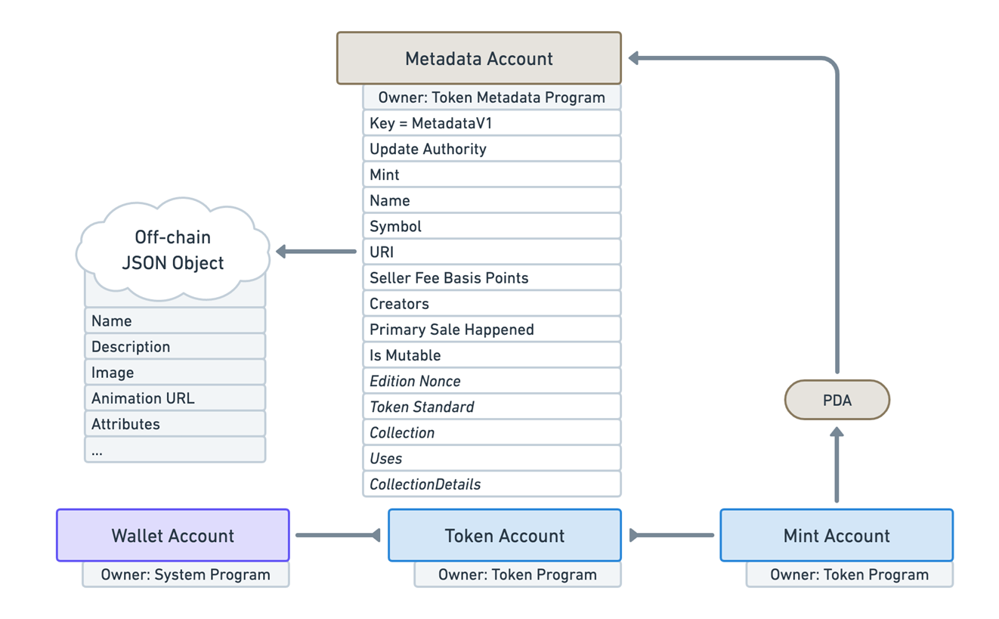
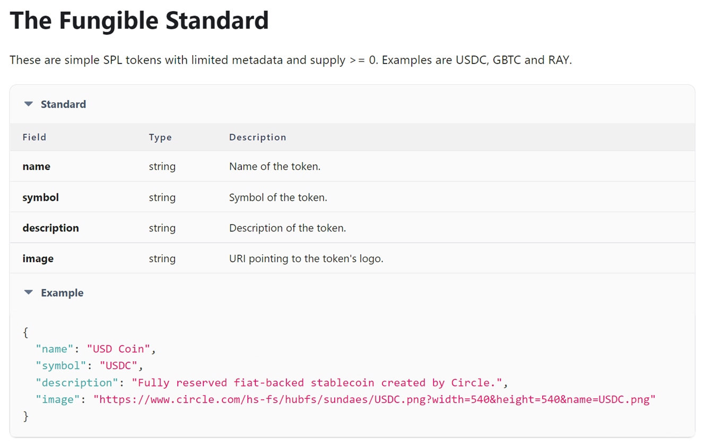

# 🧮 Token 元数据 - 给你的代币穿上华丽的外衣！

## 🎯 学习目标

上一节我们创建了代币，但它在钱包里显示为"未知"？今天我们要给它**身份证**！🪪

你将学会：
- 🎨 添加代币名称和图标
- 📝 创建元数据账户
- 🖼️ 上传和管理代币图片
- 🏷️ 理解不同的代币标准

:::tip 🌟 为什么元数据很重要？
没有元数据的代币就像：
- 📦 没有标签的包裹
- 👤 没有名字的人
- 🎮 没有封面的游戏
**元数据让你的代币活起来！**
:::



## 🎭 第一章：什么是 Token 元数据？

### 🏷️ 元数据的组成

让我们看看专业代币都有什么：



```
💎 专业代币的身份证
├── 📝 名称（Name）: "Solana"
├── 🏷️ 符号（Symbol）: "SOL"
├── 🖼️ 图标（Logo）: 紫色渐变图
├── 📊 小数位（Decimals）: 9
└── 📄 描述（Description）: "原生代币..."
```

:::info 💡 核心理解
**元数据 = 代币的身份信息**

就像人的身份证包含：
- 姓名 = Token Name
- 照片 = Token Logo
- 身份证号 = Token Address
- 其他信息 = Token Metadata
:::

### 🎯 Metaplex Token Metadata Program

这是 Solana 上最重要的程序之一！



## 🏗️ 第二章：元数据账户结构

### 📊 账户关系图



```typescript
// 🎨 元数据账户结构
interface MetadataAccount {
    // 链上数据
    name: string;           // 代币名称
    symbol: string;         // 代币符号
    uri: string;           // 指向链下 JSON

    // 权限控制
    updateAuthority: PublicKey;  // 谁能更新
    mint: PublicKey;             // 关联的铸币账户

    // 其他属性
    primarySaleHappened: boolean;
    isMutable: boolean;
    tokenStandard: TokenStandard;
    // ... 更多
}
```

### 🌐 链上 vs 链下存储

```
📦 链上存储（昂贵但永久）
├── 名称和符号
├── URI 链接
└── 基本属性

☁️ 链下存储（便宜且灵活）
├── 高清图片
├── 详细描述
├── 额外属性
└── 动画/视频
```

:::warning ⚠️ 存储成本对比
链上存储 1MB 图片 ≈ 7 SOL 💸
链下存储 1MB 图片 ≈ 0.0001 SOL 😎
**所以我们把图片放链下！**
:::

## 🏷️ 第三章：代币标准详解

### 🎯 四大代币标准

Metaplex 定义了四种代币标准：

| 标准 | 用途 | 例子 |
|------|------|------|
| 🪙 **Fungible** | 普通代币 | USDC, 你的 Meme 币 |
| 🎨 **NonFungible** | NFT | Bored Apes, Art |
| 🎮 **FungibleAsset** | 游戏道具 | 剑（可堆叠） |
| 📖 **NonFungibleEdition** | 限量版 | 1/100 印刷品 |

### 🤖 自动判断逻辑

```javascript
// 🎯 Token 标准是如何自动确定的

function determineTokenStandard(token) {
    if (hasMasterEdition(token)) {
        return "NonFungible";  // NFT
    }

    if (hasEdition(token)) {
        return "NonFungibleEdition";  // 副本
    }

    if (token.decimals === 0 && token.supply > 1) {
        return "FungibleAsset";  // 游戏物品
    }

    if (token.decimals > 0 && token.supply > 1) {
        return "Fungible";  // 普通代币
    }
}
```



## 🛠️ 第四章：实战 - 添加元数据

### 📦 安装 Metaplex SDK

```bash
# 安装必要的包
npm install @metaplex-foundation/js @metaplex-foundation/mpl-token-metadata

# 也需要这些
npm install @solana/web3.js @solana/spl-token
```

### 🎨 Step 1: 准备代币图标

首先，准备一个代币图标（建议 512x512px）：

```typescript
// 📁 准备你的文件
const tokenMetadata = {
    name: "PizzaCoin",           // 代币名称
    symbol: "PIZZA",              // 代币符号
    image: "./pizza-logo.png",   // 本地图片路径
    description: "最美味的加密货币 🍕"
};
```

### 🚀 Step 2: 初始化 Metaplex

```typescript
import { Metaplex, keypairIdentity, bundlrStorage } from "@metaplex-foundation/js";
import { Connection, Keypair, PublicKey } from "@solana/web3.js";

async function initializeMetaplex() {
    console.log("🎨 初始化 Metaplex...");

    // 🌐 连接到网络
    const connection = new Connection("https://api.devnet.solana.com");

    // 🔑 加载你的密钥对
    const wallet = Keypair.generate(); // 或从文件加载

    // 🏗️ 创建 Metaplex 实例
    const metaplex = Metaplex.make(connection)
        .use(keypairIdentity(wallet))
        .use(bundlrStorage({
            address: "https://devnet.bundlr.network",
            providerUrl: "https://api.devnet.solana.com",
            timeout: 60000,
        }));

    console.log("✅ Metaplex 初始化成功！");
    return metaplex;
}
```

:::info 💡 Bundlr 是什么？
Bundlr（现在叫 Irys）是一个去中心化存储服务：
- 永久存储你的图片和元数据
- 比 IPFS 更可靠
- 专为 Solana 优化
- 支付少量费用即可永久存储
:::

### 🖼️ Step 3: 上传图片

```typescript
async function uploadImage(metaplex: Metaplex, imagePath: string) {
    console.log("🖼️ 上传代币图片...");

    try {
        // 📤 上传图片到 Arweave
        const imageBuffer = fs.readFileSync(imagePath);
        const imageUri = await metaplex.storage().upload(imageBuffer);

        console.log("✅ 图片上传成功！");
        console.log("🔗 图片 URI:", imageUri);

        return imageUri;
    } catch (error) {
        console.error("❌ 上传失败:", error);
        throw error;
    }
}
```

### 📝 Step 4: 上传元数据 JSON

```typescript
async function uploadMetadata(
    metaplex: Metaplex,
    tokenMetadata: any,
    imageUri: string
) {
    console.log("📝 创建元数据 JSON...");

    // 🎯 构建符合标准的元数据
    const metadata = {
        name: tokenMetadata.name,
        symbol: tokenMetadata.symbol,
        description: tokenMetadata.description,
        image: imageUri,  // 使用上传的图片 URI
        attributes: [],   // 可选：添加属性
        properties: {
            category: "currency",
            creators: []
        }
    };

    // 📤 上传元数据
    const metadataUri = await metaplex.storage().uploadJson(metadata);

    console.log("✅ 元数据上传成功！");
    console.log("🔗 元数据 URI:", metadataUri);
    console.log("📋 元数据内容:", metadata);

    return metadataUri;
}
```

### 🏗️ Step 5: 创建元数据账户

```typescript
async function createTokenMetadata(
    metaplex: Metaplex,
    mint: PublicKey,
    metadataUri: string,
    tokenMetadata: any
) {
    console.log("🏗️ 创建链上元数据账户...");

    try {
        // 🎨 创建元数据
        const { nft } = await metaplex.nfts().create({
            uri: metadataUri,
            name: tokenMetadata.name,
            symbol: tokenMetadata.symbol,
            sellerFeeBasisPoints: 0,  // 无版税（代币用）
            useExistingMint: mint,    // 使用已有的铸币账户
            isMutable: true,           // 可更新
            tokenStandard: TokenStandard.Fungible  // 可替代代币
        });

        console.log("✅ 元数据账户创建成功！");
        console.log("📍 元数据地址:", nft.metadataAddress.toBase58());

        return nft;
    } catch (error) {
        console.error("❌ 创建失败:", error);
        throw error;
    }
}
```

### 🎯 完整流程

```typescript
async function addMetadataToToken(mintAddress: string) {
    console.log("🚀 开始添加代币元数据...\n");

    // 1️⃣ 初始化
    const metaplex = await initializeMetaplex();

    // 2️⃣ 准备数据
    const tokenMetadata = {
        name: "PizzaCoin",
        symbol: "PIZZA",
        description: "世界上最美味的加密货币 🍕",
        image: "./pizza-logo.png"
    };

    // 3️⃣ 上传图片
    const imageUri = await uploadImage(
        metaplex,
        tokenMetadata.image
    );

    // 4️⃣ 上传元数据
    const metadataUri = await uploadMetadata(
        metaplex,
        tokenMetadata,
        imageUri
    );

    // 5️⃣ 创建链上账户
    const mint = new PublicKey(mintAddress);
    const metadata = await createTokenMetadata(
        metaplex,
        mint,
        metadataUri,
        tokenMetadata
    );

    console.log("\n🎉 大功告成！");
    console.log("💎 你的代币现在有了完整的身份！");
    console.log("👛 在钱包中查看你的专业代币");

    return metadata;
}

// 使用
addMetadataToToken("你的代币地址").then(console.log);
```

## 🎨 第五章：更新元数据

### 🔄 更新现有元数据

```typescript
async function updateTokenMetadata(
    metaplex: Metaplex,
    mint: PublicKey,
    newMetadata: any
) {
    console.log("🔄 更新代币元数据...");

    // 获取现有 NFT
    const nft = await metaplex.nfts().findByMint({ mintAddress: mint });

    // 更新元数据
    await metaplex.nfts().update({
        nftOrSft: nft,
        name: newMetadata.name,
        symbol: newMetadata.symbol,
        uri: newMetadata.uri,
    });

    console.log("✅ 元数据更新成功！");
}
```

## 🏆 实战项目：专业代币发行

### 🎯 完整的代币发行流程

```typescript
async function launchProfessionalToken() {
    console.log("🚀 启动专业代币发行流程！\n");

    // 1️⃣ 创建代币
    console.log("Step 1: 创建代币...");
    const mint = await createToken();

    // 2️⃣ 准备元数据
    console.log("\nStep 2: 准备元数据...");
    const metadata = {
        name: "Moon Coin",
        symbol: "MOON",
        description: "To the moon! 🚀",
        image: "./moon.png",
        external_url: "https://mooncoin.xyz",
        attributes: [
            { trait_type: "Coolness", value: "100" },
            { trait_type: "Rarity", value: "Common" }
        ]
    };

    // 3️⃣ 添加元数据
    console.log("\nStep 3: 添加元数据...");
    await addMetadataToToken(mint, metadata);

    // 4️⃣ 铸造初始供应
    console.log("\nStep 4: 铸造代币...");
    await mintTokens(mint, 1000000);

    console.log("\n🎊 恭喜！专业代币发行成功！");
    console.log("📊 代币信息：");
    console.log(`  名称: ${metadata.name}`);
    console.log(`  符号: ${metadata.symbol}`);
    console.log(`  供应量: 1,000,000 ${metadata.symbol}`);
    console.log("👛 现在可以在钱包中看到完整信息了！");
}
```

## 💡 技巧和最佳实践

### 🖼️ 图片规格建议

| 用途 | 尺寸 | 格式 | 大小限制 |
|------|------|------|----------|
| 代币图标 | 512x512 | PNG/JPG | < 500KB |
| NFT 图片 | 2048x2048 | PNG/JPG | < 5MB |
| 动画 | 1920x1080 | GIF/MP4 | < 10MB |

### ⚠️ 常见问题解决

```typescript
// 问题：上传失败
// 解决：检查 Bundlr 余额
const balance = await metaplex.storage().getBalance();
if (balance < 0.01) {
    await metaplex.storage().fund(0.1 * LAMPORTS_PER_SOL);
}

// 问题：元数据不显示
// 解决：等待几分钟，或刷新缓存
await new Promise(resolve => setTimeout(resolve, 5000));

// 问题：图片加载失败
// 解决：使用 HTTPS 链接，避免 CORS
```

## 🎊 恭喜完成！

你的代币现在有了完整的身份！

### ✅ 你学会了什么

- 🎨 **元数据结构** - 理解链上链下存储
- 📝 **创建元数据** - 使用 Metaplex SDK
- 🖼️ **上传图片** - 永久存储到 Arweave
- 🏷️ **代币标准** - 理解不同类型
- 🔄 **更新机制** - 管理元数据更新

### 🚀 下一步

1. **创建 NFT** - 学习 NonFungible 标准
2. **批量处理** - 为多个代币添加元数据
3. **动态元数据** - 根据链上事件更新
4. **元数据验证** - 确保符合标准

---

**你的代币终于有了专业的外观！** 🎨 **准备征服加密世界了吗？** 🚀
